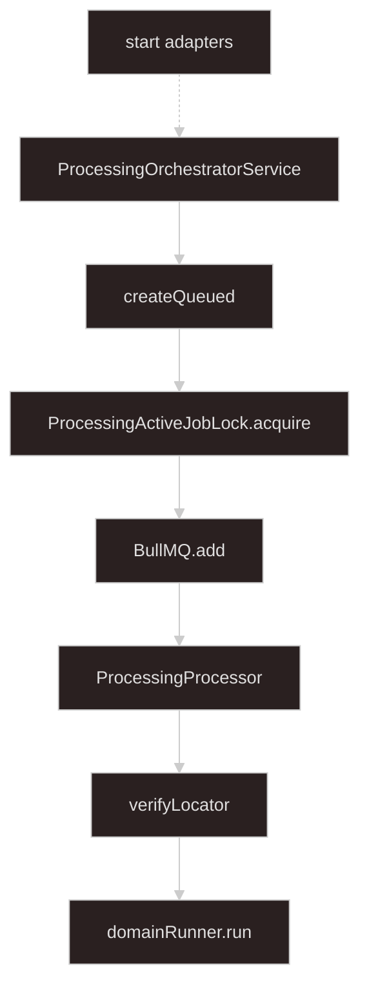

# Async processing

## Goal

**Everything from `startProcessing` onward.** Inputs arrive as **`StartProcessingInput`** from [start-processing-adapters](../start-processing-adapters/SKILL.md).

| Store | Role |
| --- | --- |
| **PostgreSQL** | `ProcessingJob`, `ProcessingManifest`, `ProcessingJobError` |
| **Redis (BullMQ)** | Job queue |
| **Redis (pub/sub)** | Live progress + terminal signal for SSE |
| **Redis (lock)** | `global_singleton` admission per `domainKind` |
| **Disk / object store** | Input blobs (upload layer); worker deletes locators in `finally` |

Verify locators in the worker after **`claimProcessingPhase`**, before **`domainRunner.run`**. Domain logic and **`ErrorDetail`** — [import-shared](../import-shared/SKILL.md). Format parse — plugin skills.

Implement under `apps/nest-app/src/async-processing/`. Upload ingest lives in **`import/upload/`** (generic). Domain apps register in **`applications/*/`**. **`AppModule`**: **`AsyncProcessingModule`** + **`LocalMultipartUploadModule`** + domain modules.

**Greenfield rule:** numbered flows describe behavior; **`Implementation patterns`** blocks are the required code shape — replicate them, do not substitute a flat single try/catch.

---

## Architecture



| Component | File | Role |
| --- | --- | --- |
| **ProcessingOrchestratorService** | `processing-orchestrator.service.ts` | `startProcessing` |
| **ProcessingJobRepository** | `processing-job.repository.ts` | Job + manifest |
| **ProcessingJobErrorRepository** | `processing-job-error.repository.ts` | `ErrorDetail[]` on `validation_failed` |
| **DomainRegistry** | `domain-registry.service.ts` | `domainKind` → runner, specs, lock, optional **`upload`** policy |
| **ProcessingSourceReader** | `processing-source.reader.ts` | verify, stream, delete locators |
| **ProcessingProcessor** | `processing.processor.ts` | BullMQ worker |
| **ProcessingProgressPublisher** | `processing-progress-publisher.service.ts` | Redis pub/sub |
| **ProcessingProgressSseService** | `processing-progress-sse.service.ts` | `GET jobs/:jobId/events` |
| **ProcessingActiveJobLock** | `processing-active-job.lock.ts` | Redis `SET NX` |
| **ProcessingController** | `processing.controller.ts` | REST + SSE |

Types and constants: **`async-processing.types.ts`**.

---

## Types

```typescript
type StartProcessingInput = {
  domainKind: string;
  sources: Record<string, ProcessingSource>;
  context?: Record<string, unknown>;
};

type ProcessingSource = {
  sourceId: string;
  label?: string;
  mimeType?: string;
  locator: SourceLocator;
};

type SourceLocator =
  | { kind: "local"; path: string; declaredSizeBytes?: number }
  | {
      kind: "object";
      provider: "s3" | "cos";
      bucket: string;
      key: string;
      declaredSizeBytes?: number;
    };

type ProcessingPhase = "queued" | "processing" | "complete" | "failed";
type ProcessingOutcome = "success" | "validation_failed" | "failed";

type VerifiedSourceLocator = SourceLocator & { sizeBytes: number; etag?: string };
type VerifiedProcessingSource = ProcessingSource & {
  verifiedLocator: VerifiedSourceLocator;
};

type DomainRunResult =
  | { outcome: "success"; processedCount: number; errorCount: 0 }
  | {
      outcome: "validation_failed";
      processedCount: number;
      errorCount: number;
      errors: readonly ErrorDetail[];
    };

type DomainRunnerIo = {
  openStream: (source: VerifiedProcessingSource) => Promise<Readable>;
  onProgress: (detail: unknown) => Promise<void>;
  context?: Record<string, unknown>;
};

type DomainRunner = {
  domainKind: string;
  run(
    jobId: string,
    sources: Map<string, VerifiedProcessingSource>,
    io: DomainRunnerIo,
  ): Promise<DomainRunResult>;
};

export const ASYNC_PROCESSING_QUEUE = "async-processing" as const;

type AsyncProcessingJobPayload = { jobId: string; domainKind: string; manifestId: string };

type ProcessingProgressEvent = { jobId: string; progress: unknown };
type ProcessingTerminalEvent = { jobId: string; phase: "complete" | "failed" };

type SourceSpec = { sourceId: string; required: boolean };
type ProcessingLockPolicy = { type: "none" } | { type: "global_singleton" };

type DomainKindRegistration = {
  domainRunner: DomainRunner;
  sourceSpecs: SourceSpec[];
  lockPolicy: ProcessingLockPolicy;
  /** Optional MIME allowlists for upload-* adapters */
  upload?: DomainUploadPolicy;
};

type DomainUploadPolicy = {
  allowedMimeBySourceId?: Record<string, readonly string[]>;
  defaultAllowedMimeTypes?: readonly string[];
};

export class ActiveJobConflictError extends Error {
  constructor(domainKind: string) {
    super(`A processing job is already active for domainKind ${domainKind}`);
    this.name = "ActiveJobConflictError";
  }
}
```

| Mapping | DB `phase` | DB `outcome` |
| --- | --- | --- |
| `success` | `complete` | `success` |
| `validation_failed` | `complete` | `validation_failed` |
| Uncaught throw | `failed` | `failed` |

On **`validation_failed`**: **`ProcessingJobErrorRepository.createManyFromErrors`**. Download: **`GET jobs/:jobId/errors`** (`application/x-ndjson`).

**`ProcessingManifest.sources`** — frozen file locators for the worker. **`ProcessingManifest.context`** — optional JSON job parameters collected at upload/start (for example `yearMonth`, `timezone`); not file locators. Domain runners validate **`io.context`** with a domain Zod schema; BullMQ payload stays `{ jobId, domainKind, manifestId }` only.

Redis channels: `async-processing:progress:{jobId}`, `async-processing:terminal:{jobId}`. BullMQ payload carries **refs only** — load `sources` from manifest by `manifestId`.

| Constant | Default | Use |
| --- | --- | --- |
| `ACTIVE_JOB_TTL_SECONDS` | 86400 | Lock TTL |
| `STALE_PROCESSING_MS` | 2h | Stale lock recovery |
| `SSE_IDLE_TIMEOUT_MS` | 60000 | SSE idle DB reload |
| `LEASE_REFRESH_INTERVAL_MS` | 60000 | Throttle lock refresh |

Domain receives **`VerifiedProcessingSource`** only — do not re-verify in `openStream`.

---

## Prisma

```prisma
model ProcessingJob {
  id             String             @id // jobId (nanoid)
  domainKind     String
  phase          ProcessingPhase    @default(queued)
  outcome        ProcessingOutcome?
  processedCount Int?
  errorCount     Int?
  createdAt      DateTime           @default(now())
  updatedAt      DateTime           @updatedAt
  completedAt    DateTime?
  manifest               ProcessingManifest?
  processingJobErrors    ProcessingJobError[]
}

model ProcessingManifest {
  id         String   @id // manifestId (nanoid)
  jobId      String   @unique
  domainKind String
  sources    Json
  context    Json? // optional job parameters (not file locators)
  createdAt  DateTime @default(now())
  job        ProcessingJob @relation(...)
}

model ProcessingJobError {
  id              String @id @default(cuid())
  processingJobId String
  sequence        Int
  payload         Json // ErrorDetail
  processingJob   ProcessingJob @relation(...)
  @@unique([processingJobId, sequence])
}
```

After schema edits: **`prisma generate`** only — user runs migrations.

---

## ProcessingJobRepository

```typescript
interface ProcessingJobRepository {
  createQueued(input: {
    jobId: string;
    domainKind: string;
    manifestId: string;
    sources: Record<string, ProcessingSource>;
    context?: Record<string, unknown>;
  }): Promise<ProcessingJob>;
  claimProcessingPhase(jobId: string): Promise<boolean>; // single-winner queued → processing
  finalize(jobId: string, patch: {
    phase: "complete" | "failed";
    outcome?: ProcessingOutcome;
    processedCount?: number;
    errorCount?: number;
    completedAt: Date;
  }): Promise<void>;
  findById(jobId: string): Promise<ProcessingJob | null>;
  findMany(...): Promise<{ jobs: ProcessingJob[]; nextCursor: string | null }>;
  deleteById(jobId: string): Promise<void>;
  getManifestByManifestId(manifestId: string): Promise<{
    manifestId: string; jobId: string; domainKind: string;
    sources: Record<string, ProcessingSource>;
    context?: Record<string, unknown>;
  } | null>;
}
```

### Implementation patterns

```typescript
async createQueued(input) {
  return prisma.$transaction(async (tx) => {
    const job = await tx.processingJob.create({
      data: { id: input.jobId, domainKind: input.domainKind, phase: "queued" },
    });
    await tx.processingManifest.create({
      data: {
        id: input.manifestId,
        jobId: input.jobId,
        domainKind: input.domainKind,
        sources: input.sources,
        context: input.context,
      },
    });
    return job;
  });
}

async claimProcessingPhase(jobId: string): Promise<boolean> {
  const result = await prisma.processingJob.updateMany({
    where: { id: jobId, phase: "queued" },
    data: { phase: "processing" },
  });
  return result.count === 1;
}
```

```typescript
async createManyFromErrors(jobId: string, errors: readonly ErrorDetail[]) {
  for (let offset = 0; offset < errors.length; offset += INSERT_BATCH_SIZE) {
    const batch = errors.slice(offset, offset + INSERT_BATCH_SIZE);
    await prisma.processingJobError.createMany({
      data: batch.map((error, i) => ({
        processingJobId: jobId,
        sequence: offset + i + 1,
        payload: error,
      })),
    });
  }
}
```

---

## ProcessingOrchestratorService

1. Resolve registration; validate required **`sourceSpecs`**.
2. `jobId`, `manifestId` = nanoid; **`createQueued`**.
3. When **`global_singleton`**, **`acquire(domainKind, jobId)`** — throws **`ActiveJobConflictError`** (adapter → HTTP 409).
4. **`queue.add`** with `{ jobId, domainKind, manifestId }`, **`attempts: 1`**.
5. Return `{ jobId, manifestId }`. On failure after step 2: release lock if acquired, **`deleteById`**, rethrow.

### Implementation patterns

```typescript
async startProcessing(input: StartProcessingInput) {
  const registration = domainRegistry.getByDomainKind(input.domainKind);
  validateSources(input.sources, registration.sourceSpecs);
  const jobId = nanoid();
  const manifestId = nanoid();
  await jobRepository.createQueued({
    jobId,
    domainKind: input.domainKind,
    manifestId,
    sources: input.sources,
    context: input.context,
  });

  let lockAcquired = false;
  try {
    if (registration.lockPolicy.type === "global_singleton") {
      await activeJobLock.acquire(input.domainKind, jobId);
      lockAcquired = true;
    }
    await asyncProcessingQueue.add(
      "async-processing-job",
      { jobId, domainKind: input.domainKind, manifestId },
      { attempts: 1, removeOnComplete: { age: 3600 }, removeOnFail: { age: 3600 } },
    );
  } catch (error) {
    if (lockAcquired) await activeJobLock.release(input.domainKind, jobId);
    await jobRepository.deleteById(jobId);
    throw error;
  }
  return { jobId, manifestId };
}
```

---

## ProcessingActiveJobLock

**Key:** `async-processing:active:{domainKind}` → `{jobId}`. BullMQ does **not** replace this lock.

**Stale recovery on acquire** (read active `jobId` from Redis, load DB row):

| DB state | Action |
| --- | --- |
| Missing | `DEL` key, retry acquire once |
| `complete` or `failed` | `DEL` key, retry acquire once |
| `processing` and stale (`STALE_PROCESSING_MS`) | finalize active `failed`, `DEL`, retry once |
| Fresh `processing` or `queued` | throw **`ActiveJobConflictError`** |

Worker **`refreshLease`** after claim (force) and throttled during domain run.

### Implementation patterns

```typescript
const RELEASE_LOCK_SCRIPT = `
if redis.call("GET", KEYS[1]) == ARGV[1] then
  return redis.call("DEL", KEYS[1])
else
  return 0
end`;

async tryAcquire(domainKind, jobId, allowStaleRecovery) {
  const key = `async-processing:active:${domainKind}`;
  if ((await redis.set(key, jobId, "EX", ACTIVE_JOB_TTL_SECONDS, "NX")) === "OK") return;
  if (!allowStaleRecovery) throw new ActiveJobConflictError(domainKind);
  // stale recovery table above, then retry with allowStaleRecovery=false
}

async release(domainKind, jobId) {
  await redis.eval(RELEASE_LOCK_SCRIPT, 1, `async-processing:active:${domainKind}`, jobId);
}

async refreshLease(domainKind, jobId) {
  const key = `async-processing:active:${domainKind}`;
  if ((await redis.get(key)) === jobId) await redis.expire(key, ACTIVE_JOB_TTL_SECONDS);
}
```

---

## Worker (`ProcessingProcessor`)

1. Idempotency — terminal phase → orphan lock cleanup, return.
2. **`claimProcessingPhase`** — if false → orphan cleanup, return.
3. Load job; **`refreshLease`** (force) when `global_singleton`.
4. **`getManifestByManifestId`** — null → **`markJobFailed`**, return.
5. Re-resolve registration from manifest **`domainKind`**.
6. **`verifyLocator`** each source → **`Map`**, track **`verifiedForCleanup`**.
7. **`refreshLease`** (force) before domain run.
8. **`domainRunner.run`** — `openStream` → `openReadStream`; `onProgress` → `publishProgress` + throttled **`refreshLease`**; pass **`context`** from manifest snapshot.
9. **`finalizeSuccess`** — persist errors when `validation_failed`; **`finalize`** `complete`.
10. **`publishTerminalIfTerminal`**.

**`finally`:** **`release`** when terminal + **`isHeldBy`**; best-effort **`deleteLocator`**.

| Failure | Action |
| --- | --- |
| Pre-domain | if phase still `processing` → **`markJobFailed`** |
| Domain throw | **`markJobFailed`** — do not rethrow into pre-domain handler |
| Post-domain | log; retry **`finalizeSuccess`** once; **`publishTerminalIfTerminal`** — never map successful domain to `failed` |

**Never** wrap finalize + publish in the same **`catch`** as domain run.

### Implementation patterns

**Required control flow** — three try scopes plus `finally`:

```typescript
@Processor(ASYNC_PROCESSING_QUEUE)
class ProcessingProcessor extends WorkerHost {
  private lastLeaseRefreshAt = new Map<string, number>();

  async process(job: Job<AsyncProcessingJobPayload>) {
    const { jobId, manifestId } = job.data;
    const verifiedForCleanup: VerifiedProcessingSource[] = [];

    const existing = await jobRepository.findById(jobId);
    if (existing?.phase === "complete" || existing?.phase === "failed") {
      await releaseOrphanLockIfTerminal(jobId, existing);
      return;
    }
    if (!(await jobRepository.claimProcessingPhase(jobId))) {
      const row = await jobRepository.findById(jobId);
      if (row) await releaseOrphanLockIfTerminal(jobId, row);
      return;
    }

    try {
      try {
        // pre-domain: job row, refreshLease(force), manifest, buildVerifiedSources, refreshLease(force)
        let result: DomainRunResult;
        try {
          result = await registration.domainRunner.run(jobId, verifiedSources, {
            openStream: (s) => sourceReader.openReadStream(s.verifiedLocator),
            onProgress: async (detail) => {
              await progressPublisher.publishProgress(jobId, detail);
              await refreshLeaseIfNeeded(registration, domainKind, jobId, false);
            },
            context: manifest.context,
          });
        } catch {
          await markJobFailed(jobId);
          return;
        }
        try {
          await finalizeSuccess(jobId, result);
          await publishTerminalIfTerminal(jobId);
        } catch {
          // log; retry finalizeSuccess once; publishTerminalIfTerminal
        }
      } catch {
        const row = await jobRepository.findById(jobId);
        if (row?.phase === "processing") await markJobFailed(jobId);
      }
    } finally {
      const row = await jobRepository.findById(jobId);
      if (row && (row.phase === "complete" || row.phase === "failed") && (await activeJobLock.isHeldBy(jobId, row.domainKind))) {
        await activeJobLock.release(row.domainKind, jobId);
      }
      for (const source of verifiedForCleanup) {
        try { await sourceReader.deleteLocator(source.verifiedLocator); } catch { /* log */ }
      }
    }
  }
}
```

```typescript
async finalizeSuccess(jobId, result: DomainRunResult) {
  if (result.outcome === "validation_failed") {
    await jobErrorRepository.createManyFromErrors(jobId, result.errors);
  }
  await jobRepository.finalize(jobId, {
    phase: "complete", outcome: result.outcome,
    processedCount: result.processedCount, errorCount: result.errorCount,
    completedAt: new Date(),
  });
}

async markJobFailed(jobId: string) {
  await jobRepository.finalize(jobId, { phase: "failed", outcome: "failed", completedAt: new Date() });
  try { await progressPublisher.publishTerminal(jobId, { phase: "failed" }); } catch { /* best effort */ }
}

async refreshLeaseIfNeeded(registration, domainKind, jobId, force: boolean) {
  if (registration.lockPolicy.type !== "global_singleton") return;
  const now = Date.now();
  if (force || now - (lastLeaseRefreshAt.get(jobId) ?? 0) >= LEASE_REFRESH_INTERVAL_MS) {
    await activeJobLock.refreshLease(domainKind, jobId);
    lastLeaseRefreshAt.set(jobId, now);
  }
}
```

```typescript
// ProcessingSourceReader.verifyLocator
async verifyLocator(locator: SourceLocator): Promise<VerifiedSourceLocator> {
  switch (locator.kind) {
    case "local": {
      const st = await stat(locator.path);
      if (!st.isFile()) throw new Error(`Local path is not a file: ${locator.path}`);
      return { ...locator, sizeBytes: st.size };
    }
    case "object": {
      if (locator.provider === "s3") {
        const head = await s3.send(new HeadObjectCommand({ Bucket: locator.bucket, Key: locator.key }));
        return { ...locator, sizeBytes: head.ContentLength ?? 0, etag: head.ETag };
      }
      const head = await cosHeadObject(locator.bucket, locator.key);
      return { ...locator, sizeBytes: head.contentLength, etag: head.etag };
    }
  }
}
```

COS SDK: `import COS = require("cos-nodejs-sdk-v5")` (`export =` module).

---

## SSE and progress

1. Load job — terminal → one snapshot, close.
2. Dedicated Redis subscriber on progress + terminal channels.
3. Initial DB snapshot on connect (non-terminal).
4. Forward progress as `{ jobId, progress }`; reset idle timer.
5. Terminal channel → reload DB snapshot, close.
6. **`SSE_IDLE_TIMEOUT_MS`** idle → reload DB; close if terminal else re-arm.

Job phase changes are **not** pub/sub events — clients use connect snapshot, idle reload, or **`GET jobs/:jobId`**.

### Implementation patterns

```typescript
async publishProgress(jobId, progress) {
  await redis.publish(`async-processing:progress:${jobId}`, JSON.stringify({ jobId, progress }));
}
async publishTerminal(jobId, phase: "complete" | "failed") {
  await redis.publish(`async-processing:terminal:${jobId}`, JSON.stringify({ jobId, phase }));
}
```

```typescript
streamJobEvents(jobId): Observable<MessageEvent> {
  return new Observable((subscriber) => {
    void (async () => {
      const job = await jobRepository.findById(jobId);
      if (!job) { subscriber.error(new NotFoundException(...)); return; }
      if (job.phase === "complete" || job.phase === "failed") {
        subscriber.next({ data: toSnapshot(job) });
        subscriber.complete();
        return;
      }
      const sub = new Redis({ host, port, maxRetriesPerRequest: null });
      sub.on("message", (channel, message) => {
        if (channel === progressChannel) { subscriber.next({ data: JSON.parse(message) }); resetIdleTimer(); }
        if (channel === terminalChannel) { void reloadSnapshotAndComplete(); }
      });
      await sub.subscribe(progressChannel, terminalChannel);
      subscriber.next({ data: toSnapshot(job) });
      resetIdleTimer();
    })();
    return () => { void cleanup(sub); };
  });
}
```

---

## HTTP API

| Route | Response |
| --- | --- |
| `GET jobs` | Paginated list |
| `GET jobs/:jobId` | Job snapshot |
| `GET jobs/:jobId/events` | SSE |
| `GET jobs/:jobId/errors` | NDJSON when `validation_failed` |

---

## Module layout

```text
async-processing/
  async-processing.types.ts
  async-processing.module.ts
  async-processing-core/
    processing-orchestrator.service.ts
    processing.processor.ts
    processing-job.repository.ts
    processing-job-error.repository.ts
    processing-active-job.lock.ts
    processing-source.reader.ts
    processing-progress-publisher.service.ts
    processing-progress-sse.service.ts
    processing.controller.ts
    domain-registry.service.ts
    async-processing-core.module.ts
  start-processing-adapters/   # separate skill
```

### Implementation patterns

```typescript
@Module({
  imports: [PrismaModule, RedisModule, BullModule.registerQueue({ name: ASYNC_PROCESSING_QUEUE })],
  controllers: [ProcessingController],
  providers: [
    ProcessingOrchestratorService, ProcessingJobRepository, ProcessingJobErrorRepository,
    ProcessingSourceReader, ProcessingActiveJobLock, ProcessingProgressPublisher,
    ProcessingProgressSseService, ProcessingProcessor, DomainRegistry,
  ],
  exports: [ProcessingOrchestratorService, DomainRegistry, ProcessingJobRepository, ProcessingJobErrorRepository],
})
export class AsyncProcessingCoreModule {}

@Module({
  imports: [AsyncProcessingCoreModule, StartProcessingAdaptersModule],
  exports: [AsyncProcessingCoreModule, StartProcessingAdaptersModule],
})
export class AsyncProcessingModule {}
```

`StartProcessingAdaptersModule` imports **core** (not umbrella) to avoid circular deps.

```typescript
@Injectable()
class DomainRegistry {
  private readonly registrations = new Map<string, DomainKindRegistration>();
  register(domainKind, registration) { this.registrations.set(domainKind, registration); }
  getByDomainKind(domainKind) {
    const r = this.registrations.get(domainKind);
    if (!r) throw new NotFoundException(`Unknown domainKind: ${domainKind}`);
    return r;
  }
}

domainRegistry.register("sales-report", {
  domainRunner: salesImportDomainRunner,
  sourceSpecs: [
    { sourceId: "salesData", required: true },
    { sourceId: "inventory", required: true },
    { sourceId: "productDescriptions", required: true },
  ],
  lockPolicy: { type: "global_singleton" },
  upload: {
    allowedMimeBySourceId: {
      salesData: ["application/vnd.openxmlformats-officedocument.spreadsheetml.sheet", "application/octet-stream"],
      inventory: ["application/vnd.openxmlformats-officedocument.spreadsheetml.sheet", "application/octet-stream"],
      productDescriptions: ["application/x-ndjson", "application/json", "application/octet-stream"],
    },
  },
});
```

Domain modules live under **`applications/<domain>/`**. They import **`AsyncProcessingModule`** only to inject **`DomainRegistry`** — no upload code in domain folders.

---

## Rules (invariants and anti-patterns)

| Rule | Rationale |
| --- | --- |
| Boundary at **`startProcessing`** | No upload types in orchestrator or worker |
| Job history in **DB** | Not Redis-only |
| One repo for job + manifest | No parallel manifest registry |
| Verify once in worker | Domain gets **`VerifiedProcessingSource`** only |
| **`attempts: 1`** + idempotency guard | No double domain runs after finalize |
| **`claimProcessingPhase`** via conditional **`updateMany`** | Single-winner queued → processing |
| **`global_singleton`**: Redis lock + **`refreshLease`** | BullMQ concurrency is not domain admission |
| **`finally`**: release when terminal + **`isHeldBy`**, then delete locators | Never release while phase is `processing` |
| Separate catches: domain vs post-domain finalize | Broad catch overwrites successful terminal rows |
| Queue refs only (`manifestId`) | No bytes, buffers, or full `sources` on BullMQ |
| **`ActiveJobConflictError`** in lock service | Adapter maps to HTTP 409, not Nest `ConflictException` |
| Lock after **`createQueued`** | Rollback target exists on acquire/enqueue failure |
| Redis pub/sub for live progress | Do not persist every tick to DB |
| No sales/domain code in **`async-processing/`** or **`import/`** | Domains register via **`DomainRegistry`** only |
| Upload in **`import/upload/`**, not **`applications/*/`** | Domain supplies **`upload`** policy on registration |

---

## Related skills

| Task | Skill |
| --- | --- |
| Upload, `POST .../start`, session | `start-processing-adapters` |
| Domain runner, `ErrorDetail` | `import-shared` |
| XLSX / JSONL parse | `import-plugin-tabular-xlsx` / `import-plugin-jsonl` |
