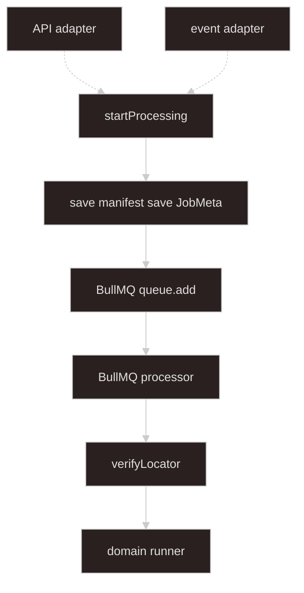

# Async processing

## Goal

**Everything from `startProcessing` onward.** Source-agnostic job orchestration — inputs arrive as validated **`StartProcessingInput`** from [import-upload-handoff](../import-upload-handoff/SKILL.md) adapters.

Only the **domain layer** is `domainKind`-specific. **Storage verification** is worker step 1. **Business validation** is domain / format plugins.

**Job progress** is SSE here. Upload and start API/event paths are upstream.

---

## Architecture

Boundary at **`startProcessing`**. Dashed arrows: upstream API and event adapters (handoff layer).



Solid arrows: this skill. Dashed arrows: handoff layer — see [import-upload-handoff](../import-upload-handoff/SKILL.md).

| Piece | Role |
| ----- | ---- |
| **[startProcessing](#inside-startprocessing)** | Processing boundary — first method in this layer |
| **[StartProcessingInput](#inbound-from-adapters)** | Inbound DTO from adapters (`domainKind` + `sources`) |
| **[ProcessingManifest](#created-in-startprocessing)** | Created in `startProcessing`; snapshot of input sources for the worker |
| **[ProcessingManifestRegistry](#processingmanifestregistry)** | `saveForJob`, `getByManifestId`, `deleteByManifestId` |
| **[ProcessingSourceReader](#processingsourcereader)** | `verifyLocator`, `openReadStream`, `deleteLocator` |
| **[BullMQ queue](#job-queue-bullmq)** | Dispatches worker jobs; payload is refs only |
| **[JobMeta store](#jobmeta-and-sse)** | Redis keys for phase, progress, outcome; publishes SSE events |

---

## Terminology

| Term | Meaning |
| ---- | ------- |
| **[StartProcessingInput](#inbound-from-adapters)** | Inbound DTO — built by handoff adapters |
| **[domainKind](#domain-registry)** | Registry key for domain runner and required `sourceId` list (e.g. `sales-import`) |
| **[sourceId](#inbound-from-adapters)** | Routing key for one input (e.g. `mainWorkbook`) |
| **[SourceLocator](#inbound-from-adapters)** | Opaque read handle: local path, object key, … |
| **[ProcessingManifest](#created-in-startprocessing)** | Snapshot of input `sources` for one job; keyed by `manifestId` |
| **[manifestId](#inside-startprocessing)** / **[jobId](#inside-startprocessing)** | Created in `startProcessing` |
| **[storage verification](#worker-processor-steps)** | Worker step 1: stat / HEAD on each `SourceLocator` |
| **[ASYNC_PROCESSING_QUEUE](#job-queue-and-meta-bullmq--redis)** | BullMQ queue name (e.g. `"async-processing"`) |
| **[AsyncProcessingJobPayload](#job-queue-and-meta-bullmq--redis)** | BullMQ job data — `jobId`, `domainKind`, `manifestId` only |
| **[JobMeta](#jobmeta-and-sse)** | Redis-backed job state; SSE clients subscribe to meta updates |

Upload handoff vocabulary (`originalName`, handoff `sources` with `UploadHandoffEntry`) stays in [import-upload-handoff](../import-upload-handoff/SKILL.md) only.

---

## Types

### Inbound (from adapters)

```typescript
type StartProcessingInput = {
  domainKind: string;
  sources: Record<string, ProcessingSource>;
};

type ProcessingSource = {
  sourceId: string;
  label?: string;
  mimeType?: string;
  locator: SourceLocator;
};

type SourceLocator =
  | { kind: "local"; path: string; declaredSizeBytes?: number }
  | {
      kind: "object";
      provider: "s3" | "cos";
      bucket: string;
      key: string;
      declaredSizeBytes?: number;
    };
```

### Created in startProcessing

```typescript
type ProcessingManifest = {
  manifestId: string;
  domainKind: string;
  jobId: string;
  sources: Record<string, ProcessingSource>;
  createdAt: string;
};

type VerifiedSourceLocator = SourceLocator & {
  sizeBytes: number;
  etag?: string;
};

type SourceSpec = { sourceId: string; required: boolean };
```

Orchestrator validates `input.sources` against `DomainKindRegistration.sourceSpecs`.

### Job queue and meta (BullMQ + Redis)

```typescript
export const ASYNC_PROCESSING_QUEUE = "async-processing" as const;

export type JobPhase = "queued" | "processing" | "complete" | "failed";

export type JobOutcome = "success" | "validation_failed" | "failed";

type JobMeta = {
  jobId: string;
  domainKind: string;
  manifestId: string;
  phase: JobPhase;
  progress?: unknown;
  outcome?: JobOutcome;
  errorBlobKey?: string;
  importedCount?: number;
  errorCount?: number;
  createdAt: string;
  updatedAt: string;
};

/** BullMQ job data — small refs only; never file bytes or locators */
type AsyncProcessingJobPayload = {
  jobId: string;
  domainKind: string;
  manifestId: string;
};
```

**Redis roles**

| Use | Mechanism |
| --- | --- |
| Job queue | BullMQ (`@nestjs/bullmq`) backed by Redis |
| `JobMeta` | Redis string keys; `patchMeta` publishes to per-job channel |
| `ProcessingManifest` | Registry implementation (often Redis; not on queue payload) |
| SSE | Redis pub/sub on `async-processing:events:{jobId}` (or equivalent prefix) |
| Lock policy | Active job id per `domainKind` in Redis (when `global_singleton`) |

Legacy code uses queue name `"async-import"` and `importKind` — migrate to the names above.

---

## ProcessingManifestRegistry

```typescript
interface ProcessingManifestRegistry {
  saveForJob(manifest: ProcessingManifest): Promise<void>;
  getByManifestId(manifestId: string): Promise<ProcessingManifest | null>;
  deleteByManifestId(manifestId: string): Promise<void>;
}
```

---

## ProcessingSourceReader

```typescript
interface ProcessingSourceReader {
  verifyLocator(locator: SourceLocator): Promise<VerifiedSourceLocator>;
  openReadStream(locator: VerifiedSourceLocator): Promise<Readable>;
  deleteLocator(locator: SourceLocator): Promise<void>;
}
```

---

## Inside startProcessing

1. Validate `input.sources` for `input.domainKind` (registry `sourceSpecs`).
2. Lock policy (read/write active job id in Redis when `global_singleton`).
3. Create `jobId`, `manifestId`, `ProcessingManifest`.
4. `saveForJob(manifest)`.
5. Save initial `JobMeta` with `phase: "queued"`.
6. **Enqueue** BullMQ job (see below).
7. Return `{ jobId, manifestId }`.

```typescript
await this.asyncProcessingQueue.add(
  "async-processing-job",
  { jobId, domainKind: input.domainKind, manifestId },
  {
    removeOnComplete: { age: 3600 },
    removeOnFail: { age: 3600 },
  },
);
```

Inject the queue with `@InjectQueue(ASYNC_PROCESSING_QUEUE)` on the orchestrator.

---

## Job queue (BullMQ)

Use **BullMQ** via `@nestjs/bullmq` for all async work after `startProcessing`.

### Module registration

```typescript
@Module({
  imports: [
    RedisModule,
    BullModule.registerQueue({ name: ASYNC_PROCESSING_QUEUE }),
  ],
  providers: [
    ProcessingOrchestratorService,
    ProcessingJobStoreService,
    ProcessingJobProgressSseService,
    ProcessingProcessor,
  ],
})
export class AsyncProcessingModule {}
```

`RedisModule` supplies the connection BullMQ and `JobMeta` / SSE pub/sub share.

### Processor (worker)

```typescript
@Injectable()
@Processor(ASYNC_PROCESSING_QUEUE)
export class ProcessingProcessor extends WorkerHost {
  async process(job: Job<AsyncProcessingJobPayload>) {
    const { jobId, domainKind, manifestId } = job.data;
    await this.jobStore.patchMetaByJobId(jobId, { phase: "processing" });

    try {
      const manifest = await this.manifestRegistry.getByManifestId(manifestId);
      // verifyLocator per source, domainRunner.run, finalize meta, cleanup
    } catch (error) {
      await this.jobStore.patchMetaByJobId(jobId, { phase: "failed", /* ... */ });
      throw error; // BullMQ records failure / retry per queue options
    }
  }
}
```

### Queue payload rules

| Put on queue | Do not put on queue |
| --- | --- |
| `jobId`, `domainKind`, `manifestId` | File bytes, buffers, streams |
| | Full `ProcessingManifest` or `sources` map |
| | `SourceLocator` paths or object keys |

Worker loads manifest from **`ProcessingManifestRegistry`** by `manifestId`.

### JobMeta and SSE

- Orchestrator and processor update `JobMeta` through a Redis-backed store.
- Each `saveMeta` / `patchMeta` **publishes** JSON `JobMeta` to the job events channel.
- SSE handler subscribes to that channel; stream ends when `phase` is `complete` or `failed`.
- `onProgress` from the domain runner calls `patchMetaByJobId` with `phase: "processing"` and `progress` detail.

---

## Worker (processor steps)

1. Load `ProcessingManifest` by `manifestId` from job payload.
2. **`verifyLocator`** per source.
3. `domainRunner.run(sources, { openStream, onProgress })` — `onProgress` patches `JobMeta`.
4. Finalize `JobMeta` (`complete` + outcome); cleanup locators and manifest registry entry.
5. Clear active-job lock for `domainKind` when policy requires it.

---

## Domain registry

```typescript
registry.register("sales-import", {
  domainRunner: salesDomainRunner,
  sourceSpecs: [{ sourceId: "mainWorkbook", required: true }],
  lockPolicy: { type: "global_singleton" },
});
```

---

## Domain layer

```typescript
type DomainImportRunner = {
  domainKind: string;
  run(
    sources: Map<string, ProcessingSource>,
    io: {
      openStream: (source: ProcessingSource) => Promise<Readable>;
      onProgress: (detail: unknown) => Promise<void>;
    },
  ): Promise<DomainImportResult>;
};
```

Format plugins still use `sourceId` / `label` on errors — see plugin skills.

---

## Frontend

1. Upload handoff → `{ sources }` — [import-upload-handoff](../import-upload-handoff/SKILL.md).
2. **API controller** `POST .../start` → adapter → `startProcessing` — same skill.
3. SSE `jobs/:jobId/events` — each event payload is `JobMeta`; driven by Redis pub/sub on meta updates.

---

## Invariants

1. **Source-agnostic** — no upload, multipart, or presigned URL types in orchestrator or worker.
2. **Boundary at `startProcessing`** — nothing in this layer runs before that call.
3. **Verify in worker** — not in upload upstream.
4. **No adapter logic here** — normalization stays in handoff layer.
5. **BullMQ payload stays small** — manifest lives in registry, not on the queue job.

---

## What not to do

| Anti-pattern | Why |
| ------------ | --- |
| `importKind` in processing layer | Use `domainKind` |
| Upload types in orchestrator | Map in handoff adapters |
| Storage verify before worker | Worker step 1 |
| API/event entry points in this module | Belong in import-upload-handoff |
| File bytes on BullMQ job | Use `ProcessingManifestRegistry` + locators |
| Custom in-process queue | Use BullMQ for retries and worker scaling |
| Skip `JobMeta` before enqueue | Client SSE has nothing to subscribe to |

---

## Suggested module layout

```text
import/
  processing/
    async-processing.types.ts            # JobMeta, payload, queue constant
    async-processing.module.ts           # BullModule.registerQueue
    processing-orchestrator.service.ts   # startProcessing, queue.add
    processing-manifest.registry.ts
    processing-source.reader.ts
    processing-job-store.service.ts      # JobMeta Redis + pub/sub
    processing-job-progress-sse.service.ts
    processing.processor.ts              # @Processor WorkerHost
```

Handoff entry points and adapters — [import-upload-handoff](../import-upload-handoff/SKILL.md) module layout.

---

## Agent invocation

| Task | Skills |
| ---- | ------ |
| Upload, handoff sources, API/event adapters | `import-upload-handoff` |
| Orchestrator, worker, domain, SSE | `async-processing` |
| Format plugins | `import-plugin-tabular-xlsx`, `import-plugin-jsonl` |
