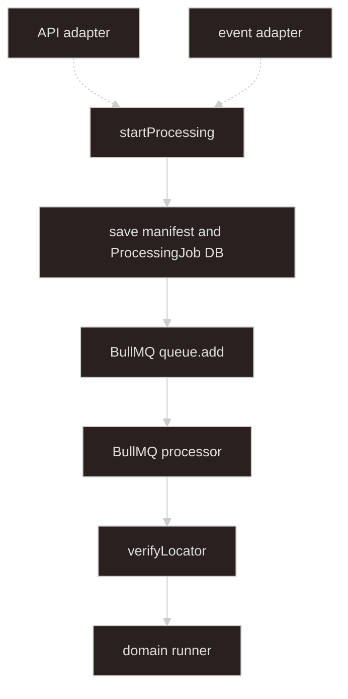

# Async processing

## Goal

**Everything from `startProcessing` onward.** Source-agnostic job orchestration — inputs arrive as validated **`StartProcessingInput`** from [import-upload-handoff](../import-upload-handoff/SKILL.md) adapters.

**Processing records** (phase, outcome, counts) persist in **DB**. **Redis** is for **BullMQ** and **live domain progress** (SSE during the run). **Domain** business logic and **`ErrorDetail`** — separate domain / plugin skills.

**Storage verification** is worker step 1. Upload and start API/event paths are upstream.

---

## Architecture

Boundary at **`startProcessing`**. Dashed arrows: upstream API and event adapters (handoff layer).



Solid arrows: this skill. Dashed arrows: handoff layer — see [import-upload-handoff](../import-upload-handoff/SKILL.md).

| Piece | Role |
| ----- | ---- |
| **[startProcessing](#inside-startprocessing)** | Processing boundary — first method in this layer |
| **[StartProcessingInput](#inbound-from-adapters)** | Inbound DTO from adapters (`domainKind` + `sources`) |
| **[ProcessingManifest](#processing-records-prisma)** | Snapshot of input `sources`; persisted with the job |
| **[ProcessingJob](#processing-records-prisma)** | Durable processing record — phase, outcome, counts |
| **[ProcessingManifestRegistry](#processingmanifestregistry)** | Load/delete manifest during the run (implementation may use DB or Redis) |
| **[ProcessingJobRepository](#processingjobrepository)** | Create and update `ProcessingJob` in DB |
| **[ProcessingSourceReader](#processingsourcereader)** | `verifyLocator`, `openReadStream`, `deleteLocator` |
| **[BullMQ queue](#job-queue-bullmq)** | Dispatches worker jobs; payload is refs only |
| **[Progress pub/sub](#live-progress-and-sse)** | Redis channel for domain `onProgress` during the run |

---

## Terminology

| Term | Meaning |
| ---- | ------- |
| **[StartProcessingInput](#inbound-from-adapters)** | Inbound DTO — built by handoff adapters |
| **[domainKind](#domain-registry)** | Registry key for domain runner and required `sourceId` list (e.g. `sales-report`) |
| **[sourceId](#inbound-from-adapters)** | Routing key for one input (e.g. `mainWorkbook`) |
| **[SourceLocator](#inbound-from-adapters)** | Opaque read handle: local path, object key, … |
| **[ProcessingJob](#processing-records-prisma)** | DB row — durable job lifecycle and outcome |
| **[ProcessingManifest](#processing-records-prisma)** | Input snapshot linked to `ProcessingJob` |
| **[manifestId](#inside-startprocessing)** / **[jobId](#inside-startprocessing)** | Created in `startProcessing` (`ProcessingJob.id`) |
| **[storage verification](#worker-processor-steps)** | Worker step 1: stat / HEAD on each `SourceLocator` |
| **[ASYNC_PROCESSING_QUEUE](#job-queue-bullmq)** | BullMQ queue name (`"async-processing"`) |
| **[AsyncProcessingJobPayload](#job-queue-bullmq)** | BullMQ job data — `jobId`, `domainKind`, `manifestId` only |
| **[ProcessingProgressEvent](#live-progress-and-sse)** | Ephemeral Redis pub/sub payload — domain progress only |

Upload handoff vocabulary stays in [import-upload-handoff](../import-upload-handoff/SKILL.md). Domain types (`DomainRunner`, `ErrorDetail`) stay in domain / plugin skills.

---

## Types

### Inbound (from adapters)

```typescript
type StartProcessingInput = {
  domainKind: string;
  sources: Record<string, ProcessingSource>;
};

type ProcessingSource = {
  sourceId: string;
  label?: string;
  mimeType?: string;
  locator: SourceLocator;
};

type SourceLocator =
  | { kind: "local"; path: string; declaredSizeBytes?: number }
  | {
      kind: "object";
      provider: "s3" | "cos";
      bucket: string;
      key: string;
      declaredSizeBytes?: number;
    };
```

### Registration (processing layer)

```typescript
type SourceSpec = { sourceId: string; required: boolean };

type DomainKindRegistration = {
  domainRunner: DomainRunner; // defined in domain skill
  sourceSpecs: SourceSpec[];
  lockPolicy: ProcessingLockPolicy;
};

type ProcessingLockPolicy =
  | { type: "none" }
  | { type: "global_singleton" };
```

Orchestrator validates `input.sources` against `DomainKindRegistration.sourceSpecs`.

### Verified locator

```typescript
type VerifiedSourceLocator = SourceLocator & {
  sizeBytes: number;
  etag?: string;
};
```

### BullMQ payload

```typescript
export const ASYNC_PROCESSING_QUEUE = "async-processing" as const;

/** BullMQ job data — small refs only; never file bytes or locators */
type AsyncProcessingJobPayload = {
  jobId: string;
  domainKind: string;
  manifestId: string;
};
```

### Live progress (Redis only)

```typescript
/** Published on Redis during domainRunner.run — not persisted per tick */
type ProcessingProgressEvent = {
  jobId: string;
  progress: unknown; // domain/plugin shape, e.g. TabularProcessingProgress
};
```

---

## Processing records (Prisma)

Durable processing history lives in **PostgreSQL** via Prisma. User runs migrations themselves after schema edits.

```prisma
enum ProcessingPhase {
  queued
  processing
  complete
  failed
}

enum ProcessingOutcome {
  success
  validation_failed
  failed
}

model ProcessingJob {
  id              String             @id // jobId (nanoid)
  domainKind      String
  phase           ProcessingPhase    @default(queued)
  outcome         ProcessingOutcome?
  processedCount  Int?
  errorCount      Int?
  errorStorageKey String?            // path/key to error blob; bytes not inline
  createdAt       DateTime           @default(now())
  updatedAt       DateTime           @updatedAt
  completedAt     DateTime?

  manifest ProcessingManifest?
}

model ProcessingManifest {
  id         String   @id // manifestId (nanoid)
  jobId      String   @unique
  domainKind String
  sources    Json     // Record<sourceId, ProcessingSource>
  createdAt  DateTime @default(now())

  job ProcessingJob @relation(fields: [jobId], references: [id], onDelete: Cascade)
}
```

| Field | Notes |
| ----- | ----- |
| `ProcessingJob.phase` | Processing lifecycle — updated in DB at queued → processing → complete/failed |
| `ProcessingJob.outcome` | Set when `phase` is terminal |
| `sources` | JSON copy of validated `StartProcessingInput.sources` at enqueue time |
| `errorStorageKey` | Set on `validation_failed` when domain returns an error blob |

After `prisma generate`, map rows to API/SSE DTOs at the boundary — do not leak Prisma types into domain runners.

---

## ProcessingJobRepository

```typescript
interface ProcessingJobRepository {
  createQueued(job: {
    id: string;
    domainKind: string;
    manifest: {
      id: string;
      sources: Record<string, ProcessingSource>;
    };
  }): Promise<ProcessingJob>;

  updatePhase(id: string, phase: ProcessingPhase): Promise<void>;

  finalize(id: string, patch: {
    phase: "complete" | "failed";
    outcome?: ProcessingOutcome;
    processedCount?: number;
    errorCount?: number;
    errorStorageKey?: string;
    completedAt: Date;
  }): Promise<void>;

  findById(id: string): Promise<ProcessingJob | null>;
}
```

---

## ProcessingManifestRegistry

Ephemeral or DB-backed access while the job runs. May delegate to `ProcessingManifest` row via Prisma.

```typescript
interface ProcessingManifestRegistry {
  saveForJob(manifest: {
    manifestId: string;
    jobId: string;
    domainKind: string;
    sources: Record<string, ProcessingSource>;
  }): Promise<void>;

  getByManifestId(manifestId: string): Promise<{
    manifestId: string;
    jobId: string;
    domainKind: string;
    sources: Record<string, ProcessingSource>;
  } | null>;

  deleteByManifestId(manifestId: string): Promise<void>;
}
```

When using Prisma-only storage, `createQueued` may write both models and `getByManifestId` reads from DB.

---

## ProcessingSourceReader

```typescript
interface ProcessingSourceReader {
  verifyLocator(locator: SourceLocator): Promise<VerifiedSourceLocator>;
  openReadStream(locator: VerifiedSourceLocator): Promise<Readable>;
  deleteLocator(locator: SourceLocator): Promise<void>;
}
```

---

## Inside startProcessing

1. Validate `input.sources` for `input.domainKind` (registry `sourceSpecs`).
2. Lock policy (active job per `domainKind` when `global_singleton`).
3. Create `jobId`, `manifestId`.
4. **`ProcessingJobRepository.createQueued`** — `ProcessingJob` + `ProcessingManifest` in DB, `phase: queued`.
5. **Enqueue** BullMQ job.
6. Return `{ jobId, manifestId }`.

```typescript
await this.asyncProcessingQueue.add(
  "async-processing-job",
  { jobId, domainKind: input.domainKind, manifestId },
  {
    removeOnComplete: { age: 3600 },
    removeOnFail: { age: 3600 },
  },
);
```

---

## Job queue (BullMQ)

Use **BullMQ** via `@nestjs/bullmq` for async dispatch after `startProcessing`.

### Module registration

```typescript
@Module({
  imports: [
    RedisModule,
    BullModule.registerQueue({ name: ASYNC_PROCESSING_QUEUE }),
  ],
  providers: [
    ProcessingOrchestratorService,
    ProcessingJobRepository,
    ProcessingManifestRegistry,
    ProcessingSourceReader,
    ProcessingProgressSseService,
    ProcessingProcessor,
    DomainRegistry,
  ],
})
export class AsyncProcessingModule {}
```

### Processor (worker)

```typescript
@Injectable()
@Processor(ASYNC_PROCESSING_QUEUE)
export class ProcessingProcessor extends WorkerHost {
  async process(job: Job<AsyncProcessingJobPayload>) {
    const { jobId, domainKind, manifestId } = job.data;
    await this.jobRepository.updatePhase(jobId, "processing");

    try {
      const manifest = await this.manifestRegistry.getByManifestId(manifestId);
      // verifyLocator, domainRunner.run, finalize DB record, cleanup
    } catch (error) {
      await this.jobRepository.finalize(jobId, {
        phase: "failed",
        completedAt: new Date(),
      });
      throw error;
    }
  }
}
```

### Queue payload rules

| Put on queue | Do not put on queue |
| --- | --- |
| `jobId`, `domainKind`, `manifestId` | File bytes, buffers, streams |
| | Full `sources` map (load from DB by `manifestId`) |
| | `SourceLocator` paths or object keys |

### Storage roles

| Store | Role |
| ----- | ---- |
| **PostgreSQL** | `ProcessingJob`, `ProcessingManifest` — durable processing records |
| **Redis (BullMQ)** | Job queue |
| **Redis (pub/sub)** | Live `ProcessingProgressEvent` during `domainRunner.run` |
| **Object store / disk** | Error report blob; DB holds `errorStorageKey` only |

Lock policy may use Redis or DB — pick one implementation per deployment.

---

## Live progress and SSE

- **`ProcessingJob.phase`** — read from DB for list/detail APIs and final SSE event.
- **Domain `onProgress`** — publish `ProcessingProgressEvent` to Redis only; do **not** write every tick to DB.
- **SSE** `jobs/:jobId/events` — subscribe to progress channel while running; on terminal phase, emit final snapshot from DB (`phase`, `outcome`, counts).
- Stream ends when DB record reaches `complete` or `failed`.

```typescript
// Inside domainRunner.run io.onProgress
await this.progressPublisher.publish(jobId, detail);
```

---

## Worker (processor steps)

1. Load manifest by `manifestId` (DB or registry).
2. **`verifyLocator`** per source.
3. `domainRunner.run(...)` — `onProgress` publishes to Redis only.
4. **`ProcessingJobRepository.finalize`** — outcome, counts, `errorStorageKey`, `completedAt`.
5. Store error blob when domain returns one; set `errorStorageKey`.
6. Cleanup locators; delete or retain manifest per product policy.
7. Clear active-job lock when policy requires it.

---

## Domain registry

```typescript
registry.register("sales-report", {
  domainRunner: salesReportDomainRunner,
  sourceSpecs: [{ sourceId: "mainWorkbook", required: true }],
  lockPolicy: { type: "global_singleton" },
});
```

Worker calls **`DomainRunner`** from the registry. Domain return value supplies `outcome`, counts, optional error blob — see domain / plugin skills for `ErrorDetail` and `DomainRunResult`.

---

## Frontend

1. Upload handoff → `{ sources }` — [import-upload-handoff](../import-upload-handoff/SKILL.md).
2. **API controller** `POST .../start` → adapter → `startProcessing` — handoff skill.
3. SSE `jobs/:jobId/events` — live domain progress from Redis; terminal state from DB.
4. `GET jobs/:jobId` — load `ProcessingJob` from DB for history after SSE closes.

---

## Invariants

1. **Source-agnostic** — no upload types in orchestrator or worker.
2. **Boundary at `startProcessing`** — nothing in this layer runs before that call.
3. **Processing records in DB** — phase and outcome are durable; not Redis-only.
4. **Redis for queue + live progress** — not the system of record for job history.
5. **Verify in worker** — not at upload time.
6. **No domain row data in processing tables** — business persistence stays in domain layer.

---

## What not to do

| Anti-pattern | Why |
| ------------ | --- |
| `Import` in processing/domain type names | Use `DomainRunner`, `domainKind`, `processedCount` |
| Store full `JobMeta` in Redis as only record | DB holds durable `ProcessingJob` |
| Write domain progress every tick to DB | Redis pub/sub for live SSE |
| Business rows in `ProcessingJob` | Domain layer owns domain models |
| File bytes on BullMQ job or in DB JSON | Locators in manifest; blobs in object store |
| API/event entry points in this module | Belong in import-upload-handoff |

---

## Suggested module layout

```text
processing/
  async-processing.types.ts
  async-processing.module.ts
  domain-registry.service.ts
  processing-orchestrator.service.ts
  processing-job.repository.ts           # Prisma
  processing-manifest.registry.ts
  processing-source.reader.ts
  processing-progress-publisher.service.ts # Redis pub/sub
  processing-progress-sse.service.ts
  processing.processor.ts
```

Prisma schema — `packages/database/prisma/schema.prisma` (or app-owned schema). Run **`prisma generate`** after edits; user applies migrations.

---

## Agent invocation

| Task | Skills |
| ---- | ------ |
| Upload, handoff sources, API/event adapters | `import-upload-handoff` |
| Orchestrator, worker, processing records, SSE | `async-processing` |
| Domain runner, ErrorDetail | domain skill + plugin skills |
