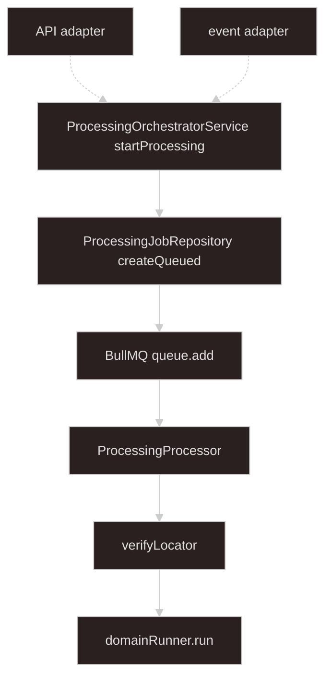

# Async processing

## Goal

**Everything from `startProcessing` onward.** Source-agnostic job orchestration — inputs arrive as validated **`StartProcessingInput`** from [import-upload-handoff](../import-upload-handoff/SKILL.md) adapters.

**Processing records** (`ProcessingJob`, `ProcessingManifest`) persist in **DB**. **Redis** is for **BullMQ** and **live domain progress** (SSE during the run). Domain business logic and **`ErrorDetail`** — plugin skills.

**Storage verification** runs in the worker after **`claimProcessingPhase`**, before **`domainRunner.run`**. Upload and start API/event paths are upstream.

Implement under **`processing/`** (see [Suggested module layout](#suggested-module-layout)). Async import uses **only** this skill set — handoff, upload-\*, async-processing, domain runners, format plugins — not a separate Redis-buffer transport stack.

---

## Architecture

Boundary at **`startProcessing`**. Dashed arrows: upstream API and event adapters (handoff layer).



Solid arrows: this skill. Dashed arrows: handoff layer — see [import-upload-handoff](../import-upload-handoff/SKILL.md).

| Component                                                           | Role                                                                               |
| ------------------------------------------------------------------- | ---------------------------------------------------------------------------------- |
| **[ProcessingOrchestratorService](#processingorchestratorservice)** | Entry point — `startProcessing`                                                    |
| **[ProcessingJobRepository](#processingjobrepository)**             | Job + manifest persistence (Prisma)                                                |
| **[DomainRegistry](#domainregistry)**                               | `domainKind` → runner, `sourceSpecs`, lock policy                                  |
| **[ProcessingSourceReader](#processingsourcereader)**               | Verify, stream, delete locators                                                    |
| **[ProcessingProcessor](#worker)**                                  | BullMQ worker — verify, run domain, finalize                                       |
| **[ProcessingProgressPublisher](#processingprogresspublisher)**     | Redis pub/sub for progress + terminal signal                                       |
| **[ProcessingProgressSseService](#live-progress-and-sse)**          | SSE stream for clients                                                             |
| **[ProcessingActiveJobLock](#processingactivejoblock)**             | Redis `SET NX` per `domainKind` — admission control (BullMQ does not replace this) |
| **[ProcessingErrorBlobStore](#processingerrorblobstore)**           | Persist validation error blob; returns `errorStorageKey`                           |

---

## Terminology

| Term                                                                                           | Meaning                                                                 |
| ---------------------------------------------------------------------------------------------- | ----------------------------------------------------------------------- |
| **[StartProcessingInput](#inbound-from-adapters)**                                             | Inbound DTO — built by handoff adapters                                 |
| **[domainKind](#domainregistry)**                                                              | Registry key (e.g. `sales-report`)                                      |
| **[DomainKindRegistration](#domainregistry)**                                                  | `domainRunner` + `sourceSpecs` + `lockPolicy`                           |
| **[SourceSpec](#domainregistry)**                                                              | Required/optional `sourceId` in a registration                          |
| **[sourceId](#inbound-from-adapters)**                                                         | Routing key for one input (e.g. `mainWorkbook`)                         |
| **[SourceLocator](#inbound-from-adapters)**                                                    | Opaque read handle: local path, object key, …                           |
| **[VerifiedProcessingSource](#verified-processing-source)**                                    | Manifest source + verified locator — passed to `domainRunner.run`       |
| **[ProcessingJob](#processing-records-prisma)**                                                | DB row — durable job lifecycle and outcome                              |
| **[ProcessingManifest](#processing-records-prisma)**                                           | Input snapshot linked to `ProcessingJob`                                |
| **[ProcessingPhase](#processing-lifecycle-types)**                                             | `queued` \| `processing` \| `complete` \| `failed`                      |
| **[ProcessingOutcome](#processing-lifecycle-types)**                                           | `success` \| `validation_failed` \| `failed`                            |
| **[jobId](#processingorchestratorservice)** / **[manifestId](#processingorchestratorservice)** | Created in `startProcessing`; `jobId` === `ProcessingJob.id`            |
| **[storage verification](#worker)**                                                            | Worker step 6 — stat / HEAD each `SourceLocator` before domain run      |
| **[ASYNC_PROCESSING_QUEUE](#job-queue-bullmq)**                                                | BullMQ queue name (`"async-processing"`)                                |
| **[ProcessingProgressEvent](#live-progress-and-sse)**                                          | Ephemeral Redis progress payload                                        |
| **[ProcessingTerminalEvent](#live-progress-and-sse)**                                          | Redis signal for SSE to reload terminal snapshot from DB                |
| **[DomainRunResult](#domain-boundary)**                                                        | Fixed return shape from `DomainRunner.run`                              |
| **[DomainRunner](#domain-boundary)**                                                           | Per-`domainKind` handler invoked by the worker                          |
| **[ActiveJobConflictError](#processingactivejoblock)**                                         | Thrown when `global_singleton` acquire fails — adapter maps to HTTP 409 |

Upload handoff vocabulary: [import-upload-handoff](../import-upload-handoff/SKILL.md). **`ErrorDetail`** — plugin skills (domain-internal).

---

## Types

### Inbound (from adapters)

```typescript
type StartProcessingInput = {
  domainKind: string;
  sources: Record<string, ProcessingSource>;
};

type ProcessingSource = {
  sourceId: string;
  label?: string;
  mimeType?: string;
  locator: SourceLocator;
};

type SourceLocator =
  | { kind: "local"; path: string; declaredSizeBytes?: number }
  | {
      kind: "object";
      provider: "s3" | "cos";
      bucket: string;
      key: string;
      declaredSizeBytes?: number;
    };
```

### Processing lifecycle types

```typescript
type ProcessingPhase = "queued" | "processing" | "complete" | "failed";

type ProcessingOutcome = "success" | "validation_failed" | "failed";
```

Mirror Prisma enums in application code (or import from generated client).

### Verified processing source

Worker verifies locators **before** calling `domainRunner.run`. Domain receives verified handles only — no re-verify in `openStream`.

```typescript
type VerifiedSourceLocator = SourceLocator & {
  sizeBytes: number;
  etag?: string;
};

type VerifiedProcessingSource = ProcessingSource & {
  verifiedLocator: VerifiedSourceLocator;
};
```

### Domain boundary

Fixed contract between worker and domain — **not generic**. Domain maps internal results to this shape before returning.

```typescript
type DomainRunResult =
  | { outcome: "success"; processedCount: number; errorCount: 0 }
  | {
      outcome: "validation_failed";
      processedCount: number;
      errorCount: number;
      errorBlob?: Buffer;
    };

type DomainRunner = {
  domainKind: string;
  run(
    sources: Map<string, VerifiedProcessingSource>,
    io: {
      openStream: (source: VerifiedProcessingSource) => Promise<Readable>;
      onProgress: (detail: unknown) => Promise<void>;
    },
  ): Promise<DomainRunResult>;
};
```

**Worker mapping to `ProcessingJob`**

| `DomainRunResult`   | DB `phase` | DB `outcome`        |
| ------------------- | ---------- | ------------------- |
| `success`           | `complete` | `success`           |
| `validation_failed` | `complete` | `validation_failed` |
| Uncaught throw      | `failed`   | `failed` (or omit)  |

On `validation_failed`, store `errorBlob` via **`ProcessingErrorBlobStore`** and set `errorStorageKey`. When `errorCount > 0`, domain should return an `errorBlob` so clients can download the report.

### BullMQ payload

```typescript
export const ASYNC_PROCESSING_QUEUE = "async-processing" as const;

/** BullMQ job data — small refs only; never file bytes or locators */
type AsyncProcessingJobPayload = {
  jobId: string;
  domainKind: string;
  manifestId: string;
};
```

`domainKind` on the payload lets the worker log/metrics without an extra DB read; manifest is still loaded by `manifestId`.

### Live progress (Redis only)

```typescript
/** Published on Redis during domainRunner.run — not persisted per tick */
type ProcessingProgressEvent = {
  jobId: string;
  progress: unknown; // domain/plugin shape, e.g. TabularProcessingProgress, JsonlProcessingProgress
};

/** Published by worker after finalize — SSE reloads full snapshot from DB */
type ProcessingTerminalEvent = {
  jobId: string;
  phase: "complete" | "failed";
};
```

`phase: "complete"` covers both `outcome: success` and `outcome: validation_failed`; clients read `outcome` from the DB snapshot.

---

## Processing records (Prisma)

Durable processing history lives in **PostgreSQL** via Prisma. User runs migrations themselves after schema edits.

```prisma
enum ProcessingPhase {
  queued
  processing
  complete
  failed
}

enum ProcessingOutcome {
  success
  validation_failed
  failed
}

model ProcessingJob {
  id              String             @id // jobId (nanoid)
  domainKind      String
  phase           ProcessingPhase    @default(queued)
  outcome         ProcessingOutcome?
  processedCount  Int?
  errorCount      Int?
  errorStorageKey String?            // path/key to error blob; bytes not inline
  createdAt       DateTime           @default(now())
  updatedAt       DateTime           @updatedAt
  completedAt     DateTime?

  manifest ProcessingManifest?
}

model ProcessingManifest {
  id         String   @id // manifestId (nanoid)
  jobId      String   @unique
  domainKind String
  sources    Json     // Record<sourceId, ProcessingSource>
  createdAt  DateTime @default(now())

  job ProcessingJob @relation(fields: [jobId], references: [id], onDelete: Cascade)
}
```

| Field                   | Notes                                                                 |
| ----------------------- | --------------------------------------------------------------------- |
| `ProcessingJob.phase`   | Updated in DB at queued → processing → complete/failed                |
| `ProcessingJob.outcome` | Set when `phase` is terminal                                          |
| `sources`               | JSON copy of validated `StartProcessingInput.sources` at enqueue time |
| `errorStorageKey`       | Set on `validation_failed` when domain returns an error blob          |

After `prisma generate`, map rows to API/SSE DTOs at the boundary — do not leak Prisma types into domain runners.

---

## ProcessingJobRepository

Single access point for **`ProcessingJob`** and **`ProcessingManifest`** (Prisma). No separate manifest registry.

```typescript
interface ProcessingJobRepository {
  createQueued(input: {
    jobId: string;
    domainKind: string;
    manifestId: string;
    sources: Record<string, ProcessingSource>;
  }): Promise<ProcessingJob>;

  updatePhase(jobId: string, phase: ProcessingPhase): Promise<void>;

  /** Single-winner queued → processing; returns false if another worker claimed */
  claimProcessingPhase(jobId: string): Promise<boolean>;

  finalize(
    jobId: string,
    patch: {
      phase: "complete" | "failed";
      outcome?: ProcessingOutcome;
      processedCount?: number;
      errorCount?: number;
      errorStorageKey?: string;
      completedAt: Date;
    },
  ): Promise<void>;

  findById(jobId: string): Promise<ProcessingJob | null>;

  /** Orchestrator rollback when enqueue fails after createQueued */
  deleteById(jobId: string): Promise<void>;

  getManifestByManifestId(manifestId: string): Promise<{
    manifestId: string;
    jobId: string;
    domainKind: string;
    sources: Record<string, ProcessingSource>;
  } | null>;
}
```

`createQueued` writes **`ProcessingJob`** and **`ProcessingManifest`** in one transaction.

---

## ProcessingSourceReader

```typescript
interface ProcessingSourceReader {
  verifyLocator(locator: SourceLocator): Promise<VerifiedSourceLocator>;
  openReadStream(locator: VerifiedSourceLocator): Promise<Readable>;
  deleteLocator(locator: SourceLocator): Promise<void>;
}
```

---

## DomainRegistry

```typescript
type SourceSpec = { sourceId: string; required: boolean };

type ProcessingLockPolicy = { type: "none" } | { type: "global_singleton" };

type DomainKindRegistration = {
  domainRunner: DomainRunner;
  sourceSpecs: SourceSpec[];
  lockPolicy: ProcessingLockPolicy;
};

interface DomainRegistry {
  register(domainKind: string, registration: DomainKindRegistration): void;
  getByDomainKind(domainKind: string): DomainKindRegistration;
}
```

Example:

```typescript
registry.register("sales-report", {
  domainRunner: salesReportDomainRunner,
  sourceSpecs: [{ sourceId: "mainWorkbook", required: true }],
  lockPolicy: { type: "global_singleton" },
});
```

Worker calls **`DomainRunner`** from the registry. Domain-internal validation uses **`ErrorDetail`** in plugin skills.

---

## ProcessingOrchestratorService

**Single entry point** for handoff adapters. Owns validation, lock acquisition, DB write, and enqueue.

```typescript
interface ProcessingOrchestratorService {
  startProcessing(
    input: StartProcessingInput,
  ): Promise<{ jobId: string; manifestId: string }>;
}
```

Inject: **`DomainRegistry`**, **`ProcessingJobRepository`**, **`ProcessingActiveJobLock`**, BullMQ queue.

### `startProcessing` steps

1. Resolve **`DomainKindRegistration`** for `input.domainKind`.
2. Validate `input.sources` against `sourceSpecs` (required keys present).
3. Create `jobId`, `manifestId` (nanoid).
4. **`ProcessingJobRepository.createQueued`** — job + manifest in DB, `phase: queued`.
5. When `lockPolicy.type === "global_singleton"`, **`ProcessingActiveJobLock.acquire(domainKind, jobId)`** — on conflict throw **`ActiveJobConflictError`**; orchestrator **`deleteById(jobId)`** and rethrow (adapter maps to HTTP 409).
6. **Enqueue** BullMQ job.
7. Return `{ jobId, manifestId }`.

If step 5 or 6 throws after `createQueued`, orchestrator **`deleteById(jobId)`** (cascade manifest). Release the Redis lock only when **`lockAcquired`** is true.

```typescript
async startProcessing(input: StartProcessingInput) {
  const registration = this.domainRegistry.getByDomainKind(input.domainKind);
  this.validateSources(input.sources, registration.sourceSpecs);

  const jobId = nanoid();
  const manifestId = nanoid();

  await this.jobRepository.createQueued({
    jobId,
    domainKind: input.domainKind,
    manifestId,
    sources: input.sources,
  });

  let lockAcquired = false;

  try {
    if (registration.lockPolicy.type === "global_singleton") {
      await this.activeJobLock.acquire(input.domainKind, jobId);
      lockAcquired = true;
    }

    await this.asyncProcessingQueue.add(
      "async-processing-job",
      { jobId, domainKind: input.domainKind, manifestId },
      {
        attempts: 1,
        removeOnComplete: { age: 3600 },
        removeOnFail: { age: 3600 },
      },
    );
  } catch (error) {
    if (lockAcquired) {
      await this.activeJobLock.release(input.domainKind, jobId);
    }
    await this.jobRepository.deleteById(jobId);
    throw error;
  }

  return { jobId, manifestId };
}
```

Use **`attempts: 1`** (or worker idempotency below) so a terminal `finalize` is never followed by a retry that re-runs domain logic.

### ProcessingActiveJobLock

**Redis recommended.** BullMQ handles job dispatch and worker concurrency — it does **not** provide `global_singleton` admission control or HTTP 409 at `startProcessing`. Use a small Redis-backed lock; DB-only is optional and awkward for TTL/lease.

```typescript
/** Thrown by acquire when global_singleton job already running — adapter maps to HTTP 409 */
class ActiveJobConflictError extends Error {}

interface ProcessingActiveJobLock {
  /** Atomic SET NX — key value is jobId */
  acquire(domainKind: string, jobId: string): Promise<void>; // throws ActiveJobConflictError
  /** Delete key only when value matches jobId */
  release(domainKind: string, jobId: string): Promise<void>;
  /** True when Redis key value equals jobId — orphan lock cleanup after terminal job */
  isHeldBy(jobId: string, domainKind: string): Promise<boolean>;
  /** Extend TTL during long runs — required for global_singleton */
  refreshLease(domainKind: string, jobId: string): Promise<void>;
}
```

**Redis key:** `async-processing:active:{domainKind}` → `{jobId}`.

**Acquire (atomic):**

```typescript
// SET key jobId NX EX ttlSeconds — null reply → ActiveJobConflictError
const ACTIVE_JOB_TTL_SECONDS = 60 * 60 * 24; // match worst-case run; refreshLease for longer
```

**Release (compare-and-delete):**

```typescript
// Lua: if GET key == jobId then DEL key
// No-op when lockPolicy is none (implementation skips Redis)
```

**Stale lock recovery (orchestrator `acquire`):** On **`ActiveJobConflictError`**, read active **`jobId`** from Redis and load **`ProcessingJob`** from DB.

| DB state                                                                                           | Action                                                            |
| -------------------------------------------------------------------------------------------------- | ----------------------------------------------------------------- |
| Job **missing**                                                                                    | **`DEL`** key → **retry `acquire` once**                          |
| **`complete`** or **`failed`**                                                                     | **`DEL`** key → **retry `acquire` once**                          |
| **`processing`** and **`updatedAt`** older than **`STALE_PROCESSING_MS`** (e.g. 2× worst-case run) | **`finalize`** `failed`, **`DEL`** key → **retry `acquire` once** |
| **`processing`** and fresh, or **`queued`** with same active key                                   | **Re-throw** **`ActiveJobConflictError`**                         |

DB phase is durable truth; Redis is the fast gate. Tune **`STALE_PROCESSING_MS`** per domain.

**Crash recovery:** TTL on the key clears orphaned locks when a worker dies before **`release`**. Worker **must** call **`refreshLease(domainKind, jobId)`** at domain-run start and periodically during long runs (e.g. throttled from **`onProgress`** or a timer) so TTL does not expire during queue wait + processing.

| `lockPolicy`       | On active job                  | On worker complete                                                               |
| ------------------ | ------------------------------ | -------------------------------------------------------------------------------- |
| `none`             | no-op                          | no-op                                                                            |
| `global_singleton` | throw `ActiveJobConflictError` | `release(domainKind, jobId)` in worker `finally` (always call; no-op for `none`) |

Lock is acquired **after** `createQueued`. Orchestrator **releases (when acquired) and deletes the job** if enqueue fails.

---

## ProcessingProgressPublisher

```typescript
interface ProcessingProgressPublisher {
  publishProgress(jobId: string, progress: unknown): Promise<void>;
  publishTerminal(jobId: string, event: ProcessingTerminalEvent): Promise<void>;
}
```

Channels: `async-processing:progress:{jobId}`, `async-processing:terminal:{jobId}`.

---

## ProcessingErrorBlobStore

```typescript
interface ProcessingErrorBlobStore {
  /** Returns storage key persisted on ProcessingJob.errorStorageKey */
  putErrorBlob(jobId: string, blob: Buffer): Promise<string>;
}
```

Key convention: e.g. `processing-errors/{jobId}.xlsx`. Bytes never go in DB or BullMQ.

---

## Worker

`@Processor(ASYNC_PROCESSING_QUEUE)` — canonical steps:

1. **Idempotency guard** — if job already `complete` or `failed` in DB, run **orphan lock cleanup** (same as step 2 when terminal) and return.
2. **`claimProcessingPhase(jobId)`** — conditional `queued` → `processing`.
   - If **`false`**: load job — when phase is terminal and Redis lock value equals this **`jobId`**, **`release`**; return.
3. When **`lockPolicy.type === "global_singleton"`**, **`refreshLease(domainKind, jobId)`** — first extension after claim (covers queue wait since orchestrator **`acquire`**).
4. **`getManifestByManifestId(manifestId)`** — if **null**, **`finalize`** `failed`, **`publishTerminal`** (best effort), return.
5. Set **`domainKind = manifest.domainKind`** (authoritative — not BullMQ payload alone).
6. **`verifyLocator`** per source; build **`Map<string, VerifiedProcessingSource>`** (track partial set in **`verifiedForCleanup`**).
7. **`refreshLease`** again before domain run when **`global_singleton`**.
8. **`domainRunner.run`** — `openStream` → **`openReadStream`**; **`onProgress`** → **`publishProgress`**, and **throttled** **`refreshLease`** (e.g. at most once per 60s — not every tick).
9. Store error blob when present; compute **`errorStorageKey`**.
10. **`finalize`** `phase: complete` with outcome from **`DomainRunResult`**.
11. **`publishTerminal`** `{ phase: "complete" }`.
12. **`finally`** (always): **`release(domainKind, jobId)`** first; then **best-effort** **`deleteLocator`** (log per-source failures).

**Error paths**

- **Domain throw (step 8):** **`finalize`** `failed`, **`publishTerminal`** `{ phase: "failed" }` (best effort), rethrow.
- **Post-domain failure (steps 9–11):** log; **retry `finalize` once** with the same **`DomainRunResult`** when the domain succeeded. **Do not** map to `failed` when a valid **`DomainRunResult`** is already in scope. If retry fails, **`publishTerminal`** (best effort) after checking DB phase; leave row as-is when already terminal.
- **Never** wrap steps 9–11 in the same **`catch`** as step 8.

```typescript
@Injectable()
@Processor(ASYNC_PROCESSING_QUEUE)
export class ProcessingProcessor extends WorkerHost {
  async process(job: Job<AsyncProcessingJobPayload>) {
    const { jobId, manifestId } = job.data;
    const verifiedForCleanup: VerifiedProcessingSource[] = [];
    let domainKind = job.data.domainKind; // fallback until manifest loads

    const existing = await this.jobRepository.findById(jobId);
    if (existing?.phase === "complete" || existing?.phase === "failed") {
      return;
    }

    const claimed = await this.jobRepository.claimProcessingPhase(jobId);
    if (!claimed) {
      const row = await this.jobRepository.findById(jobId);
      if (
        row &&
        (row.phase === "complete" || row.phase === "failed") &&
        (await this.activeJobLock.isHeldBy(jobId, row.domainKind))
      ) {
        await this.activeJobLock.release(row.domainKind, jobId);
      }
      return;
    }

    try {
      const manifest =
        await this.jobRepository.getManifestByManifestId(manifestId);
      if (!manifest) {
        await this.jobRepository.finalize(jobId, {
          phase: "failed",
          outcome: "failed",
          completedAt: new Date(),
        });
        await this.progressPublisher.publishTerminal(jobId, {
          phase: "failed",
        });
        return;
      }

      domainKind = manifest.domainKind;
      const registration = this.domainRegistry.getByDomainKind(domainKind);

      const verifiedSources = await this.buildVerifiedSources(
        manifest.sources,
        verifiedForCleanup,
      );

      if (registration.lockPolicy.type === "global_singleton") {
        await this.activeJobLock.refreshLease(domainKind, jobId);
      }

      let result: DomainRunResult;
      try {
        result = await registration.domainRunner.run(verifiedSources, {
          openStream: (source) =>
            this.sourceReader.openReadStream(source.verifiedLocator),
          onProgress: async (detail) => {
            await this.progressPublisher.publishProgress(jobId, detail);
            if (registration.lockPolicy.type === "global_singleton") {
              await this.activeJobLock.refreshLease(domainKind, jobId);
            }
          },
        });
      } catch (domainError) {
        await this.jobRepository.finalize(jobId, {
          phase: "failed",
          outcome: "failed",
          completedAt: new Date(),
        });
        await this.progressPublisher.publishTerminal(jobId, {
          phase: "failed",
        });
        throw domainError;
      }

      try {
        const errorStorageKey =
          result.outcome === "validation_failed" && result.errorBlob
            ? await this.errorBlobStore.putErrorBlob(jobId, result.errorBlob)
            : undefined;

        await this.jobRepository.finalize(jobId, {
          phase: "complete",
          outcome: result.outcome,
          processedCount: result.processedCount,
          errorCount: result.errorCount,
          errorStorageKey,
          completedAt: new Date(),
        });
        await this.progressPublisher.publishTerminal(jobId, {
          phase: "complete",
        });
      } catch (postDomainError) {
        this.logger.error(
          `Post-domain finalize failed for job ${jobId}`,
          postDomainError,
        );
        const row = await this.jobRepository.findById(jobId);
        if (row?.phase === "processing") {
          await this.jobRepository.finalize(jobId, {
            phase: "failed",
            outcome: "failed",
            completedAt: new Date(),
          });
        }
      }
    } finally {
      await this.activeJobLock.release(domainKind, jobId);
      for (const source of verifiedForCleanup) {
        try {
          await this.sourceReader.deleteLocator(source.verifiedLocator);
        } catch (cleanupError) {
          this.logger.warn(
            `deleteLocator failed for job ${jobId}`,
            cleanupError,
          );
        }
      }
    }
  }
}
```

Add **`isHeldBy(jobId, domainKind)`** on **`ProcessingActiveJobLock`** (compare Redis key value) for step 2 orphan cleanup — or inline **`GET`** + compare in the worker.

---

## Live progress and SSE

```typescript
interface ProcessingProgressSseService {
  /** Streams progress events until terminal snapshot from DB, then closes */
  streamJobEvents(jobId: string): Promise<Readable>; // or Observable for Nest SSE helper
}
```

### SSE handler flow

1. Client opens `GET jobs/:jobId/events`.
2. Handler loads **`ProcessingJob`** from DB — if already `complete` or `failed`, emit one snapshot and close.
3. Subscribe to progress and terminal Redis channels for `jobId`.
4. On **progress** — forward `{ jobId, progress }` to client (domain shape); reset idle timer.
5. On **terminal** — **reload `ProcessingJob` from DB**, emit full snapshot (`phase`, `outcome`, counts, `errorStorageKey`), close stream.
6. Heartbeat while subscribed; unsubscribe on client disconnect.
7. **Idle fallback** — if no terminal event within **`SSE_IDLE_TIMEOUT_MS`** (e.g. 60s) after last progress/heartbeat, **reload `ProcessingJob` from DB**:
   - If terminal → emit snapshot and close.
   - If still `queued` or `processing` → emit current DB snapshot (optional) and keep subscribed, or close with guidance to poll **`GET jobs/:jobId`**.

Worker publishes **terminal** immediately after successful **`finalize`** (including `validation_failed` with `phase: complete`). Clients should still poll **`GET jobs/:jobId`** if SSE closes without a terminal snapshot.

Client upload/start sequences: [import-upload-handoff](../import-upload-handoff/SKILL.md).

---

## Job queue (BullMQ)

Use **BullMQ** via `@nestjs/bullmq` for async dispatch after `startProcessing`.

### Module registration

```typescript
@Module({
  imports: [
    RedisModule,
    BullModule.registerQueue({ name: ASYNC_PROCESSING_QUEUE }),
  ],
  providers: [
    ProcessingOrchestratorService,
    ProcessingJobRepository,
    ProcessingSourceReader,
    ProcessingErrorBlobStore,
    ProcessingActiveJobLock,
    ProcessingProgressPublisher,
    ProcessingProgressSseService,
    ProcessingProcessor,
    DomainRegistry,
  ],
})
export class AsyncProcessingModule {}
```

### Queue payload rules

| Put on queue                        | Do not put on queue                               |
| ----------------------------------- | ------------------------------------------------- |
| `jobId`, `domainKind`, `manifestId` | File bytes, buffers, streams                      |
|                                     | Full `sources` map (load from DB by `manifestId`) |
|                                     | `SourceLocator` paths or object keys              |

### Storage roles

| Store                   | Role                                                                           |
| ----------------------- | ------------------------------------------------------------------------------ |
| **PostgreSQL**          | `ProcessingJob`, `ProcessingManifest` — durable processing records             |
| **Redis (BullMQ)**      | Job queue                                                                      |
| **Redis (pub/sub)**     | `ProcessingProgressEvent` (live) + `ProcessingTerminalEvent` (terminal signal) |
| **Redis (active lock)** | `async-processing:active:{domainKind}` — `global_singleton` admission control  |
| **Object store / disk** | Input blobs (upload layer) + error report blob (`errorStorageKey`)             |

---

## Invariants

1. **Source-agnostic** — no upload types in orchestrator or worker.
2. **Boundary at `startProcessing`** — nothing in this layer runs before that call.
3. **Processing records in DB** — phase and outcome are durable; not Redis-only.
4. **Redis for queue + live progress + active lock** — not the system of record for job history.
5. **One repository for job + manifest** — no parallel manifest registry.
6. **Verify in worker** — not at upload time; domain receives **`VerifiedProcessingSource`** only.
7. **No domain row data in processing tables** — business persistence stays in domain layer.
8. **No BullMQ retry after terminal finalize** — `attempts: 1` or worker idempotency guard.
9. **Conditional phase transition** — `claimProcessingPhase` must be single-winner when duplicate workers exist.
10. **BullMQ ≠ domain lock** — worker concurrency or per-domain queues do not replace `ProcessingActiveJobLock`.
11. **Lock release before locator cleanup** — **`finally`** releases Redis lock even when **`deleteLocator`** fails.
12. **Separate domain vs post-domain errors** — post-success **`finalize`** must not be overwritten by a broad **`catch`**.

---

## What not to do

| Anti-pattern                                        | Why                                                           |
| --------------------------------------------------- | ------------------------------------------------------------- |
| `Import` in processing/domain type names            | Use `DomainRunner`, `domainKind`, `processedCount`            |
| Separate manifest registry + repository             | Single `ProcessingJobRepository` (Prisma)                     |
| Redis-only job history                              | DB holds durable `ProcessingJob`                              |
| Write domain progress every tick to DB              | Redis pub/sub for live SSE                                    |
| Business rows in `ProcessingJob`                    | Domain layer owns domain models                               |
| File bytes on BullMQ job or in DB JSON              | Locators in manifest; blobs in object store                   |
| API/event entry points in this module               | Belong in import-upload-handoff                               |
| Re-verify locators inside `openStream`              | Worker verifies once; pass `verifiedLocator`                  |
| Default BullMQ retries on processing jobs           | Double domain runs after `finalize`                           |
| Acquire lock before job row exists                  | Failed acquire blocks domain with no rollback target          |
| Nest `ConflictException` in lock service            | Throw `ActiveJobConflictError`; adapter maps to 409           |
| BullMQ concurrency as `global_singleton`            | Queues jobs instead of 409; use Redis lock at orchestrator    |
| Check-then-set active key without `SET NX`          | Race allows two concurrent starts — use atomic acquire        |
| Redis-buffer job meta + upload bytes stack          | Use DB `ProcessingJob`, object-store locators, handoff skills |
| Broad try/catch around finalize + publishTerminal   | Post-domain errors overwrite terminal success rows            |
| deleteLocator before release in finally             | Locator failure blocks lock release — release first           |
| Optional refreshLease on long global_singleton runs | TTL expiry allows double start mid-job                        |

---

## Suggested module layout

```text
processing/
  async-processing.types.ts
  async-processing.module.ts
  domain-registry.service.ts
  processing-orchestrator.service.ts
  processing-active-job.lock.ts          # Redis SET NX + compare-and-delete release
  processing-job.repository.ts           # Prisma — job + manifest
  processing-source.reader.ts
  processing-error-blob.store.ts
  processing-progress-publisher.service.ts
  processing-progress-sse.service.ts
  processing.processor.ts
```

Prisma schema — `packages/database/prisma/schema.prisma` (or app-owned schema). Run **`prisma generate`** after edits; user applies migrations.

---

## Agent invocation

| Task                                          | Skills                                            |
| --------------------------------------------- | ------------------------------------------------- |
| Upload, handoff sources, API/event adapters   | `import-upload-handoff`                           |
| Orchestrator, worker, processing records, SSE | `async-processing`                                |
| Domain runner implementation, ErrorDetail     | plugin skills (+ `DomainRunResult` in this skill) |
