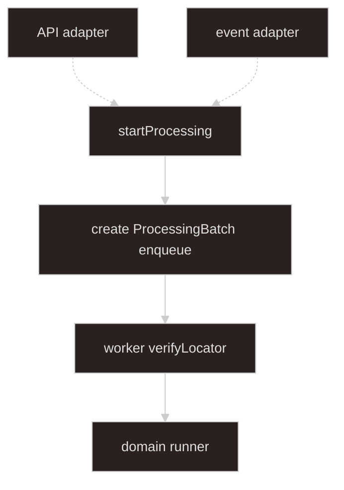

# Async processing

## Goal

**Everything from `startProcessing` onward.** Source-agnostic job orchestration — inputs arrive as validated **`StartProcessingInput`** from [import-upload-handoff](../import-upload-handoff/SKILL.md) adapters.

Only the **domain layer** is `domainKind`-specific. **Storage verification** is worker step 1. **Business validation** is domain / format plugins.

**Job progress** is SSE here. Upload and start API/event paths are upstream.

---

## Architecture

Boundary at **`startProcessing`**. Dashed arrows: upstream API and event adapters (handoff layer).



Solid arrows: this skill. Dashed arrows: handoff layer — see [import-upload-handoff](../import-upload-handoff/SKILL.md).

| Piece | Role |
| ----- | ---- |
| **startProcessing** | Processing boundary — first method in this layer |
| **StartProcessingInput** | Inbound DTO from adapters (`domainKind` + `sources`) |
| **ProcessingBatch** | Created in `startProcessing`; used by worker |
| **ProcessingBatchRegistry** | `saveForJob`, `getByBatchId`, `deleteByBatchId` |
| **ProcessingSourceReader** | `verifyLocator`, `openReadStream`, `deleteLocator` |

---

## Terminology

| Term | Meaning |
| ---- | ------- |
| **StartProcessingInput** | Inbound DTO — built by handoff adapters |
| **domainKind** | Registry key for domain runner and required `sourceId` list |
| **sourceId** | Routing key for one input (e.g. `mainWorkbook`) |
| **SourceLocator** | Opaque read handle: local path, object key, … |
| **batchId** / **jobId** | Created in `startProcessing` |
| **storage verification** | Worker step 1: stat / HEAD on each `SourceLocator` |

Upload vocabulary (`uploadSlotId`, upload `slots`) stays in [import-upload-handoff](../import-upload-handoff/SKILL.md) only.

---

## Types

### Inbound (from adapters)

```typescript
type StartProcessingInput = {
  domainKind: string;
  sources: Record<string, ProcessingSource>;
};

type ProcessingSource = {
  sourceId: string;
  label?: string;
  mimeType?: string;
  locator: SourceLocator;
};

type SourceLocator =
  | { kind: "local"; path: string; declaredSizeBytes?: number }
  | {
      kind: "object";
      provider: "s3" | "cos";
      bucket: string;
      key: string;
      declaredSizeBytes?: number;
    };
```

### Created in startProcessing

```typescript
type ProcessingBatch = {
  batchId: string;
  domainKind: string;
  jobId: string;
  sources: Record<string, ProcessingSource>;
  createdAt: string;
};

type VerifiedSourceLocator = SourceLocator & {
  sizeBytes: number;
  etag?: string;
};

type SourceSlotSpec = { sourceId: string; required: boolean };
```

Orchestrator validates `input.sources` against `DomainKindRegistration.sourceSlots`.

### Job queue and meta

```typescript
type JobMeta = {
  jobId: string;
  domainKind: string;
  batchId: string;
  phase: JobPhase;
  progress?: unknown;
  outcome?: "success" | "validation_failed" | "failed";
  // ...
};

type AsyncProcessingJobPayload = {
  jobId: string;
  domainKind: string;
  batchId: string;
};
```

---

## ProcessingBatchRegistry

```typescript
interface ProcessingBatchRegistry {
  saveForJob(batch: ProcessingBatch): Promise<void>;
  getByBatchId(batchId: string): Promise<ProcessingBatch | null>;
  deleteByBatchId(batchId: string): Promise<void>;
}
```

---

## ProcessingSourceReader

```typescript
interface ProcessingSourceReader {
  verifyLocator(locator: SourceLocator): Promise<VerifiedSourceLocator>;
  openReadStream(locator: VerifiedSourceLocator): Promise<Readable>;
  deleteLocator(locator: SourceLocator): Promise<void>;
}
```

---

## Inside startProcessing

1. Validate `input.sources` for `input.domainKind` (registry `sourceSlots`).
2. Lock policy.
3. Create `jobId`, `batchId`, `ProcessingBatch`.
4. `saveForJob(batch)`.
5. Enqueue `{ jobId, domainKind, batchId }`.
6. Return `{ jobId, batchId }`.

---

## Worker

1. Load `ProcessingBatch` by `batchId`.
2. **`verifyLocator`** per source.
3. `domainRunner.run(sources, { openStream, onProgress })`.
4. Finalize job; cleanup locators.

---

## Domain registry

```typescript
registry.register("sales-import", {
  domainRunner: salesDomainRunner,
  sourceSlots: [{ sourceId: "mainWorkbook", required: true }],
  lockPolicy: { type: "global_singleton" },
});
```

---

## Domain layer

```typescript
type DomainImportRunner = {
  domainKind: string;
  run(
    sources: Map<string, ProcessingSource>,
    io: {
      openStream: (source: ProcessingSource) => Promise<Readable>;
      onProgress: (detail: unknown) => Promise<void>;
    },
  ): Promise<DomainImportResult>;
};
```

Format plugins still use `sourceId` / `label` on errors — see plugin skills.

---

## Frontend

1. Upload handoff → `{ slots }` — [import-upload-handoff](../import-upload-handoff/SKILL.md).
2. **API controller** `POST .../start` → adapter → `startProcessing` — same skill.
3. SSE `jobs/:jobId/events`.

---

## Invariants

1. **Source-agnostic** — no upload, multipart, or presigned URL types in orchestrator or worker.
2. **Boundary at `startProcessing`** — nothing in this layer runs before that call.
3. **Verify in worker** — not in upload upstream.
4. **No adapter logic here** — normalization stays in handoff layer.

---

## What not to do

| Anti-pattern | Why |
| ------------ | --- |
| `importKind` in processing layer | Use `domainKind` |
| Upload types in orchestrator | Map in handoff adapters |
| Storage verify before worker | Worker step 1 |
| API/event entry points in this module | Belong in import-upload-handoff |

---

## Suggested module layout

```text
import/
  processing/
    processing-orchestrator.service.ts   # startProcessing
    processing-batch.registry.ts
    processing-source.reader.ts
    import.processor.ts                  # worker
```

Handoff entry points and adapters — [import-upload-handoff](../import-upload-handoff/SKILL.md) module layout.

---

## Agent invocation

| Task | Skills |
| ---- | ------ |
| Upload, slots, API/event adapters | `import-upload-handoff` |
| Orchestrator, worker, domain, SSE | `async-processing` |
| Format plugins | `import-plugin-tabular-xlsx`, `import-plugin-jsonl` |
