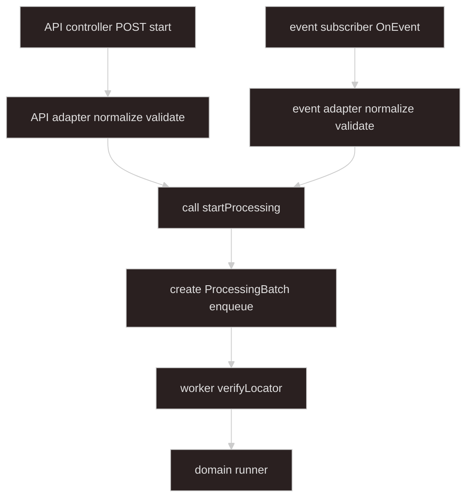

# Processing — inbound contract

## Goal

**Source-agnostic async processing.** Entry points are an **API controller** and an **event subscriber** — each delegates to its own **adapter** that normalizes upstream data into **`StartProcessingInput`**, validates (e.g. Zod), then calls **`startProcessing`**.

- **Upload** — [import-upload-handoff](../import-upload-handoff/SKILL.md) builds upload `slots`; **API or event adapter** maps to `StartProcessingInput`.
- **Direct API** — controller receives body; **API adapter** validates and normalizes.

**Storage verification** is worker step 1. **Business validation** is domain / format plugins.

**Related:** [async-processing](../async-processing/SKILL.md) · [import-upload-handoff](../import-upload-handoff/SKILL.md)

---

## Architecture



**Rule:** controller and subscriber are **thin** — they only forward to an adapter. **Only adapters** call `startProcessing`.

| Piece | Role |
| ----- | ---- |
| **API controller** | HTTP entry — receives raw body, delegates to API adapter |
| **Event subscriber** | Event entry — receives raw payload, delegates to event adapter |
| **API adapter** | Normalize API body (incl. upload handoff shape) → `StartProcessingInput` → orchestrator |
| **Event adapter** | Normalize event payload (incl. upload handoff) → `StartProcessingInput` → orchestrator |
| **StartProcessingInput** | Validated DTO — `domainKind` + `sources` |
| **ProcessingBatch** | Created in `startProcessing`; used by worker |
| **ProcessingBatchRegistry** | `saveForJob`, `getByBatchId`, `deleteByBatchId` |
| **ProcessingSourceReader** | `verifyLocator`, `openReadStream`, `deleteLocator` |

---

## Terminology

| Term | Meaning |
| ---- | ------- |
| **StartProcessingInput** | Normalized, validated inbound DTO for `startProcessing` |
| **domainKind** | Registry key for domain runner and required `sourceId` list (e.g. `sales-import`) |
| **sourceId** | Routing key for one input (e.g. `mainWorkbook`) — not upload-specific |
| **SourceLocator** | Opaque read handle: local path, object key, … |
| **API controller** | HTTP entry point — `POST .../start` |
| **Event subscriber** | `@OnEvent("processing.start-requested")` entry point |
| **API adapter** | Normalizes raw API body → `StartProcessingInput`; calls orchestrator |
| **Event adapter** | Normalizes raw event payload → `StartProcessingInput`; calls orchestrator |
| **batchId** / **jobId** | Created in `startProcessing` |
| **storage verification** | Worker step 1: stat / HEAD on each `SourceLocator` |

Upload vocabulary (`uploadSlotId`, upload `slots`) stays in [import-upload-handoff](../import-upload-handoff/SKILL.md) only.

---

## Types

### Adapter inbound (processing DTO)

```typescript
type StartProcessingInput = {
  domainKind: string;
  sources: Record<string, ProcessingSource>;
};

type ProcessingSource = {
  sourceId: string;
  label?: string;       // display only; was originalName from upload
  mimeType?: string;
  locator: SourceLocator;
};

type SourceLocator =
  | { kind: "local"; path: string; declaredSizeBytes?: number }
  | {
      kind: "object";
      provider: "s3" | "cos";
      bucket: string;
      key: string;
      declaredSizeBytes?: number;
    };
  // future: { kind: "db"; ... } — processing unchanged at adapter boundary
```

### Adapter boundary

```typescript
// API adapter — normalize API body (may include upload handoff fields)
class ApiStartProcessingAdapter {
  async handle(raw: unknown): Promise<{ jobId: string; batchId: string }> {
    const input = this.normalizeAndValidate(raw);
    return this.processingOrchestrator.startProcessing(input);
  }
}

// Event adapter — normalize event payload (often upload handoff shape)
class EventStartProcessingAdapter {
  async handle(raw: unknown): Promise<{ jobId: string; batchId: string }> {
    const input = this.normalizeAndValidate(raw);
    return this.processingOrchestrator.startProcessing(input);
  }
}
```

Shared helper used inside adapters:

```typescript
function mapUploadHandoffToInput(
  domainKind: string,
  slots: UploadHandoffSlots,
): StartProcessingInput;
```

### Created in startProcessing

```typescript
type ProcessingBatch = {
  batchId: string;
  domainKind: string;
  jobId: string;
  sources: Record<string, ProcessingSource>;
  createdAt: string;
};

type VerifiedSourceLocator = SourceLocator & {
  sizeBytes: number;
  etag?: string;
};
```

```typescript
type SourceSlotSpec = { sourceId: string; required: boolean };
```

Orchestrator validates `input.sources` against `DomainKindRegistration.sourceSlots`.

---

## ProcessingBatchRegistry

```typescript
interface ProcessingBatchRegistry {
  saveForJob(batch: ProcessingBatch): Promise<void>;
  getByBatchId(batchId: string): Promise<ProcessingBatch | null>;
  deleteByBatchId(batchId: string): Promise<void>;
}
```

---

## ProcessingSourceReader

```typescript
interface ProcessingSourceReader {
  verifyLocator(locator: SourceLocator): Promise<VerifiedSourceLocator>;
  openReadStream(locator: VerifiedSourceLocator): Promise<Readable>;
  deleteLocator(locator: SourceLocator): Promise<void>;
}
```

---

## Entry points and adapters

Processing has **two entry points**. Each entry point delegates to **one adapter**. Only the adapter calls `startProcessing`.

### API controller (entry)

```typescript
@Post("start")
async start(@Body() body: unknown) {
  return this.apiStartProcessingAdapter.handle(body);
}
```

### API adapter

```http
POST /applications/async-processing/start
Content-Type: application/json

{ "domainKind": "sales-import", "sources": { ... } }
```

Body may also carry upload handoff shape (`domainKind` + `slots`); API adapter maps to `StartProcessingInput` before Zod parse.

→ **202** `{ "jobId": "...", "batchId": "..." }`

### Event subscriber (entry)

```typescript
@OnEvent("processing.start-requested")
async onProcessingStartRequested(payload: unknown) {
  await this.eventStartProcessingAdapter.handle(payload);
}
```

Emitted by [import-upload-handoff](../import-upload-handoff/SKILL.md). Subscriber does not parse — adapter does.

### Event adapter

Normalizes upload handoff payload (`domainKind` + `slots`) or full `StartProcessingInput` → validate → `startProcessing`.

### Upload handoff map (inside adapters)

```typescript
function mapUploadHandoffToInput(
  domainKind: string,
  slots: UploadHandoffSlots,
): StartProcessingInput {
  return {
    domainKind,
    sources: Object.fromEntries(
      Object.entries(slots).map(([id, slot]) => [
        id,
        {
          sourceId: slot.uploadSlotId,
          label: slot.originalName,
          mimeType: slot.mimeType,
          locator: slot.source,
        },
      ]),
    ),
  };
}
```

---

## Inside startProcessing

1. Validate `input.sources` for `input.domainKind` (registry `sourceSlots`).
2. Lock policy.
3. Create `jobId`, `batchId`, `ProcessingBatch`.
4. `saveForJob(batch)`.
5. Enqueue `{ jobId, domainKind, batchId }`.
6. Return `{ jobId, batchId }`.

Worker: load batch → **`verifyLocator`** per source → domain runner.

---

## Invariants

1. **Source-agnostic** — processing types do not mention upload, multipart, or presigned URLs.
2. **Entry then adapter** — controller/subscriber forward raw input; adapter normalizes and validates.
3. **Two adapters only** call `startProcessing` — not controllers or subscribers.
4. **Verify in worker** — not in upload upstream.
5. **Upload handoff maps in adapter** — upload module never calls orchestrator.

---

## Suggested module layout

```text
import/
  contract/
    start-processing-input.schema.ts
    map-upload-handoff-to-input.ts
    processing-batch.registry.ts
    processing-source.reader.ts
  processing/
    async-processing.controller.ts           # API entry
    api-start-processing.adapter.ts          # normalize → startProcessing
    processing-start-requested.listener.ts   # event entry
    event-start-processing.adapter.ts        # normalize → startProcessing
    processing-orchestrator.service.ts
    import.processor.ts
```

---

## Agent invocation

| Task | Skills |
| ---- | ------ |
| Upload handoff | `import-upload-handoff` |
| DTO, adapters, registry, reader | `import-batch-contract` |
| Orchestrator, worker, SSE, domain | `async-processing` |
