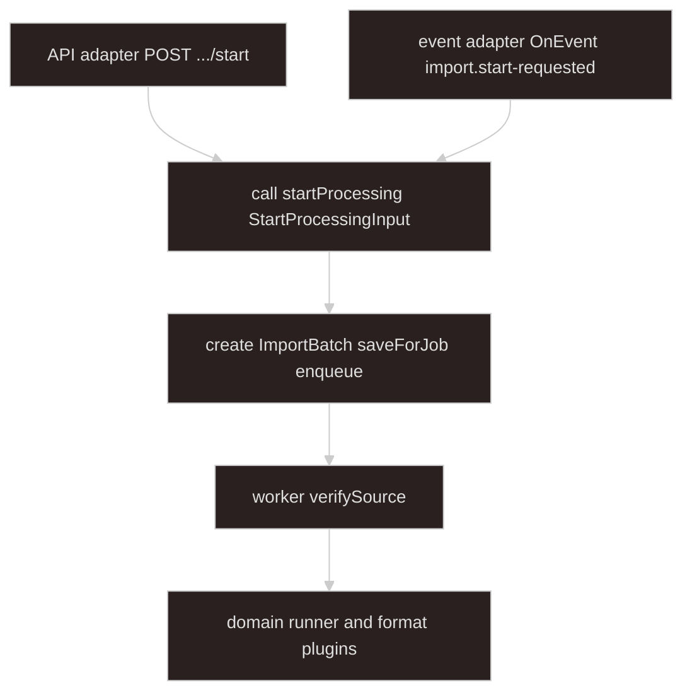

# Import batch — processing inbound contract

## Goal

**Downstream of upload.** [import-upload-handoff](../import-upload-handoff/SKILL.md) ends at **`slots`** or **`import.start-requested`**. This skill starts at the **processing adapters** — the only callers of **`startProcessing`**.

**Storage verification** is worker step 1. **Business validation** is domain / format plugins.

**Related:** [async-processing](../async-processing/SKILL.md) · [import-upload-handoff](../import-upload-handoff/SKILL.md)

---

## Architecture



**Rule:** only **API adapter** and **event adapter** call `startProcessing`.

| Piece | Role |
| ----- | ---- |
| **StartProcessingInput** | Adapter inbound — `importKind` + `slots` |
| **ImportBatch** | Created inside `startProcessing`; used by worker |
| **ImportBatchRegistry** | `saveForJob`, `getByBatchId`, `deleteByBatchId` |
| **ImportBatchSlotReader** | `verifySource`, `openReadStream`, `deleteSource` |

---

## Terminology

| Term | Meaning |
| ---- | ------- |
| **StartProcessingInput** | What adapters pass to `startProcessing` |
| **API adapter** | `AsyncImportController` `POST .../start` |
| **Event adapter** | `ImportStartRequestedListener` `@OnEvent import.start-requested` |
| **batchId** / **jobId** | Created in `startProcessing` |
| **storage verification** | Worker step 1: stat / HEAD |

`uploadSlotId`, `ImportBatchSlot`, `ImportBatchSource` — built upstream; shape in [import-upload-handoff](../import-upload-handoff/SKILL.md).

---

## Types

### Adapter inbound

```typescript
type StartProcessingInput = {
  importKind: string;
  slots: Record<string, ImportBatchSlot>;
};

type ImportBatchSlot = {
  uploadSlotId: string;
  originalName: string;
  mimeType?: string;
  source: ImportBatchSource;
};

type ImportBatchSource =
  | { kind: "local"; path: string; declaredSizeBytes?: number }
  | {
      kind: "object";
      provider: "s3" | "cos";
      bucket: string;
      key: string;
      declaredSizeBytes?: number;
    };
```

### Created in startProcessing

```typescript
type ImportBatch = {
  batchId: string;
  importKind: string;
  jobId: string;
  slots: Record<string, ImportBatchSlot>;
  createdAt: string;
};

type VerifiedImportBatchSource = ImportBatchSource & {
  sizeBytes: number;
  etag?: string;
};
```

```typescript
type UploadSlotSpec = { uploadSlotId: string; required: boolean };
```

Orchestrator validates `input.slots` against `ImportKindRegistration.uploadSlots`.

---

## ImportBatchRegistry

```typescript
interface ImportBatchRegistry {
  saveForJob(batch: ImportBatch): Promise<void>;
  getByBatchId(batchId: string): Promise<ImportBatch | null>;
  deleteByBatchId(batchId: string): Promise<void>;
}
```

| Method | Caller |
| ------ | ------ |
| `saveForJob` | Orchestrator before enqueue |
| `getByBatchId` | Worker |
| `deleteByBatchId` | Worker after terminal state |

---

## ImportBatchSlotReader

```typescript
interface ImportBatchSlotReader {
  verifySource(source: ImportBatchSource): Promise<VerifiedImportBatchSource>;
  openReadStream(source: VerifiedImportBatchSource): Promise<Readable>;
  deleteSource(source: ImportBatchSource): Promise<void>;
}
```

---

## Adapters (only entry points)

### API adapter

```http
POST /applications/async-import/start
Content-Type: application/json

{ "importKind": "sales-import", "slots": { ... } }
```

```typescript
@Post("start")
async start(@Body() body: StartProcessingInput) {
  return this.processingOrchestrator.startProcessing(body);
}
```

→ **202** `{ "jobId": "...", "batchId": "..." }`

Optional `uploadSessionId` to validate `slots` against the upload session that produced them.

### Event adapter

```typescript
@OnEvent("import.start-requested")
async onImportStartRequested(payload: StartProcessingInput) {
  await this.processingOrchestrator.startProcessing(payload);
}
```

Event is **emitted** by [import-upload-handoff](../import-upload-handoff/SKILL.md); listener lives in processing module.

---

## Inside startProcessing

1. Validate `input.slots` for `input.importKind`.
2. Lock policy.
3. Create `jobId`, `batchId`, `ImportBatch`.
4. `saveForJob(batch)`.
5. Enqueue `{ jobId, importKind, batchId }`.
6. Return `{ jobId, batchId }`.

Worker: load batch → **`verifySource`** per slot → domain runner. Details: [async-processing](../async-processing/SKILL.md).

---

## Invariants

1. **Two adapters only** call `startProcessing`.
2. **`ImportBatch` exists only after** an adapter calls `startProcessing`.
3. **Verify in worker** — not at upload time.
4. **Cleanup after terminal job** — `deleteSource`, `deleteByBatchId`.

---

## Suggested module layout

```text
import/
  contract/
    import-batch.types.ts
    import-batch.registry.ts
    import-batch-slot.reader.ts
  processing/
    async-import.controller.ts          # API adapter
    import-start-requested.listener.ts  # event adapter
    processing-orchestrator.service.ts
    import.processor.ts
    ...
```

---

## Agent invocation

| Task | Skills |
| ---- | ------ |
| Upload, slots, emit event | `import-upload-handoff` |
| StartProcessingInput, adapters, registry, reader | `import-batch-contract` |
| Orchestrator, worker, SSE, domain | `async-processing` |
