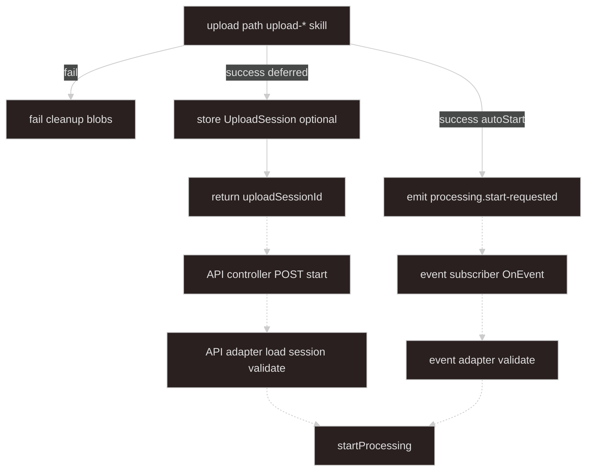

# Import upload and handoff

## Goal

**Shared contract and start paths before `startProcessing`.** Upload-* skills persist bytes and build handoff **`sources`**; **this skill** defines the envelope, **who may start processing**, and **adapters** that call **`ProcessingOrchestratorService.startProcessing`** — the [async-processing](../async-processing/SKILL.md) boundary.

- **Upload failed** — cleanup partial blobs; **no** processing job record, **no** event.
- **Upload succeeded** — ingest returns **`sources`** (and optional **`uploadSessionId`**); see upload-* skills.
- **Deferred start** — client **`POST .../start`** with **`uploadSessionId`** (recommended) → **API adapter** loads canonical sources → `startProcessing`.
- **autoStart** — ingest emits **`processing.start-requested`** → **event adapter** → `startProcessing`.

**Upload progress** — upload-* skills (Nest stream, S3/COS SDK). **Job progress** — [async-processing](../async-processing/SKILL.md) (SSE).

**Ingest implementations:** [upload-local-multipart](../upload-local-multipart/SKILL.md) · [upload-s3-direct](../upload-s3-direct/SKILL.md) · [upload-cos-direct](../upload-cos-direct/SKILL.md)

---

## Scope

| This skill owns | Upload-* skills own |
| --- | --- |
| `UploadHandoffSources`, handoff → `StartProcessingInput` map | Multipart, presigned PUT, COS STS |
| API controller + **API adapter** | Disk paths, presigned URLs, rollback |
| Event subscriber + **event adapter** | `autoStart` emit from upload handler |
| **Deferred start trust model** (`uploadSessionId`) | Writing bytes, building locators |
| Start API **202** / **409** mapping | Upload routes and checklists |

| Neither this skill nor upload-* | [async-processing](../async-processing/SKILL.md) owns |
| --- | --- |
| `startProcessing` implementation, worker, SSE, lock, DB job rows | |

---

## Architecture

Stops at **`startProcessing`**. Solid arrows: ingest (upload-*). Dashed arrows: this skill.



---

## Terminology

| Term | Meaning |
| ---- | ------- |
| **handoff `sources`** | `UploadHandoffSources` — server-built locators from ingest |
| **`uploadSessionId`** | Server id; start API loads canonical `sources` — **do not trust client locators** |
| **`UploadSession`** | Server-stored `{ domainKind, sources, expiresAt }` keyed by `uploadSessionId` |
| **sourceId** | Routing key (e.g. `mainWorkbook`); map key should match `entry.sourceId` |
| **originalName** | Client filename; maps to `ProcessingSource.label` |
| **SourceLocator** | `local` path or `object` bucket/key — **server-generated at ingest** |
| **autoStart** | Ingest emits event; requires `domainKind` on upload session |
| **StartProcessingInput** | Adapter output — [async-processing inbound](../async-processing/SKILL.md#inbound-from-adapters) |
| **API / event adapter** | Only handoff code that may call `startProcessing` |
| **ActiveJobConflictError** | `global_singleton` busy — API → **409**; event → log + skip (default) |

---

## Handoff sources

```typescript
type UploadHandoffEntry = {
  sourceId: string;
  originalName: string;
  mimeType?: string;
  locator: SourceLocator;
};

type SourceLocator =
  | { kind: "local"; path: string; declaredSizeBytes?: number }
  | {
      kind: "object";
      provider: "s3" | "cos";
      bucket: string;
      key: string;
      declaredSizeBytes?: number;
    };

type UploadHandoffSources = Record<string, UploadHandoffEntry>;

type UploadSession = {
  uploadSessionId: string;
  domainKind: string;
  sources: UploadHandoffSources;
  expiresAt: Date;
};
```

**Ingest rules** (upload-* skills)

- **Server owns `path` and `key`** — never accept from client on upload routes.
- **No HEAD/stat** at ingest — worker verify in [async-processing](../async-processing/SKILL.md#worker).
- **No `ProcessingJobRepository`** at ingest.
- **Ingest never calls `startProcessing`** — adapters only.

After successful ingest, **persist `UploadSession`** (Redis or DB) when using deferred start, then return **`uploadSessionId`** to the client.

---

## Deferred start: trust model

**Default (recommended): session-backed start**

Client must **not** echo locators on `POST .../start`. Client sends **`uploadSessionId`** (+ optional `domainKind` for verification). API adapter **loads `UploadSession` server-side** and builds `StartProcessingInput` from stored `sources`.

```http
POST /applications/async-processing/start
Content-Type: application/json

{ "uploadSessionId": "sess_abc", "domainKind": "sales-report" }
```

```typescript
async resolveSourcesForStart(body: StartApiBody): Promise<StartProcessingInput> {
  const session = await this.uploadSessionStore.get(body.uploadSessionId);
  if (!session || session.expiresAt < new Date()) {
    throw new NotFoundException("Upload session expired or unknown");
  }
  if (body.domainKind && body.domainKind !== session.domainKind) {
    throw new BadRequestException("domainKind mismatch");
  }
  return mapUploadHandoffToInput(session.domainKind, session.sources);
}
```

Reject start bodies that carry **`sources` with locators** unless behind an explicit **signed-locator** mode (HMAC token from upload response) — not the default.

**autoStart (event path):** payload `{ domainKind, sources }` is **in-process** from ingest — locators are trusted because upload code just built them. Same process, no client round-trip.

---

## Adapter output (processing boundary DTO)

Canonical: [async-processing — Inbound](../async-processing/SKILL.md#inbound-from-adapters).

```typescript
type StartProcessingInput = {
  domainKind: string;
  sources: Record<string, ProcessingSource>;
};

type ProcessingSource = {
  sourceId: string;
  label?: string;
  mimeType?: string;
  locator: SourceLocator;
};
```

---

## Validation

**Adapter** (before `startProcessing`):

- Parse raw body / event with Zod.
- Resolve **`StartProcessingInput`** via session store or trusted in-process payload.
- Shape checks: non-empty `domainKind`, at least one source, each `sourceId` key matches `entry.sourceId`, locators present.

**Orchestrator** ([async-processing](../async-processing/SKILL.md)): validate against **`DomainKindRegistration.sourceSpecs`** (required keys). Adapters do **not** duplicate registry rules.

```typescript
const startApiBodySchema = z.object({
  uploadSessionId: z.string().min(1),
  domainKind: z.string().min(1).optional(),
});

const processingStartRequestedSchema = z.object({
  domainKind: z.string().min(1),
  sources: z.record(
    z.string(),
    z.object({
      sourceId: z.string().min(1),
      originalName: z.string(),
      mimeType: z.string().optional(),
      locator: sourceLocatorSchema,
    }),
  ),
});
```

---

## Entry points and adapters

Controllers and subscribers are **thin**. **Only adapters** call **`processingOrchestrator.startProcessing`**.

### API controller (entry)

```typescript
@Post("start")
@HttpCode(202)
async start(@Body() body: unknown) {
  return this.apiStartProcessingAdapter.handle(body);
}
```

Controller sets **202 Accepted**; adapter returns `{ jobId, manifestId }`.

### API adapter

→ **202** `{ "jobId": "...", "manifestId": "..." }`  
→ **409** on **`ActiveJobConflictError`** (`global_singleton`)

```typescript
class ApiStartProcessingAdapter {
  async handle(raw: unknown): Promise<{ jobId: string; manifestId: string }> {
    const input = await this.resolveAndValidateStartInput(raw);
    try {
      return await this.processingOrchestrator.startProcessing(input);
    } catch (error) {
      if (error instanceof ActiveJobConflictError) {
        throw new ConflictException({
          code: "PROCESSING_ACTIVE_JOB",
          message: `A processing job is already active for domainKind ${input.domainKind}`,
        });
      }
      throw error;
    }
  }
}
```

### Event subscriber (entry)

```typescript
@OnEvent("processing.start-requested")
async onProcessingStartRequested(payload: unknown) {
  await this.eventStartProcessingAdapter.handle(payload);
}
```

### Event adapter

**Default on `ActiveJobConflictError`:** log at **warn**, **return without throw** (upload already succeeded; no HTTP client). Do not enqueue a second job.

```typescript
class EventStartProcessingAdapter {
  private readonly logger = new Logger(EventStartProcessingAdapter.name);

  async handle(raw: unknown): Promise<{ jobId: string; manifestId: string } | void> {
    const input = this.normalizeAndValidateFromEvent(raw);
    try {
      return await this.processingOrchestrator.startProcessing(input);
    } catch (error) {
      if (error instanceof ActiveJobConflictError) {
        this.logger.warn(
          `Skipped autoStart for ${input.domainKind}: active job already running`,
        );
        return;
      }
      throw error;
    }
  }
}
```

### Handoff to processing map

```typescript
function mapUploadHandoffToInput(
  domainKind: string,
  handoffSources: UploadHandoffSources,
): StartProcessingInput {
  return {
    domainKind,
    sources: Object.fromEntries(
      Object.entries(handoffSources).map(([key, entry]) => {
        if (key !== entry.sourceId) {
          throw new BadRequestException(`sourceId mismatch: ${key} vs ${entry.sourceId}`);
        }
        return [
          key,
          {
            sourceId: entry.sourceId,
            label: entry.originalName,
            mimeType: entry.mimeType,
            locator: entry.locator,
          },
        ];
      }),
    ),
  };
}
```

---

## On upload success

| Mode | Ingest action | Start path |
| ---- | ------------- | ---------- |
| **Deferred (default S3/COS/local)** | Save **`UploadSession`**, return `{ uploadSessionId }` | Client **`POST .../start`** with session id |
| **autoStart (optional local)** | Emit `{ domainKind, sources }` in-process | Event adapter |

Local multipart: [upload-local-multipart](../upload-local-multipart/SKILL.md).

---

## Invariants

1. **Fail → cleanup only** — no processing job record, no event.
2. **Ingest → handoff `sources` or session only** — no `startProcessing` from upload code.
3. **Deferred start → session-backed locators** — adapter loads `sources` from server store.
4. **Entry then adapter** — controller/subscriber forward raw input.
5. **Only adapters call `startProcessing`**.
6. **No storage verify** at ingest time.
7. **Upload progress ≠ job SSE**.

---

## What not to do

| Anti-pattern | Why |
| ------------ | --- |
| Trust client-supplied `locator` on `POST .../start` | Forged paths / keys — use `uploadSessionId` |
| Upload code calls `startProcessing` | Adapters only |
| Controller/subscriber calls `startProcessing` | Delegate to adapter |
| Skip adapter normalization | Adapters own parse + session resolve |
| HEAD/stat at ingest | Worker verify in async-processing |
| Swallow `ActiveJobConflictError` on API start | Map to HTTP 409 |
| Rethrow `ActiveJobConflictError` on autoStart default | Log + skip — upload already succeeded |

---

## Suggested module layout

```text
import/
  handoff/
    upload-session.types.ts
    upload-session.store.ts              # Redis or DB — canonical sources for deferred start
    start-processing-input.schema.ts
    map-upload-handoff-to-input.ts
    start-processing.controller.ts       # POST .../start — 202
    api-start-processing.adapter.ts
    processing-start-requested.listener.ts
    event-start-processing.adapter.ts
  upload/
    local-multipart/
    s3-direct/
    cos-direct/
```

---

## Checklists

**New handoff / start wiring (this skill):**

```text
- [ ] UploadSession store + TTL for deferred start
- [ ] POST .../start accepts uploadSessionId; adapter loads sources server-side
- [ ] API adapter maps ActiveJobConflictError → 409; controller @HttpCode(202)
- [ ] Event adapter: ActiveJobConflictError → log warn + return
- [ ] mapUploadHandoffToInput + Zod schemas
```

**New ingest path (upload-* skill + handoff ingest rules):**

```text
- [ ] Fail → cleanup blobs, no event, no ProcessingJobRepository
- [ ] Success → server-generated path/key; save UploadSession or emit autoStart
- [ ] Document sourceId constants for the client
```

---

## Agent invocation

| Task | Skills |
| ---- | ------ |
| Handoff types, session store, start adapters | `import-upload-handoff` |
| Multipart / S3 / COS ingest | upload-* + this skill (ingest rules) |
| Orchestrator, worker, SSE, lock | `async-processing` |
