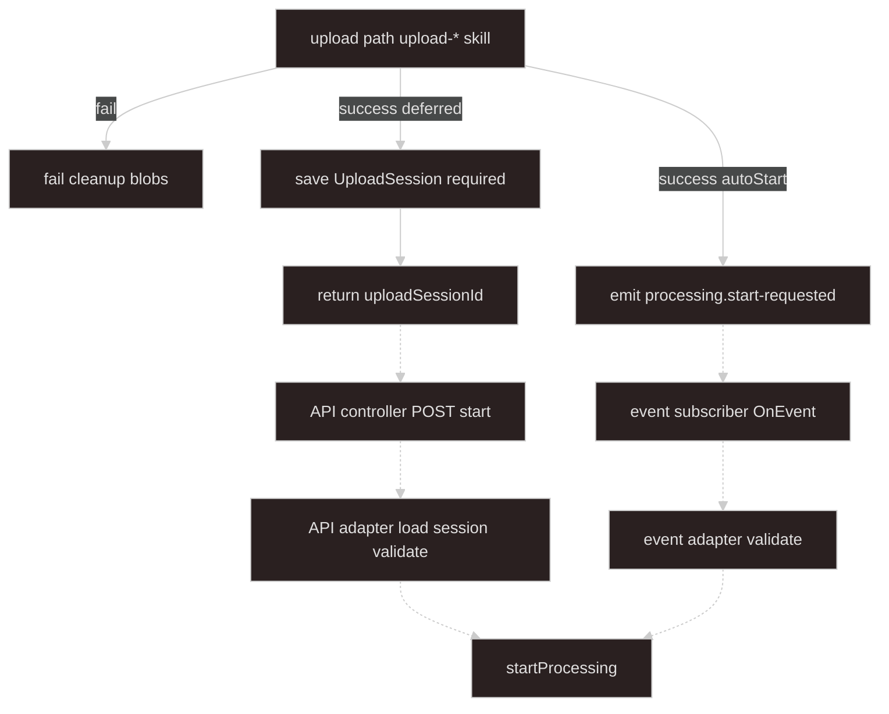

# Start processing adapters

## Goal

**How upload paths trigger `startProcessing`.** Upload-* skills persist bytes and build **`UploadSessionSources`** server-side; **this skill** defines **`UploadSessionStore`**, **API/event adapters**, and the mapping to [**`ProcessingOrchestratorService.startProcessing`**](../async-processing/SKILL.md#processingorchestratorservice).

- **Upload failed** — cleanup partial blobs; **no** processing job record, **no** event.
- **Upload succeeded (deferred)** — ingest saves **`UploadSession`**, returns **`{ uploadSessionId }`** to client only — not locators.
- **Upload succeeded (autoStart)** — ingest emits **`processing.start-requested`** with in-process `{ domainKind, sources }`.
- **Deferred start** — client **`POST .../start`** with **`uploadSessionId`** → **API adapter** loads session → `startProcessing` → **consumes session**.

**Upload progress** — upload-* skills (Nest stream, S3/COS SDK). **Job progress** — [async-processing](../async-processing/SKILL.md) (SSE).

**Upload ingest:** [upload-local-multipart](../upload-local-multipart/SKILL.md) · [upload-s3-direct](../upload-s3-direct/SKILL.md) · [upload-cos-direct](../upload-cos-direct/SKILL.md)

---

## Scope

| This skill owns | Upload-* skills own |
| --- | --- |
| **`UploadSessionSources`**, map → **`StartProcessingInput`** | Multipart, presigned PUT, COS STS |
| API controller + **API adapter** | Disk paths, presigned URLs, rollback |
| Event subscriber + **event adapter** | `autoStart` emit from upload handler |
| **Deferred start trust model** (`uploadSessionId`) + **`UploadSessionStore`** | Writing bytes, building locators |
| Start API **202** / **409** mapping | Upload routes and checklists |

| Neither this skill nor upload-* | [async-processing](../async-processing/SKILL.md) owns |
| --- | --- |
| `startProcessing` implementation, worker, SSE, lock, DB job rows | |

---

## Architecture

Stops at **`startProcessing`**. Solid arrows: ingest (upload-*). Dashed arrows: this skill.



---

## Terminology

| Term | Meaning |
| ---- | ------- |
| **`UploadSessionSources`** | Server-built locators from ingest — stored on session or passed in-process |
| **`uploadSessionId`** | Server id; start API loads canonical `sources` — **do not trust client locators** |
| **`UploadSession`** | Server-stored `{ domainKind, sources, expiresAt }`; optional **`startedJobId`** for idempotent replay |
| **`UploadSessionStore`** | `save` / `get` / `consume` — ingest saves; adapter loads and consumes on successful start |
| **sourceId** | Routing key (e.g. `mainWorkbook`); map key should match `entry.sourceId` |
| **originalName** | Client filename; maps to `ProcessingSource.label` |
| **SourceLocator** | `local` path or `object` bucket/key — **server-generated at ingest** |
| **autoStart** | Ingest emits event; requires `domainKind` on upload session |
| **StartProcessingInput** | Adapter output — [async-processing inbound](../async-processing/SKILL.md#inbound-from-adapters) |
| **API / event adapter** | Only start-adapter code that may call `startProcessing` |
| **ActiveJobConflictError** | `global_singleton` busy — API → **409**; event → log + skip (default) |

---

## Session source types

```typescript
type UploadSourceEntry = {
  sourceId: string;
  originalName: string;
  mimeType?: string;
  locator: SourceLocator;
};

type SourceLocator =
  | { kind: "local"; path: string; declaredSizeBytes?: number }
  | {
      kind: "object";
      provider: "s3" | "cos";
      bucket: string;
      key: string;
      declaredSizeBytes?: number;
    };

type UploadSessionSources = Record<string, UploadSourceEntry>;
```

Types may live in `upload-session.types.ts` alongside **`UploadSession`** below.

## Upload session

```typescript
type UploadSession = {
  uploadSessionId: string;
  domainKind: string;
  sources: UploadSessionSources;
  expiresAt: Date;
  /** Set after first successful start — optional idempotent replay */
  startedJobId?: string;
  startedManifestId?: string;
};

interface UploadSessionStore {
  save(session: UploadSession): Promise<void>;
  get(uploadSessionId: string): Promise<UploadSession | null>;
  /** Delete session after successful start (default) */
  consume(uploadSessionId: string): Promise<void>;
}
```

Ingest calls **`save`** after building `sources`. Adapters call **`get`**; API adapter calls **`consume`** after successful **`startProcessing`** (or sets **`startedJobId`** for idempotent retry — pick one policy per deployment).

### Session lifecycle (deferred start)

| Step | Session state |
| ---- | ------------- |
| Ingest success | **`save`** — session pending |
| **`POST .../start`** loads session | **`get`** — must exist and `expiresAt` in future |
| **`startProcessing` succeeds** | **`consume`** (recommended) **or** set **`startedJobId`** / **`startedManifestId`** and return same ids on replay |
| **`startProcessing` fails** (409, enqueue error) | **Keep session** — client may retry start with same **`uploadSessionId`** |
| Second **`POST .../start`** after **`consume`** | **`get`** → null → **404** — client must re-upload |

**Recommended:** **`consume`** immediately after successful **`startProcessing`**. Client retries that lost the 202 response must re-upload (or implement **`startedJobId`** idempotency instead of consume).

**Ingest rules** (upload-* skills)

- **Server owns `path` and `key`** — never accept from client on upload routes.
- **No HEAD/stat** at ingest — worker verify in [async-processing](../async-processing/SKILL.md#worker).
- **No `ProcessingJobRepository`** at ingest.
- **Ingest never calls `startProcessing`** — adapters only.

After successful ingest, **persist `UploadSession`** (Redis or DB) when using deferred start, then return **`uploadSessionId`** to the client.

---

## Deferred start: trust model

**Default (recommended): session-backed start**

Client must **not** echo locators on `POST .../start`. Client sends **`uploadSessionId`** (+ optional `domainKind` for verification). API adapter **loads `UploadSession` server-side** and builds `StartProcessingInput` from stored `sources`.

```http
POST /applications/async-processing/start
Content-Type: application/json

{ "uploadSessionId": "sess_abc", "domainKind": "sales-report" }
```

Parse with **`startApiBodySchema.strict()`** — reject bodies that include client **`sources`**. Load session via **`UploadSessionStore.get`**, map with **`mapSessionSourcesToStartInput`**, then **`startProcessing`**. See **API adapter** below for **`consume`** and failure retry behavior.

When using **`consume`** after success, a replayed **`uploadSessionId`** gets **404** (session gone). With **`startedJobId`** idempotency instead, return stored **`{ jobId, manifestId }`** on replay.

Reject **signed-locator** mode only when explicitly implemented — not the default.

**autoStart (event path):** payload `{ domainKind, sources }` is **in-process** from ingest — locators are trusted because upload code just built them. Same process, no client round-trip.

---

## Adapter output (processing boundary DTO)

Canonical: [async-processing — Inbound](../async-processing/SKILL.md#inbound-from-adapters).

```typescript
type StartProcessingInput = {
  domainKind: string;
  sources: Record<string, ProcessingSource>;
};

type ProcessingSource = {
  sourceId: string;
  label?: string;
  mimeType?: string;
  locator: SourceLocator;
};
```

---

## Validation

**Adapter** (before `startProcessing`):

- Parse raw body / event with Zod.
- Resolve **`StartProcessingInput`** via session store or trusted in-process payload.
- Shape checks: non-empty `domainKind`, at least one source, each `sourceId` key matches `entry.sourceId`, locators present.

**Orchestrator** ([async-processing — `startProcessing`](../async-processing/SKILL.md#processingorchestratorservice)): validate against **`DomainKindRegistration.sourceSpecs`**. Adapters do **not** duplicate registry rules.

```typescript
const sourceLocatorSchema = z.discriminatedUnion("kind", [
  z.object({
    kind: z.literal("local"),
    path: z.string().min(1),
    declaredSizeBytes: z.number().int().nonnegative().optional(),
  }),
  z.object({
    kind: z.literal("object"),
    provider: z.enum(["s3", "cos"]),
    bucket: z.string().min(1),
    key: z.string().min(1),
    declaredSizeBytes: z.number().int().nonnegative().optional(),
  }),
]);

/** POST .../start — session id only; rejects unknown keys (e.g. client sources) */
const startApiBodySchema = z
  .object({
    uploadSessionId: z.string().min(1),
    domainKind: z.string().min(1).optional(),
  })
  .strict();

/** Event path only — in-process payload from ingest */
const processingStartRequestedSchema = z.object({
  domainKind: z.string().min(1),
  sources: z.record(
    z.string(),
    z.object({
      sourceId: z.string().min(1),
      originalName: z.string(),
      mimeType: z.string().optional(),
      locator: sourceLocatorSchema,
    }),
  ),
});
```

---

## Entry points and adapters

Controllers and subscribers are **thin**. **Only adapters** call **`processingOrchestrator.startProcessing`**.

### API controller (entry)

```typescript
@Post("start")
@HttpCode(202)
async start(@Body() body: unknown) {
  return this.apiStartProcessingAdapter.handle(body);
}
```

Controller sets **202 Accepted**; adapter returns `{ jobId, manifestId }`.

### API adapter

→ **202** `{ "jobId": "...", "manifestId": "..." }`  
→ **409** on **`ActiveJobConflictError`** (`global_singleton`)

```typescript
class ApiStartProcessingAdapter {
  async handle(raw: unknown): Promise<{ jobId: string; manifestId: string }> {
    const body = startApiBodySchema.parse(raw);
    const session = await this.uploadSessionStore.get(body.uploadSessionId);
    if (!session || session.expiresAt < new Date()) {
      throw new NotFoundException("Upload session expired or unknown");
    }
    if (session.startedJobId && session.startedManifestId) {
      return { jobId: session.startedJobId, manifestId: session.startedManifestId };
    }

    const input = mapSessionSourcesToStartInput(session.domainKind, session.sources);
    try {
      const result = await this.processingOrchestrator.startProcessing(input);
      await this.uploadSessionStore.consume(body.uploadSessionId);
      return result;
    } catch (error) {
      if (error instanceof ActiveJobConflictError) {
        throw new ConflictException({
          code: "PROCESSING_ACTIVE_JOB",
          message: `A processing job is already active for domainKind ${input.domainKind}`,
        });
      }
      throw error;
    }
  }
}
```

On **`startProcessing` failure**, do **not** **`consume`** — client may retry with the same **`uploadSessionId`**. Alternative idempotency: persist **`startedJobId`** on session instead of **`consume`**, and return stored ids when set (omit **`consume`** in that mode).

### Event subscriber (entry)

```typescript
@OnEvent("processing.start-requested")
async onProcessingStartRequested(payload: unknown) {
  await this.eventStartProcessingAdapter.handle(payload);
}
```

### Event adapter

**Default on `ActiveJobConflictError`:** log at **warn**, **return without throw** (upload already succeeded; no HTTP client). Do not enqueue a second job.

```typescript
class EventStartProcessingAdapter {
  private readonly logger = new Logger(EventStartProcessingAdapter.name);

  async handle(raw: unknown): Promise<{ jobId: string; manifestId: string } | void> {
    const input = this.normalizeAndValidateFromEvent(raw);
    try {
      return await this.processingOrchestrator.startProcessing(input);
    } catch (error) {
      if (error instanceof ActiveJobConflictError) {
        this.logger.warn(
          `Skipped autoStart for ${input.domainKind}: active job already running`,
        );
        return;
      }
      throw error;
    }
  }
}
```

### Map session sources to StartProcessingInput

```typescript
function mapSessionSourcesToStartInput(
  domainKind: string,
  sessionSources: UploadSessionSources,
): StartProcessingInput {
  return {
    domainKind,
    sources: Object.fromEntries(
      Object.entries(sessionSources).map(([key, entry]) => {
        if (key !== entry.sourceId) {
          throw new BadRequestException(`sourceId mismatch: ${key} vs ${entry.sourceId}`);
        }
        return [
          key,
          {
            sourceId: entry.sourceId,
            label: entry.originalName,
            mimeType: entry.mimeType,
            locator: entry.locator,
          },
        ];
      }),
    ),
  };
}
```

---

## On upload success

| Mode | Ingest action | Start path |
| ---- | ------------- | ---------- |
| **Deferred (default S3/COS/local)** | Save **`UploadSession`**, return `{ uploadSessionId }` | Client **`POST .../start`** with session id |
| **autoStart (optional local)** | Emit `{ domainKind, sources }` in-process | Event adapter |

Local multipart: [upload-local-multipart](../upload-local-multipart/SKILL.md).

---

## Invariants

1. **Fail → cleanup only** — no processing job record, no event.
2. **Ingest → session or in-process sources only** — no `startProcessing` from upload code.
3. **Deferred start → session-backed locators** — adapter loads `sources` from **`UploadSessionStore`**.
4. **Consume session after successful start** — prevent replay double-jobs (or use **`startedJobId`** idempotency).
5. **Entry then adapter** — controller/subscriber forward raw input.
6. **Only adapters call `startProcessing`**.
7. **No storage verify** at ingest time.
8. **Upload progress ≠ job SSE**.

---

## What not to do

| Anti-pattern | Why |
| ------------ | --- |
| Trust client-supplied `locator` on `POST .../start` | Forged paths / keys — use `uploadSessionId` |
| Upload code calls `startProcessing` | Adapters only |
| Controller/subscriber calls `startProcessing` | Delegate to adapter |
| Skip adapter normalization | Adapters own parse + session resolve |
| HEAD/stat at ingest | Worker verify in async-processing |
| Swallow `ActiveJobConflictError` on API start | Map to HTTP 409 |
| Rethrow `ActiveJobConflictError` on autoStart default | Log + skip — upload already succeeded |
| Start without `consume` / idempotency | Same `uploadSessionId` can enqueue duplicate jobs |
| `startApiBodySchema` without `.strict()` | Client can POST forged `sources` alongside session id |

---

## Suggested module layout

Nest under **`async-processing/`**. **`StartProcessingAdaptersModule`** imports **`AsyncProcessingCoreModule`**; the umbrella **`AsyncProcessingModule`** imports both. Upload-* modules import **`AsyncProcessingModule`** (or **`UploadSessionStore`** via that export) to call **`save`**.

```text
async-processing/
  async-processing-core.module.ts
  async-processing.module.ts             # umbrella — AppModule imports this
  start-processing-adapters/
    start-processing-adapters.module.ts
    upload-session.types.ts
    upload-session.store.ts              # Redis or DB — canonical sources for deferred start
    start-processing-input.schema.ts
    map-session-sources-to-start-input.ts
    start-processing.controller.ts       # POST .../start — 202
    api-start-processing.adapter.ts
    processing-start-requested.listener.ts
    event-start-processing.adapter.ts
  upload/                                # upload-* skills (future)
    local-multipart/
    s3-direct/
    cos-direct/
```

---

## Checklists

**New start adapters (this skill):**

```text
- [ ] UploadSessionStore: save, get, consume (+ TTL on save)
- [ ] startApiBodySchema.strict() — uploadSessionId only on POST .../start
- [ ] Consume session after successful startProcessing (or startedJobId idempotency)
- [ ] Keep session on start failure so client can retry
- [ ] API adapter: ActiveJobConflictError → 409; controller @HttpCode(202)
- [ ] Event adapter: ActiveJobConflictError → log warn + return
- [ ] mapSessionSourcesToStartInput + sourceLocatorSchema for event path
```

**New ingest path (upload-* skill + ingest rules above):**

```text
- [ ] Fail → cleanup blobs, no event, no ProcessingJobRepository
- [ ] Success → server-generated path/key; save UploadSession or emit autoStart
- [ ] Document sourceId constants for the client
```

---

## Agent invocation

| Task | Skills |
| ---- | ------ |
| Session store, start API/event adapters | `start-processing-adapters` |
| Multipart / S3 / COS ingest | upload-* + this skill (ingest rules) |
| Orchestrator, worker, SSE, lock | `async-processing` |
