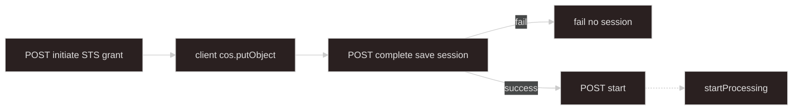

# Upload — Tencent COS direct (STS)

## Goal

Client uploads **directly to COS** with **scoped STS** credentials and a server-generated **`objectKey`**. Server saves **`UploadSession`** on complete; client starts processing with **`uploadSessionId`** only. Stops before **`startProcessing`** — [start-processing-adapters](../start-processing-adapters/SKILL.md). Parallel to [upload-s3-direct](../upload-s3-direct/SKILL.md).

**Upload progress:** browser / COS SDK — **not** job SSE.

**Implemented** under `import/upload/object-store/` — shared initiate/complete flow with scoped STS (session prefix only, not `allowPrefix: "*"`).

---

## Scope

| This skill owns | [start-processing-adapters](../start-processing-adapters/SKILL.md) owns |
| --- | --- |
| Initiate (scoped STS + server **`key`**) | **`UploadSession`** + **`UploadSessionStore`** |
| Complete → build **`UploadSessionSources`** | Start API, deferred trust model |
| Pending upload state between initiate and complete | `POST .../start`, adapters |

Inject **`UploadSessionStore`** from start-processing-adapters — do not duplicate session persistence here.

---

## When to use

- Large files to Tencent COS; avoid proxying bytes through Nest.
- Client uses **`cos.putObject`** (or multipart) with temporary credentials.
- **Deferred start (default):** complete returns **`{ uploadSessionId }`**; client **`POST .../start`**.

## Must not

- Call **`startProcessing`** from upload code — start adapters only.
- Write **`ProcessingJobRepository`** or acquire lock at upload time.
- **HEAD** object at complete — worker **verify** in [async-processing](../async-processing/SKILL.md#worker).
- Accept client-supplied **`bucket`** / **`key`** on complete.
- Return locators on deferred success — **`uploadSessionId`** only.
- Issue STS with **`allowPrefix: "*"`** — scope policy to server key prefix for the session.
- Use deprecated **`uploadFileToCos`** proxy path — direct client upload only.

---

## Terminology

Same as [upload-s3-direct — Terminology](../upload-s3-direct/SKILL.md#terminology), with **STS grant** instead of presigned PUT.

| Term | Meaning |
| ---- | ------- |
| **Initiate** | Allocate keys + return scoped STS + upload targets per **`sourceId`** |
| **Complete** | Register uploads; **`UploadSessionStore.save`** |

---

## Flow



Worker **headObject** runs at job time — not on complete.

---

## HTTP surface (sketch)

Resolve **`sourceSpecs`** from **`DomainRegistry`** on initiate — [upload-local-multipart](../upload-local-multipart/SKILL.md#validation-and-sourcespecs).

### Initiate

```http
POST /applications/:domainKind/upload/cos/initiate
Content-Type: application/json

{
  "uploadSessionId": "optional-client-hint",
  "files": [
    { "sourceId": "productDescriptions", "originalName": "desc.jsonl", "mimeType": "application/x-ndjson" }
  ]
}
```

Server:

1. Validate **`sourceId`** / MIME against **`sourceSpecs`**.
2. Generate **`uploadSessionId`** if omitted.
3. For each file: **`key = {prefix}/{uploadSessionId}/{sourceId}-{nanoid}{ext}`**.
4. Issue **STS** policy allowing **`PutObject`** (and multipart actions if needed) **only** under that key prefix.
5. Store pending upload record (Redis) with bucket, region, keys, metadata — TTL aligned with STS duration.

Response:

```typescript
{
  uploadSessionId: string;
  credential: CredentialData; // qcloud-cos-sts shape
  region: string;
  bucket: string;
  uploads: Record<string, {
    sourceId: string;
    key: string;
  }>;
}
```

### Complete

Same shape as S3 complete — [upload-s3-direct — Complete](../upload-s3-direct/SKILL.md#complete). Build locators with **`provider: "cos"`**.

---

## Session source entry (object locator)

```typescript
{
  sourceId: "productDescriptions",
  originalName: clientFileName,
  mimeType: "application/x-ndjson",
  locator: {
    kind: "object",
    provider: "cos",
    bucket: string,
    key: string,
    declaredSizeBytes?: number,
  },
}
```

Type: [start-processing-adapters — Session source types](../start-processing-adapters/SKILL.md#session-source-types).

---

## Responsibilities

| Concern | This path |
| ------- | --------- |
| Scoped STS + server **`objectKey`** | yes |
| Validate against **`sourceSpecs`** on initiate | yes |
| Pending state initiate → complete | yes |
| Complete → **`UploadSessionStore.save`**, return **`{ uploadSessionId }`** | yes |
| Fail → no manifest / job record | yes |
| HEAD on complete | **no** — worker |
| **`processing.start-requested`** | **no** (default) |
| Legacy **`GET tencent-cos-objects/temporary-credential`** | **not** this skill’s API |

---

## Operations notes

- **CORS** on COS bucket for browser uploads.
- **STS policy** — restrict **`resource`** to `{prefix}/{uploadSessionId}/`** (not whole bucket).
- **`REGION`** env — required for worker COS reads ([`ProcessingSourceReader`](../async-processing/SKILL.md)).
- Reference STS wiring only: `TencentCosObjectsService.getTemporaryCredential` in `apps/nest-app/src/tencent-cos-objects/` — replace broad **`allowPrefix: *`** when implementing this skill.

---

## Suggested files

```text
async-processing/upload/cos-direct/
  cos-direct-upload.controller.ts
  cos-direct-upload.service.ts          # inject UploadSessionStore
  cos-sts-grant.service.ts              # prefix-scoped policy
  cos-pending-upload.store.ts
  build-cos-upload-session-sources.ts

async-processing/start-processing-adapters/
  upload-session.store.ts

# Legacy — do not extend for new upload flow:
tencent-cos-objects/
```

---

## Checklist

```text
- [ ] Initiate validates sourceSpecs; server keys only; STS scoped to key prefix
- [ ] Pending upload state with TTL between initiate and complete
- [ ] Complete saves UploadSession; return { uploadSessionId } only
- [ ] Locator provider: "cos" (not "s3")
- [ ] No ProcessingJobRepository at upload time
- [ ] No HEAD on complete
- [ ] CORS for browser upload if needed
- [ ] Client POST .../start with uploadSessionId
```

---

## Agent invocation

| Task | Skills |
| ---- | ------ |
| COS STS initiate/complete | `upload-cos-direct` + `start-processing-adapters` |
| S3 presigned (peer path) | `upload-s3-direct` |
| Session store, start adapters | `start-processing-adapters` |
| Worker verify, job, SSE | `async-processing` |
