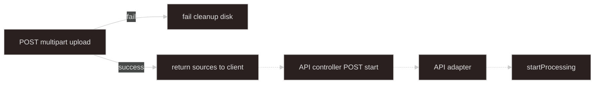
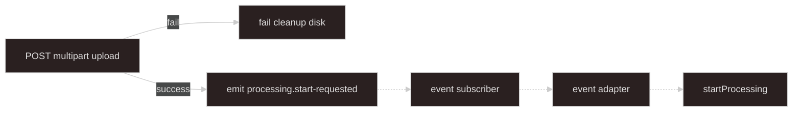

# Upload — local multipart (proxy ingest)

## Goal

Client sends files to **NestJS** via multipart. Server writes bytes to **disk**, builds handoff **`sources`**, then either returns them to the client or emits **`processing.start-requested`**. Stops before **`startProcessing`** — see [import-upload-handoff](../import-upload-handoff/SKILL.md). Job orchestration: [async-processing](../async-processing/SKILL.md).

**Upload progress:** Nest stream meter — not job SSE ([async-processing](../async-processing/SKILL.md) SSE).

**Input files are ephemeral:** worker **`deleteLocator`** removes local paths after processing ([async-processing — Worker](../async-processing/SKILL.md#worker)).

---

## When to use

- Browser or API client POSTs multipart to Nest (proxy ingest).
- Small/medium files where server disk is acceptable.
- Optional **`autoStart`** — skip client start API and emit event after upload.

## Must not

- Call **`startProcessing`** from upload code — handoff adapters only.
- Write **`ProcessingJobRepository`** or acquire **`ProcessingActiveJobLock`** at upload time.
- **HEAD/stat** locators at upload — worker **verify** step in [async-processing](../async-processing/SKILL.md#worker).
- Accept client-supplied **`path`** or use **`originalName`** as the on-disk filename.
- Put file **buffers** on BullMQ or in Redis — persist to disk; handoff carries **`SourceLocator`** only.

---

## Terminology

| Term | Meaning |
| ---- | ------- |
| **`LocalUploadSession`** | Per-request options: `domainKind`, `autoStart` |
| **`sourceId`** | Multipart field name — must match domain **`sourceSpecs`** ([async-processing](../async-processing/SKILL.md#domainregistry)) |
| **`UploadHandoffSources`** | Canonical map type — [import-upload-handoff](../import-upload-handoff/SKILL.md#handoff-sources) |
| **`uploadSessionId`** | Optional server id when session state is stored server-side for deferred start |

---

## Upload session

```typescript
type LocalUploadSession = {
  uploadSessionId?: string; // optional — include in deferred start API when stored server-side
  domainKind?: string;
  autoStart?: boolean; // true → emit processing.start-requested after success
};
```

| `autoStart` | `domainKind` | On success |
| --- | --- | --- |
| `false` (default) | Client sends on start API | Return `{ sources, uploadSessionId? }` — client calls **API controller** |
| `true` | **Required** on session | Emit `{ domainKind, sources }` — **event subscriber** → **event adapter** |

Event adapter may surface **`ActiveJobConflictError`** as 409 when **`global_singleton`** lock is busy — [import-upload-handoff](../import-upload-handoff/SKILL.md#api-adapter).

---

## Flow

Solid arrows: this skill. Dashed arrows: [import-upload-handoff](../import-upload-handoff/SKILL.md) adapters — never call **`startProcessing`** from upload code.

**Deferred start (`autoStart: false`):**



**autoStart (`autoStart: true`):**



---

## HTTP / Nest surface

```typescript
@Post("upload")
@UseInterceptors(
  FileFieldsInterceptor(
    sourceSpecs.map((s) => ({ name: s.sourceId, maxCount: 1 })),
  ),
)
async upload(
  @UploadedFiles() files: Record<string, Express.Multer.File[]>,
  @Body() session: LocalUploadSession,
) {
  return this.localMultipartUploadService.handleUpload(files, session);
}
```

- **Route** — e.g. `POST /applications/:domainKind/upload` or session-scoped upload URL; keep upload routes in handoff `upload/local-multipart/`.
- **Field names** — each **`sourceId`** from domain **`sourceSpecs`** (e.g. `mainWorkbook`) is one multipart field, max one file.
- **Limits** — configure Multer/body size per largest expected file; reject disallowed MIME types before writing disk (domain-specific allowlist).

---

## Disk persistence

Use Multer **`diskStorage`** (not memory + Redis buffer). Memory storage is for tiny dev-only paths; production async processing expects **`locator: { kind: "local", path }`**.

**Path rules**

1. Base directory — e.g. `{TMP}/processing-uploads/` (env-configured).
2. **Server-generated path** — `{base}/{uploadSessionId}/{sourceId}-{nanoid}{ext}` or `{base}/{nanoid}/{sourceId}{ext}`.
3. Extension — derive from validated MIME or safe default (`.bin`); never trust client path segments.
4. Create directories with restrictive permissions; reject `..` and absolute paths from client metadata.

```typescript
function buildSavedPath(sessionId: string, sourceId: string, mimeType: string): string {
  const ext = extensionFromMime(mimeType);
  return join(UPLOAD_BASE_DIR, sessionId, `${sourceId}-${nanoid()}${ext}`);
}
```

Set **`declaredSizeBytes`** from Multer **`file.size`** after write.

---

## Validation and `sourceSpecs`

Resolve required **`sourceId`** list from domain registration (**`DomainKindRegistration.sourceSpecs`**) or a local upload config keyed by **`domainKind`**.

1. Validate **`session.domainKind`** when `autoStart` or when route embeds kind.
2. For each **`SourceSpec`**: if **`required`**, field must have exactly one file; if optional, zero or one.
3. Reject unknown field names (not in specs) unless product explicitly allows extras.
4. Validate MIME/size before persisting; on any failure, **rollback** (see below).

---

## Build handoff `sources`

Wrap entries in **`UploadHandoffSources`** — [import-upload-handoff](../import-upload-handoff/SKILL.md#handoff-sources).

```typescript
const sources: UploadHandoffSources = {
  mainWorkbook: {
    sourceId: "mainWorkbook",
    originalName: file.originalname,
    mimeType: file.mimetype,
    locator: {
      kind: "local",
      path: savedPath,
      declaredSizeBytes: file.size,
    },
  },
};
```

---

## Success paths

**Deferred (`autoStart: false`):**

```typescript
return { sources, uploadSessionId: session.uploadSessionId };
```

Client later **`POST .../start`** with `domainKind` + handoff `sources` (or `uploadSessionId` if server stored the session). API adapter maps to **`StartProcessingInput`**.

**autoStart (`autoStart: true`, `domainKind` set):**

```typescript
this.eventEmitter.emit("processing.start-requested", {
  domainKind: session.domainKind,
  sources,
});
return { sources }; // optional — client may still display upload result
```

---

## Failure and rollback

On **any** error after one or more files were written:

1. **`unlink`** every path recorded for this request (track in a `savedPaths: string[]`).
2. Do **not** emit event or return handoff `sources`.
3. No **`ProcessingJob`** row, no BullMQ enqueue, no Redis active lock.

Validate cheap checks (required fields, MIME) **before** first disk write when possible to avoid partial writes.

---

## Responsibilities

| Concern | This path |
| ------- | --------- |
| Multipart receive + Multer **`diskStorage`** | yes |
| Server-generated **`path`** per **`sourceId`** | yes |
| Validate against domain **`sourceSpecs`** | yes |
| Return `{ sources, uploadSessionId? }` or emit event | yes |
| Fail → unlink partial files, no job record | yes |
| Locator stat verify | **no** — [async-processing worker](../async-processing/SKILL.md#worker) |
| **`ProcessingJobRepository`** / active lock | **no** |
| Call **`startProcessing`** | **no** — handoff adapters only |
| Delete files after job | **no** — worker **`deleteLocator`** |

---

## Suggested files

```text
import/upload/local-multipart/
  local-upload-session.types.ts
  local-multipart-upload.controller.ts
  local-multipart-upload.service.ts
  multer-disk-storage.factory.ts
  build-upload-handoff-sources.ts
  rollback-saved-paths.ts
```

---

## Checklist

```text
- [ ] diskStorage — unique server paths under configured base dir
- [ ] Required sourceIds validated before or with atomic rollback on failure
- [ ] Fail → unlink all savedPaths, no event, no ProcessingJobRepository
- [ ] Success deferred → { sources, uploadSessionId? }; client uses start API
- [ ] Success autoStart → emit processing.start-requested with domainKind + sources
- [ ] Never call startProcessing from upload code
- [ ] Document sourceId constants for the client (match multipart field names)
```

---

## Agent invocation

| Task | Skills |
| ---- | ------ |
| Multipart disk upload, autoStart | `upload-local-multipart` + `import-upload-handoff` |
| Start API, adapters, handoff types | `import-upload-handoff` |
| Worker verify, job, lock, SSE | `async-processing` |
