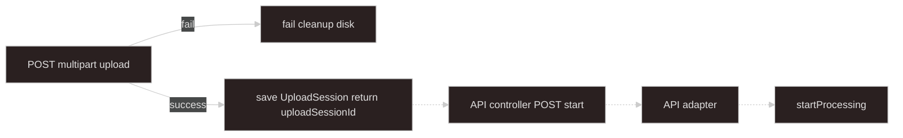
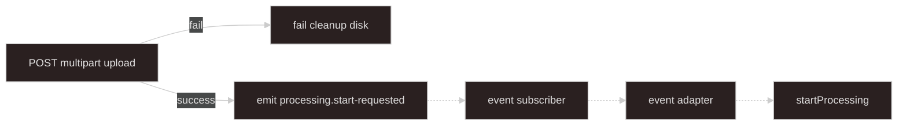

# Upload — local multipart (proxy ingest)

## Goal

Client sends files to **NestJS** via **`multipart/form-data`**. Server writes bytes to **disk**, builds handoff **`sources`**, then either saves **`UploadSession`** and returns **`{ uploadSessionId }`** (deferred) or emits **`processing.start-requested`** (autoStart). Stops before **`startProcessing`** — see [import-upload-handoff](../import-upload-handoff/SKILL.md). Job orchestration: [async-processing](../async-processing/SKILL.md).

**Upload progress:** Nest stream meter — not job SSE ([async-processing](../async-processing/SKILL.md) SSE).

**Input files are ephemeral:** worker **`deleteLocator`** removes local paths after processing ([async-processing — Worker](../async-processing/SKILL.md#worker)).

---

## Scope

| This skill owns | [import-upload-handoff](../import-upload-handoff/SKILL.md) owns |
| --- | --- |
| Multer, disk paths, rollback | **`UploadSession`** type + **`UploadSessionStore`** |
| Build **`UploadHandoffSources`** | Start API, adapters, deferred trust model |
| **`LocalUploadSession`** form fields | `mapUploadHandoffToInput`, `POST .../start` |

Inject **`UploadSessionStore`** from handoff — do not duplicate session persistence here.

---

## When to use

- Browser or API client POSTs multipart to Nest (proxy ingest).
- Small/medium files where server disk is acceptable.
- Optional **`autoStart`** — skip client start API and emit event after upload.

## Must not

- Call **`startProcessing`** from upload code — handoff adapters only.
- Write **`ProcessingJobRepository`** or acquire **`ProcessingActiveJobLock`** at upload time.
- **HEAD/stat** locators at upload — worker **verify** step in [async-processing](../async-processing/SKILL.md#worker).
- Accept client-supplied **`path`** or use **`originalName`** as the on-disk filename.
- Put file **buffers** on BullMQ or in Redis — persist to disk; handoff carries **`SourceLocator`** only.
- Return handoff **`sources`** or **locators** to the client on **deferred** success — only **`uploadSessionId`** ([handoff trust model](../import-upload-handoff/SKILL.md#deferred-start-trust-model)).

---

## Terminology

| Term | Meaning |
| ---- | ------- |
| **`LocalUploadSession`** | Per-request **form fields**: `domainKind`, `autoStart`, optional client `uploadSessionId` hint |
| **`UploadSession`** | Persisted record in handoff store — [import-upload-handoff](../import-upload-handoff/SKILL.md#handoff-types) |
| **`sourceId`** | Multipart **file** field name — must match domain **`sourceSpecs`** |
| **`UploadHandoffSources`** | Built server-side — [import-upload-handoff](../import-upload-handoff/SKILL.md#handoff-types) |
| **`uploadSessionId`** | Server id returned to client; client sends it on **`POST .../start`** (server generates if omitted) |

---

## Upload session

**`domainKind` is required** for every upload (form field or route param). Needed to resolve **`sourceSpecs`** and to save **`UploadSession`**.

```typescript
type LocalUploadSession = {
  domainKind: string;
  autoStart?: boolean; // default false
  uploadSessionId?: string; // optional client hint; server may generate nanoid()
};
```

| `autoStart` | On success |
| --- | --- |
| `false` (default) | **`UploadSessionStore.save`** → return `{ uploadSessionId }` only |
| `true` | Emit `{ domainKind, sources }` in-process → event adapter |

On **`global_singleton`** conflict during autoStart, event adapter **logs and skips** (no HTTP 409) — [import-upload-handoff — Event adapter](../import-upload-handoff/SKILL.md#event-adapter).

---

## Flow

Solid arrows: this skill. Dashed arrows: [import-upload-handoff](../import-upload-handoff/SKILL.md) adapters.

**Deferred start (`autoStart: false`):**



**autoStart (`autoStart: true`):**



---

## HTTP / Nest surface

Use **`multipart/form-data`** for files **and** session fields — not a separate JSON body.

```typescript
@Post(":domainKind/upload")
@UseInterceptors(
  FileFieldsInterceptor(
    sourceSpecs.map((s) => ({ name: s.sourceId, maxCount: 1 })),
  ),
)
async upload(
  @Param("domainKind") domainKindFromRoute: string,
  @UploadedFiles() files: Record<string, Express.Multer.File[]>,
  @Body("autoStart") autoStartRaw?: string,
  @Body("uploadSessionId") uploadSessionId?: string,
) {
  const registration = this.domainRegistry.getByDomainKind(domainKindFromRoute);
  const session: LocalUploadSession = {
    domainKind: domainKindFromRoute,
    autoStart: autoStartRaw === "true",
    uploadSessionId,
  };
  return this.localMultipartUploadService.handleUpload(
    files,
    session,
    registration.sourceSpecs,
  );
}
```

- **`sourceSpecs`** — from **`DomainRegistry.getByDomainKind(domainKind)`** per request (or route param).
- **File fields** — one per **`sourceId`** (e.g. `mainWorkbook`).
- **Text fields** — `autoStart`, optional `uploadSessionId`; **`domainKind`** from route or `@Body("domainKind")` when not in path.
- **Limits** — Multer/body size; MIME allowlist before disk write.

---

## Disk persistence

Use Multer **`diskStorage`** (not memory + Redis buffer).

**Path rules**

1. Base directory — e.g. `{TMP}/processing-uploads/` (env-configured).
2. **Server-generated path** — `{base}/{uploadSessionId}/{sourceId}-{nanoid}{ext}`.
3. Extension from validated MIME or safe default (`.bin`).
4. Restrictive directory permissions; reject `..` in client metadata.

```typescript
function buildSavedPath(sessionId: string, sourceId: string, mimeType: string): string {
  const ext = extensionFromMime(mimeType);
  return join(UPLOAD_BASE_DIR, sessionId, `${sourceId}-${nanoid()}${ext}`);
}
```

Set **`declaredSizeBytes`** from Multer **`file.size`** after write.

---

## Validation and `sourceSpecs`

1. Resolve **`sourceSpecs`** from **`DomainRegistry`** by **`session.domainKind`**.
2. For each **`SourceSpec`**: required → exactly one file; optional → zero or one.
3. Reject unknown file field names.
4. Validate MIME/size before persisting; on failure **rollback**.

---

## Build handoff `sources`

```typescript
const sources: UploadHandoffSources = {
  mainWorkbook: {
    sourceId: "mainWorkbook",
    originalName: file.originalname,
    mimeType: file.mimetype,
    locator: {
      kind: "local",
      path: savedPath,
      declaredSizeBytes: file.size,
    },
  },
};
```

Type: [import-upload-handoff — Handoff types](../import-upload-handoff/SKILL.md#handoff-types).

---

## Success paths

**Deferred (`autoStart: false`):**

```typescript
const uploadSessionId = session.uploadSessionId ?? nanoid();
await this.uploadSessionStore.save({
  uploadSessionId,
  domainKind: session.domainKind,
  sources,
  expiresAt: addHours(new Date(), 24),
});
return { uploadSessionId };
```

**`UploadSessionStore`** — handoff module ([import-upload-handoff](../import-upload-handoff/SKILL.md#suggested-module-layout)). Payload matches handoff **`UploadSession`** type.

Client **`POST .../start`** with **`uploadSessionId`** only — [deferred start trust model](../import-upload-handoff/SKILL.md#deferred-start-trust-model).

**autoStart (`autoStart: true`):**

```typescript
this.eventEmitter.emit("processing.start-requested", {
  domainKind: session.domainKind,
  sources,
});
return { accepted: true }; // do not return locators to client
```

---

## Failure and rollback

On **any** error after one or more files were written:

1. **`unlink`** every path in `savedPaths: string[]`.
2. Do **not** emit event, save session, or return locators.
3. No **`ProcessingJob`** row, no BullMQ enqueue, no Redis active lock.

Run cheap validation before the first disk write when possible.

---

## Responsibilities

| Concern | This path |
| ------- | --------- |
| Multipart + **`diskStorage`** | yes |
| Server-generated **`path`** per **`sourceId`** | yes |
| Validate against **`sourceSpecs`** | yes |
| Save **`UploadSession`** via injected store (deferred) | yes |
| Return **`{ uploadSessionId }`** only on deferred success | yes |
| Emit **`processing.start-requested`** (autoStart) | yes |
| Implement **`UploadSessionStore`** | **no** — handoff |
| Locator verify / job / lock / **`startProcessing`** | **no** |

---

## Suggested files

```text
import/upload/local-multipart/
  local-upload-session.types.ts
  local-multipart-upload.controller.ts
  local-multipart-upload.service.ts      # inject UploadSessionStore from handoff
  multer-disk-storage.factory.ts
  build-upload-handoff-sources.ts
  rollback-saved-paths.ts

import/handoff/
  upload-session.store.ts                # shared with S3/COS deferred start
```

---

## Checklist

```text
- [ ] multipart/form-data: file fields = sourceIds; domainKind required (route or form)
- [ ] sourceSpecs from DomainRegistry per domainKind
- [ ] diskStorage — server paths only; rollback savedPaths on failure
- [ ] Deferred: UploadSessionStore.save → return { uploadSessionId } only (no locators)
- [ ] autoStart: emit processing.start-requested; minimal HTTP response (no locators)
- [ ] Never call startProcessing from upload code
- [ ] Document sourceId field names for the client
```

---

## Agent invocation

| Task | Skills |
| ---- | ------ |
| Multipart disk upload, autoStart | `upload-local-multipart` + `import-upload-handoff` |
| UploadSession store, start adapters | `import-upload-handoff` |
| Worker verify, job, lock, SSE | `async-processing` |
