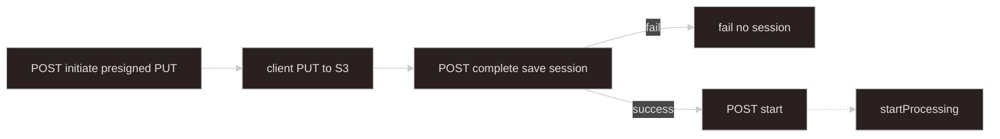

# Upload — S3 direct (presigned PUT)

## Goal

Client uploads **directly to S3** with a server-generated **`objectKey`**. Server saves **`UploadSession`** on complete; client starts processing with **`uploadSessionId`** only. Stops before **`startProcessing`** — [start-processing-adapters](../start-processing-adapters/SKILL.md). Job orchestration — [async-processing](../async-processing/SKILL.md).

**Upload progress:** browser / AWS SDK — **not** job SSE.

**Implemented** under `import/upload/object-store/` — shared initiate/complete flow with S3 presigned PUT.

---

## Scope

| This skill owns | [start-processing-adapters](../start-processing-adapters/SKILL.md) owns |
| --- | --- |
| Initiate (presigned PUT + server **`key`**) | **`UploadSession`** type + **`UploadSessionStore`** |
| Complete → build **`UploadSessionSources`** | Start API, adapters, deferred trust model |
| Pending upload state between initiate and complete | `mapSessionSourcesToStartInput`, `POST .../start` |
| S3 CORS / bucket policy notes | Session **`consume`** after successful start |

Inject **`UploadSessionStore`** from start-processing-adapters — do not duplicate session persistence here.

---

## When to use

- Large files; avoid proxying bytes through Nest.
- Browser or mobile client can **`PUT`** to S3.
- **Deferred start (default):** complete returns **`{ uploadSessionId }`**; client **`POST .../start`**.

## Must not

- Call **`startProcessing`** from upload code — start adapters only.
- Write **`ProcessingJobRepository`** or acquire **`ProcessingActiveJobLock`** at upload time.
- **HeadObject** / stat at complete — worker **verify** in [async-processing](../async-processing/SKILL.md#worker).
- Accept client-supplied **`bucket`** / **`key`** on complete — server owns keys from initiate.
- Return **`sources`** or **locators** to the client on deferred success — only **`uploadSessionId`** ([deferred start trust model](../start-processing-adapters/SKILL.md#deferred-start-trust-model)).
- **`autoStart`** on object-store paths unless explicitly designed — default **deferred** (same as [start-processing-adapters — On upload success](../start-processing-adapters/SKILL.md#on-upload-success)).

---

## Terminology

| Term | Meaning |
| ---- | ------- |
| **`uploadSessionId`** | Server id spanning initiate + complete; returned to client; used on **`POST .../start`** |
| **`sourceId`** | Domain **`SourceSpec`** key (multipart field name equivalent) |
| **`objectKey`** | Server-generated S3 key — never from client |
| **`UploadSessionSources`** | Built server-side on complete — [session source types](../start-processing-adapters/SKILL.md#session-source-types) |
| **Initiate** | Allocate keys + presigned PUT URLs per requested **`sourceId`** |
| **Complete** | Confirm uploads registered; **`UploadSessionStore.save`** |

---

## Flow

Solid arrows: this skill. Dashed: start-processing-adapters.



Worker **HeadObject** runs at job time — not on complete.

---

## HTTP surface (sketch)

Resolve **`sourceSpecs`** from **`DomainRegistry.getByDomainKind(domainKind)`** on initiate — same as [upload-local-multipart](../upload-local-multipart/SKILL.md#validation-and-sourcespecs).

### Initiate

```http
POST /applications/:domainKind/upload/s3/initiate
Content-Type: application/json

{
  "uploadSessionId": "optional-client-hint",
  "files": [
    { "sourceId": "mainWorkbook", "originalName": "data.xlsx", "mimeType": "application/vnd.openxmlformats-officedocument.spreadsheetml.sheet" }
  ]
}
```

Server:

1. Validate each **`sourceId`** against **`sourceSpecs`** (required/optional, MIME allowlist).
2. Generate **`uploadSessionId`** if omitted.
3. For each file: **`key = {prefix}/{uploadSessionId}/{sourceId}-{nanoid}{ext}`** (server prefix from env).
4. Presign **`PutObject`** (include **`Content-Type`** in signature when enforced).
5. Store **pending upload** record (Redis): `{ uploadSessionId, domainKind, pending: Record<sourceId, { bucket, key, originalName, mimeType }> }` with TTL.

Response:

```typescript
{
  uploadSessionId: string;
  uploads: Record<string, {
    sourceId: string;
    bucket: string;
    key: string;
    presignedPutUrl: string;
    requiredHeaders?: { "Content-Type"?: string };
  }>;
}
```

### Complete

```http
POST /applications/:domainKind/upload/s3/complete
Content-Type: application/json

{
  "uploadSessionId": "sess_abc",
  "files": [
    { "sourceId": "mainWorkbook", "declaredSizeBytes": 12345 }
  ]
}
```

Server:

1. Load pending record; reject unknown or expired session.
2. Build **`UploadSessionSources`** with **`provider: "s3"`** locators (no HeadObject).
3. **`UploadSessionStore.save`**, delete pending record.
4. Return **`{ uploadSessionId }`** only.

On failure after partial client PUT: do **not** save session; optionally enqueue orphan-key cleanup (background) — document policy per deployment.

---

## Session source entry (object locator)

```typescript
{
  sourceId: "mainWorkbook",
  originalName: clientFileName,
  mimeType: "application/vnd.openxmlformats-officedocument.spreadsheetml.sheet",
  locator: {
    kind: "object",
    provider: "s3",
    bucket: string,
    key: string,
    declaredSizeBytes?: number,
  },
}
```

Type: [start-processing-adapters — Session source types](../start-processing-adapters/SKILL.md#session-source-types).

---

## Responsibilities

| Concern | This path |
| ------- | --------- |
| Server-generated **`objectKey`** | yes |
| Presigned PUT per **`sourceId`** | yes |
| Validate against **`sourceSpecs`** on initiate | yes |
| Pending state initiate → complete | yes |
| Complete → **`UploadSessionStore.save`**, return **`{ uploadSessionId }`** | yes |
| Fail → no manifest / job record | yes |
| HeadObject on complete | **no** — worker |
| **`processing.start-requested`** | **no** (default) |
| Implement **`UploadSessionStore`** | **no** — start-processing-adapters |

---

## Operations notes

- **CORS** on bucket for browser **`PUT`** (allowed origin, **`PUT`**, exposed headers if needed).
- **Bucket policy** — restrict writes to server key prefix when possible.
- **MIME** — validate before presign; bind **`Content-Type`** in signature when enforcing.
- **Multi-file domains** — one initiate/complete round-trip; map key per **`sourceId`**.

---

## Suggested files

```text
async-processing/upload/s3-direct/
  s3-direct-upload.controller.ts
  s3-direct-upload.service.ts           # inject UploadSessionStore
  s3-presigned-put.service.ts
  s3-pending-upload.store.ts            # Redis TTL between initiate and complete
  build-s3-upload-session-sources.ts

async-processing/start-processing-adapters/
  upload-session.store.ts               # shared with local / COS
```

---

## Checklist

```text
- [ ] Initiate validates sourceSpecs; server keys only
- [ ] Pending upload state with TTL between initiate and complete
- [ ] Complete saves UploadSession; return { uploadSessionId } only (no locators)
- [ ] No ProcessingJobRepository at upload time
- [ ] No HeadObject on complete
- [ ] CORS for browser PUT if needed
- [ ] Client POST .../start with uploadSessionId
```

---

## Agent invocation

| Task | Skills |
| ---- | ------ |
| S3 presigned initiate/complete | `upload-s3-direct` + `start-processing-adapters` |
| Session store, start adapters | `start-processing-adapters` |
| Worker verify HeadObject, job, SSE | `async-processing` |
| COS direct upload (peer path) | `upload-cos-direct` |
