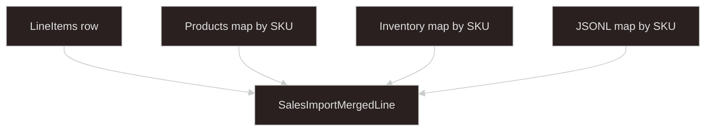

# Sales import application

Business logic for merging three upload sources into **`SalesImportMergedLine`** rows. Not reusable — lives here, not under `import/plugins/`.

Reusable pieces stay in:

| Layer | Path | Role |
| --- | --- | --- |
| Tabular parse | `import/plugins/tabular-xlsx/` | `.xlsx` sheets to row maps |
| JSONL parse | `import/plugins/jsonl/` | Lines to JSON objects |
| Shared errors / error XLSX | `import/shared/` | `ErrorDetail`, `buildValidationErrorXlsxBuffer` |
| Job orchestration | `async-processing/` | Worker, `DomainRegistry`, SSE |
| Upload + start | `start-processing-adapters/`, upload-* skills | Session, `POST .../start` |
| Test file generator | `applications/sales-import-fixtures/` | Local fixture bundles |

Agent skills for reusable layers remain under `.cursor/skills/`. **This folder uses this README only.**

---

## Async processing registration

| Constant | Value |
| --- | --- |
| **`SALES_IMPORT_DOMAIN_KIND`** | `"sales-report"` ( **`DomainRegistry`** key ) |
| Lock policy | `global_singleton` (planned) |

**`DomainRunner.run(jobId, sources, io)`** — see `async-processing.types.ts`. The worker passes **`jobId`** so rows can set **`SalesImportMergedLine.processingJobId`**.

---

## Upload sources

| `sourceId` | File | Role |
| --- | --- | --- |
| **`salesData`** | `salesData.xlsx` | **Products** sheet (SKU catalog) + **LineItems** sheet (base rows) |
| **`inventory`** | `inventory.xlsx` | **Inventory** sheet — supplement by SKU |
| **`productDescriptions`** | `productDescriptions.jsonl` | One object per catalog SKU — supplement by SKU |

Specs: **`sales-import.constants.ts`**, **`sales-import-merge.policy.ts`**.

---

## Merge model

**Base grain:** one output row per **LineItems** data row.

For each line item, read **`sku`**, then look up supplements:



| Output field | Source |
| --- | --- |
| `orderId`, `sku`, `quantity`, `saleDate` | LineItems |
| `productName`, `category`, `unitPrice` | Products (same workbook, by SKU) |
| `inventoryQty` | inventory.xlsx (by SKU) |
| `description` | productDescriptions.jsonl (by SKU) |
| `sourceLineNumber` | 1-based Excel row in LineItems |
| `processingJobId` | `jobId` from `DomainRunner.run` |

**Products** and **inventory** are loaded into **`Map<sku, …>`** first. **JSONL** is one line per catalog SKU (unique pairs in fixtures).

---

## Validation

Row-level rules (invalid row → **`ErrorDetail`**, still evaluate all rows):

| Rule | Result |
| --- | --- |
| Empty **`sku`** | Error |
| **`quantity`** ≤ 0 | Error |
| Invalid **`Sale Date`** | Error |
| Negative **`Unit Price`** | Error |
| Negative **`Inventory Qty`** | Allowed |
| SKU missing from **Products** | Error |
| SKU missing from **inventory** | Error |
| SKU missing from **JSONL** | Error |

Parse-time errors (bad headers, invalid JSON, and so on) come from format plugins before business validation.

---

## Persistence

**Partial save:** insert every **valid** merged row into **`SalesImportMergedLine`**. If **any** row errors exist:

- Return **`validation_failed`**
- Set **`processedCount`** / **`errorCount`**
- Build error XLSX via **`buildValidationErrorXlsxBuffer`** (worker stores blob)

If all rows pass → **`success`**.

Use **`Decimal`** for **`unitPrice`** at the domain boundary (see project debugging rules).

---

## Planned module layout

```text
applications/sales-import/
  README.md                         # this file
  sales-import-merge.policy.ts      # policy flags + domain kind
  sales-import.constants.ts         # sourceSpecs, TabularSheetSpec headers
  sales-import-domain.runner.ts     # DomainRunner — not implemented yet
  sales-import.module.ts            # register DomainRegistry on bootstrap — not implemented yet
```

---

## Implementation checklist

```text
- [ ] DomainRunner: load salesData workbook once; parse Products → map; parse LineItems → merge loop
- [ ] Parse inventory sheet → map; parse JSONL → map (stream)
- [ ] Validate each merged row; collect ErrorDetail; batch insert valid rows with jobId
- [ ] reportDomainProgress for validating_rows / saving_database
- [ ] Register sales-report in DomainRegistry with salesImportSourceSpecs
- [ ] upload-local-multipart (3 file fields) + Next.js upload UI — separate from this module
```

---

## Test fixtures

Generate bundles from Next.js **`/files/sales-import-fixtures`** (Nest **`applications/sales-import-fixtures`**).

| Scenario | Expected job outcome |
| --- | --- |
| **perfect** | `success` |
| **partial** | `validation_failed` + error XLSX |
| **fail_fast** | `failed` (salesData missing LineItems sheet) |

---

## Related docs

- `.cursor/skills/import-plugin-tabular-xlsx/SKILL.md`
- `.cursor/skills/import-plugin-jsonl/SKILL.md`
- `.cursor/skills/import-shared/SKILL.md`
- `.cursor/skills/async-processing/SKILL.md`
- `.cursor/skills/start-processing-adapters/SKILL.md`
