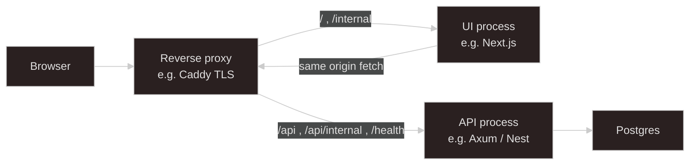
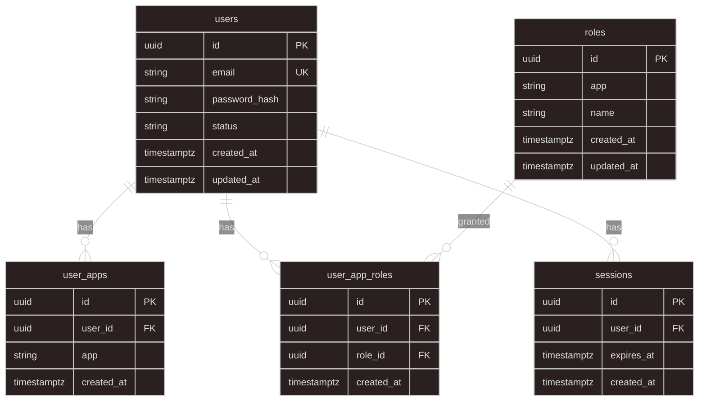

# A Generic Enterprise Web Architecture Design

A reusable pattern for a **customer-facing product** and an **internal ERP / staff console** that share one company domain, one identity, and one primary API process — without treating “obscure path” as security.

This document captures the design decisions agreed for long-term simplicity: one origin, path-split surfaces, Google-like identity, and server-side sessions.

## Goals

| Goal                        | Approach                                                     |
| --------------------------- | ------------------------------------------------------------ |
| One company product surface | Customer shop + internal ERP on the **same host**            |
| One login story             | **One identity** (email/account), many apps and roles        |
| Simple ops early            | **One API process**; split later only if needed              |
| Browser-first auth          | **Server sessions** + `httpOnly` cookie (not JWT-by-default) |
| Clear boundaries            | Path prefixes + **authorization checks**, not path secrecy   |
| Reverse-proxy friendly      | Prefixes that map cleanly to Caddy / nginx / Traefik         |

## High-level shape



**Rule of thumb:** start with **one API + one or more UIs**. Split into separate API services when team, scale, or compliance force it — not on day one.

## URL and routing strategy

Single origin, path-split UI and API:

| URL                            | Role                           |
| ------------------------------ | ------------------------------ |
| `example.com/`                 | Customer UI                    |
| `example.com/api/...`          | Customer / shop API            |
| `example.com/internal/...`     | Internal / staff UI            |
| `example.com/api/internal/...` | Internal / ERP API             |
| `example.com/health`           | Liveness / readiness (no auth) |

### Why this works

- **Same scheme + host** → first-party cookies work with `Path=/`; browser calls to `/api` are same-site.
- **Prefixes are conventions for humans and proxies**, not access control. Staff routes still require entitlement + roles.
- **Caddy (and similar)** can match `/api*` and `/health` to the API and everything else to the UI — no path rewriting required if the API expects full paths including `/api`.

Example Caddy sketch:

```caddyfile
example.com {
  handle /api* {
    reverse_proxy 127.0.0.1:3002
  }
  handle /health {
    reverse_proxy 127.0.0.1:3002
  }
  handle {
    reverse_proxy 127.0.0.1:3000
  }
}
```

### Optional later variants

| Variant                        | When                                          |
| ------------------------------ | --------------------------------------------- |
| `/api/v1/...`                  | First breaking public API version             |
| Host split (`api.` / `admin.`) | Stronger ops or cookie isolation              |
| Separate API binaries          | Independent deploy / scale / compliance walls |

Do **not** strip `/api` at the proxy unless the API is mounted at `/`. Prefer reverse-proxy as-is.

## One identity, many apps (Google-like)

Identity is central. Shop and internal are **apps** that consume that identity — not separate accounts that happen to share an email.

| Google analogy                      | This system                   |
| ----------------------------------- | ----------------------------- |
| Google Account                      | `users` (email + credentials) |
| Gmail / YouTube                     | Shop app / Internal app       |
| What you may do inside each product | Roles / permissions           |

```text
Identity (core)
  users + user_apps + roles + user_app_roles + sessions

Consumed by
  /api/...            → shop (requires shop entitlement)
  /api/internal/...   → ERP (requires internal entitlement)

Frontends
  /          → customer UI
  /internal  → staff UI
```

**Industry default:** one account per email, many capabilities — not two user rows for the same person.

### Identity data model



| Table            | Purpose                                                               |
| ---------------- | --------------------------------------------------------------------- |
| `users`          | One account per email                                                 |
| `user_apps`      | Which products the account may open (`shop`, `internal`, …)           |
| `roles`          | In-app roles (runtime names, e.g. `admin`, `manager`) scoped by `app` |
| `user_app_roles` | Role assignments                                                      |
| `sessions`       | Server-side session rows; cookie holds opaque session id              |

**Intended uniqueness**

- `users.email` — unique
- `user_apps (user_id, app)` — unique
- `roles (app, name)` — unique
- `user_app_roles (user_id, role_id)` — unique

### Separation of concerns

| Concept             | Answers                                 | Example                    |
| ------------------- | --------------------------------------- | -------------------------- |
| **Identity**        | Who is this person?                     | `users` row                |
| **App entitlement** | May they open this product?             | `user_apps.app = shop`     |
| **Role / RBAC**     | What can they do _inside_ that product? | `roles` + `user_app_roles` |
| **Session**         | Are they signed in right now?           | `sessions` + cookie        |

Do **not** collapse “customer vs staff” into a single enum that tries to mean both product access and fine-grained permission. Use **apps for access**, **roles for in-app RBAC** (especially internal).

### Auth route sketch

| Method | Path                          | Notes                                               |
| ------ | ----------------------------- | --------------------------------------------------- |
| `POST` | `/api/auth/register`          | Creates user + `shop` entitlement; sets session     |
| `POST` | `/api/auth/sign-in`           | Requires `shop` entitlement                         |
| `POST` | `/api/auth/sign-out`          | Clears session                                      |
| `GET`  | `/api/auth/me`                | Current user (shop context)                         |
| `POST` | `/api/internal/auth/sign-in`  | Requires `internal` entitlement; no public register |
| `POST` | `/api/internal/auth/sign-out` |                                                     |
| `GET`  | `/api/internal/auth/me`       | Current user (internal context)                     |

Two entry URLs, **same account**. After sign-in, enforce the entitlement for that surface. Staff accounts are granted `internal` via `user_apps` (invite / admin), not public self-register.

## Session auth (preferred default)

For first-party shop + ERP on one domain, prefer **server-side sessions** over JWT.

|         | Session + cookie                          | JWT (Bearer)                                   |
| ------- | ----------------------------------------- | ---------------------------------------------- |
| Storage | Server (DB/Redis): id → user              | Claims in token (+ refresh)                    |
| Browser | `httpOnly` / `Secure` / `SameSite` cookie | Header or JS-readable storage                  |
| Revoke  | Delete session → immediate                | Hard until expiry unless blocklist / short TTL |
| Fit     | Excellent for same-origin web             | Better for mobile / many external APIs         |

### Cookie policy

| Attribute  | Value             | Why                                                         |
| ---------- | ----------------- | ----------------------------------------------------------- |
| Name       | e.g. `sid`        | Opaque session id (optionally encrypted/private cookie jar) |
| `HttpOnly` | yes               | Not readable from JS                                        |
| `Secure`   | yes in production | HTTPS via reverse proxy                                     |
| `SameSite` | `Lax` (typical)   | Strong CSRF reduction for cross-site POSTs                  |
| `Path`     | `/`               | Sent to `/api` and `/api/internal`                          |

### Session storage: Postgres first

|                            | Postgres                        | Redis         |
| -------------------------- | ------------------------------- | ------------- |
| Infra                      | Already required for the app DB | Extra service |
| Revoke / ban with user row | Easy in one transaction         | Two systems   |
| Latency at huge QPS        | Good enough early               | Better later  |

**Start with a `sessions` table in Postgres.** Move hot session traffic to Redis when you measure the need (many API nodes, very chatty auth checks).

### CSRF on one origin

Same-origin UI → API plus `SameSite=Lax` cookies already removes most classic cross-site cookie CSRF. Still treat mutating APIs carefully (auth checks, optional CSRF token if you add third-party embeds or `SameSite=None` later).

When UI and API share one origin behind the proxy, browser CORS is largely unnecessary; keep an explicit origin allowlist mainly for **local split-port** development.

## One API process vs two

| Approach     | Meaning                                                                  |
| ------------ | ------------------------------------------------------------------------ |
| **One API**  | One binary/service; `/api` + `/api/internal`; shared DB and domain model |
| **Two APIs** | Separate deployables (e.g. storefront-api + erp-api), maybe separate DBs |

**Prefer one API** when:

- Same company, same products/orders/inventory truth
- Same Postgres, shared domain
- Small/medium team
- Shop vs ERP differ in **UI and permissions**, not in business ownership

**Split later** when deploy cadence, blast radius, or compliance demand it. The path prefixes and identity model still apply across services.

## Frontend layout

| Surface     | Path        | Talks to            |
| ----------- | ----------- | ------------------- |
| Customer UI | `/`         | `/api/...`          |
| Internal UI | `/internal` | `/api/internal/...` |

One SPA/Next app with route groups, or two frontends behind the same proxy — both fine. Auth is the shared cookie on the parent domain (or host-only cookie on `example.com`).

## Deployment notes (Caddy-friendly)

1. Terminate TLS at the edge; set `COOKIE_SECURE` (or equivalent) true in the API.
2. Proxy `/api*` and `/health` to the API; proxy UI paths to the frontend.
3. Do not rely on `/api/internal` being “hidden”; optionally rate-limit or IP-restrict that prefix at the edge for defense in depth.
4. Health check `GET /health` without cookies or auth.
5. Version public APIs only when you need a breaking cut (`/api/v1`).

## What to defer

- Profile tables (`customer_profiles`, `staff_profiles`) until you have real fields
- Fine-grained permissions beyond roles until RBAC pressure appears
- JWT / OAuth / SSO until a concrete client needs them
- Redis sessions until Postgres session load warrants it
- Separate admin hostnames until ops requires them

## Decision summary

| Topic             | Decision                                                         |
| ----------------- | ---------------------------------------------------------------- |
| Process topology  | One primary API; UI(s) separate                                  |
| URL layout        | One domain; `/`, `/api`, `/internal`, `/api/internal`, `/health` |
| Identity          | One user per email (Google-like)                                 |
| Product access    | `user_apps` (`shop` / `internal` / …)                            |
| In-app authz      | `roles` + `user_app_roles`                                       |
| Auth mechanism    | Server session + `httpOnly` cookie                               |
| Session store     | Postgres first                                                   |
| Security boundary | Entitlements + roles (paths are organization only)               |
| Edge              | Path-based reverse proxy (e.g. Caddy); no prefix strip           |

## Related implementation sketch

A concrete Rust/Axum + SeaORM instance of this pattern lives in the moon monorepo `apps/axum-app` (shop under `/api`, ERP under `/api/internal`, private cookie `sid`, Postgres `sessions`). This document is the **generic** design; stack choices may vary (Nest, Next, etc.) as long as the boundaries above stay intact.
