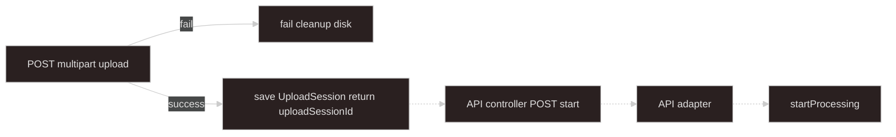
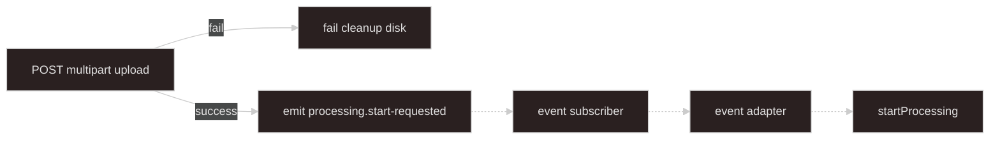
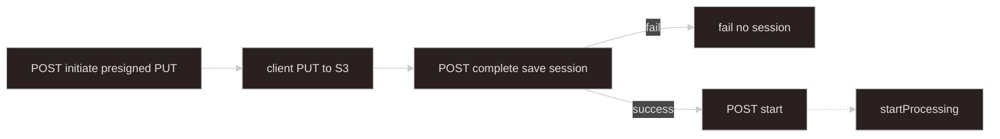

# Layer 1: Optional Upload Layer

The upload layer is not part of the core async-processing system. It is documented here because many processing flows start with file uploads.

Its job is simple: accept bytes, store them somewhere controlled by the server, and produce server-generated locators that a later adapter can use.

## Boundary

```text
client file bytes
  -> upload endpoint or direct object-store upload
  -> server-generated local/object locators
  -> UploadSession or trusted in-process start event
```

The upload layer stops before `startProcessing`.

**Greenfield rule:** numbered flows in this chapter describe behavior. **Implementation pattern** blocks show the required code shape. Upload code never calls `startProcessing`; Layer 2 adapters do.

## Scope

| This layer owns                                  | [Layer 2](../02-start-processing-adapter-layer/README.md) owns      |
| ------------------------------------------------ | ------------------------------------------------------------------- |
| Multipart, disk paths, rollback                  | `UploadSession` type + `UploadSessionStore`                         |
| S3 presigned PUT / COS STS / Aliyun OSS presigned PUT initiate and complete | Start API, adapters, deferred trust model                           |
| Build `UploadSessionSources`                     | `mapSessionSourcesToStartInput`, `POST applications/async-processing/start` |
| `LocalUploadSession` form fields                 | Session consume after successful start                              |

Inject `UploadSessionStore` from Layer 2 — do not duplicate session persistence in upload modules.

Types: [Appendix B](../appendix-b-shared-types/README.md). Constants: [Appendix C](../appendix-c-constants/README.md). Object-store request Zod: [Appendix D](../appendix-d-validation-schemas/README.md).

## Local Multipart Upload

Use local multipart upload when a browser or API client posts files to NestJS with `multipart/form-data`. Small or medium files where server disk is acceptable.

**Upload progress:** Nest stream metering — not job SSE ([Layer 3](../03-async-processing-core-layer/README.md)).

**Input files are ephemeral:** the worker deletes local paths in `finally` after processing.

### Must not

- Call `startProcessing` from upload code.
- Write `ProcessingJob` rows or acquire `ProcessingActiveJobLock`.
- HEAD/stat locators at upload time — worker verifies in Layer 3.
- Accept client-supplied `path` or use `originalName` as the on-disk filename.
- Put file buffers on BullMQ or in Redis.
- Return `sources` or locators on deferred success — only `{ uploadSessionId }`.

### Terminology

| Term                 | Meaning                                                                                                 |
| -------------------- | ------------------------------------------------------------------------------------------------------- |
| `LocalUploadSession` | Per-request form fields: `domainKind`, `autoStart`, optional `uploadSessionId` hint, optional `context` |
| `sourceId`           | Multipart **file** field name — must match domain `sourceSpecs`                                         |
| `uploadSessionId`    | Folder name under upload base dir; returned to client; not `jobId`                                      |

`domainKind` is required on every upload (route param or form field) to resolve `sourceSpecs` and save `UploadSession`.

### Routes and disk layout

```text
POST applications/async-processing/:domainKind/upload
```

```text
{PROCESSING_UPLOAD_BASE_DIR}/{uploadSessionId}/{sourceId}-{nanoid}.{ext}
```

Use `PROCESSING_UPLOAD_BASE_DIR_ENV` and `DEFAULT_UPLOAD_MAX_BYTES` from [Appendix C](../appendix-c-constants/README.md). The upload folder uses `uploadSessionId`, not `jobId`.

### Deferred vs auto-start

| Mode                                  | Upload success                                         | Next step                                 |
| ------------------------------------- | ------------------------------------------------------ | ----------------------------------------- |
| Deferred (`autoStart` false, default) | `UploadSessionStore.save` → `{ uploadSessionId }` only | Client `POST applications/async-processing/start` |
| autoStart (`autoStart` true)          | Emit `processing.start-requested` in-process           | Layer 2 event adapter                     |

On `global_singleton` conflict during autoStart, the event adapter logs and skips — no HTTP `409` ([Layer 2](../02-start-processing-adapter-layer/README.md)).

### Flow: deferred start



### Flow: autoStart



### Implementation pattern: controller

Resolve full `DomainKindRegistration` (not only `sourceSpecs`) — includes optional `upload` MIME policy.

```typescript
@Controller("applications/async-processing")
class LocalMultipartUploadController {
  @Post(":domainKind/upload")
  @UseInterceptors(AnyFilesInterceptor(createLocalMultipartMulterOptions()))
  async upload(
    @Param("domainKind") domainKindFromRoute: string,
    @UploadedFiles() uploadedFiles: Express.Multer.File[] | undefined,
    @Body() body: Record<string, string | undefined>,
    @Req() req: RequestWithSessionId,
  ) {
    const registration = domainRegistry.getByDomainKind(domainKindFromRoute);
    const session: LocalUploadSession = {
      domainKind: domainKindFromRoute,
      autoStart: body.autoStart === "true",
      uploadSessionId: body.uploadSessionId,
      context: buildUploadSessionContextFromMultipartBody(
        body,
        registration.sourceSpecs.map((spec) => spec.sourceId),
      ),
    };
    return localMultipartUploadService.handleUpload(
      groupUploadedFiles(uploadedFiles),
      session,
      registration,
      req,
    );
  }
}
```

File field names are `sourceId` values. Form fields `autoStart` and optional `uploadSessionId` are reserved ([Appendix C](../appendix-c-constants/README.md)). Extra non-file fields become `context`.

### Implementation pattern: multipart context

```typescript
function buildUploadSessionContext(
  fields: Record<string, string | undefined>,
): Record<string, unknown> | undefined {
  const context: Record<string, unknown> = {};
  for (const [key, value] of Object.entries(fields)) {
    const trimmed = value?.trim();
    if (trimmed) context[key] = trimmed;
  }
  return Object.keys(context).length > 0 ? context : undefined;
}

function buildUploadSessionContextFromMultipartBody(
  body: Record<string, string | undefined>,
  sourceFieldNames: readonly string[],
): Record<string, unknown> | undefined {
  const reserved = new Set([...UPLOAD_FORM_RESERVED_KEYS, ...sourceFieldNames]);
  const fields: Record<string, string | undefined> = {};
  for (const [key, value] of Object.entries(body)) {
    if (!reserved.has(key)) fields[key] = value;
  }
  return buildUploadSessionContext(fields);
}
```

### Implementation pattern: Multer disk storage

Use `diskStorage`, not memory storage. Stash resolved `uploadSessionId` on the request so every file in one POST shares the same session folder.

```typescript
function createLocalMultipartMulterOptions() {
  const uploadBaseDir =
    process.env[PROCESSING_UPLOAD_BASE_DIR_ENV] ??
    join(process.cwd(), "temp", "processing-uploads");
  const maxFileSizeBytes =
    Number(process.env[PROCESSING_UPLOAD_MAX_BYTES_ENV]) ??
    DEFAULT_UPLOAD_MAX_BYTES;

  return {
    limits: { fileSize: maxFileSizeBytes },
    storage: diskStorage({
      destination: async (req, _file, cb) => {
        const sessionId =
          req.body?.uploadSessionId?.trim() ||
          req[RESOLVED_UPLOAD_SESSION_ID] ||
          nanoid();
        req[RESOLVED_UPLOAD_SESSION_ID] = sessionId;
        const dir = join(uploadBaseDir, sessionId);
        await mkdir(dir, { recursive: true });
        cb(null, dir);
      },
      filename: (_req, file, cb) => {
        const ext =
          extensionFromOriginalName(file.originalname) ||
          extensionFromMime(file.mimetype);
        cb(null, `${file.fieldname}-${nanoid()}${ext}`);
      },
    }),
  };
}
```

### Implementation pattern: build sources and MIME check

Validate each file against `registration.upload.allowedMimeBySourceId` when present. Default tabular allowlist when the domain omits upload policy — `DEFAULT_TABULAR_XLSX_MIMES` in [Appendix C](../appendix-c-constants/README.md):

```typescript
function buildUploadSessionSources(
  filesBySourceId: Record<string, Express.Multer.File>,
  sourceSpecs: readonly SourceSpec[],
  options?: {
    allowedMimeBySourceId?: Record<string, readonly string[]>;
    defaultAllowedMimeTypes?: readonly string[];
  },
): UploadSessionSources {
  const defaultAllowed =
    options?.defaultAllowedMimeTypes ?? DEFAULT_TABULAR_XLSX_MIMES;
  // For each spec: required → one file; optional → zero or one
  // assertAllowedMimeType per sourceId
  // locator: { kind: "local", path: file.path, declaredSizeBytes: file.size }
}
```

### Implementation pattern: `handleUpload`

```typescript
async handleUpload(
  files: Record<string, Express.Multer.File[] | undefined>,
  session: LocalUploadSession,
  registration: DomainKindRegistration,
  req: RequestWithSessionId,
): Promise<{ uploadSessionId: string } | { accepted: true }> {
  const savedPaths: string[] = [];
  try {
    // Validate sourceSpecs: required/optional counts, reject unknown field names
    const sources = buildUploadSessionSources(filesBySourceId, sourceSpecs, {
      allowedMimeBySourceId: registration.upload?.allowedMimeBySourceId,
      defaultAllowedMimeTypes: registration.upload?.defaultAllowedMimeTypes,
    });
    const uploadSessionId =
      req[RESOLVED_UPLOAD_SESSION_ID] ??
      session.uploadSessionId?.trim() ??
      nanoid();

    if (session.autoStart) {
      eventEmitter.emit(PROCESSING_START_REQUESTED_EVENT, {
        domainKind: session.domainKind,
        sources,
        context: session.context,
      });
      return { accepted: true };
    }

    await uploadSessionStore.save({
      uploadSessionId,
      domainKind: session.domainKind,
      sources,
      expiresAt: new Date(Date.now() + DEFAULT_UPLOAD_SESSION_TTL_SECONDS * 1000),
      context: session.context,
    });
    return { uploadSessionId };
  } catch (error) {
    await rollbackSavedPaths(savedPaths);
    throw error;
  }
}
```

### Implementation pattern: rollback

```typescript
async function rollbackSavedPaths(savedPaths: readonly string[]) {
  await Promise.all(
    savedPaths.map(async (path) => {
      try {
        await unlink(path);
      } catch {
        /* best effort */
      }
    }),
  );
}
```

---

## Amazon S3 Direct Upload

Client uploads directly to S3 with a server-generated `objectKey`. Server saves `UploadSession` on complete; client starts processing with `uploadSessionId` only. Default mode is **deferred** — no `autoStart` unless explicitly designed.

**Upload progress:** browser or AWS SDK — not job SSE.

### Routes

```text
POST applications/async-processing/:domainKind/upload/s3/initiate
POST applications/async-processing/:domainKind/upload/s3/complete
```

Request bodies: `objectStoreUploadInitiateBodySchema` and `objectStoreUploadCompleteBodySchema` in [Appendix D](../appendix-d-validation-schemas/README.md).

### Flow



Worker `HeadObject` runs at job time — not on complete.

### Initiate

1. Resolve `sourceSpecs` from `DomainRegistry.getByDomainKind(domainKind)`.
2. Validate each `sourceId` and MIME against `registration.upload` policy.
3. Generate `uploadSessionId` if omitted.
4. For each file: `key = {prefix}/{uploadSessionId}/{sourceId}-{nanoid}{ext}` (server prefix from env).
5. Presign `PutObject` (include `Content-Type` in signature when enforcing MIME).
6. Store **pending upload** in Redis: `{ uploadSessionId, domainKind, pending: Record<sourceId, { bucket, key, originalName, mimeType }> }` with `DEFAULT_PENDING_UPLOAD_TTL_SECONDS`.

Response shape (`S3InitiateResult` in [Appendix B](../appendix-b-shared-types/README.md)):

```typescript
{
  uploadSessionId: string;
  uploads: Record<
    string,
    {
      sourceId: string;
      bucket: string;
      key: string;
      presignedPutUrl: string;
      requiredHeaders?: { "Content-Type"?: string };
    }
  >;
}
```

### Complete

1. Load pending record; reject unknown or expired session.
2. Build `UploadSessionSources` with `provider: "s3"` locators — no `HeadObject`.
3. `UploadSessionStore.save`, delete pending record.
4. Return `{ uploadSessionId }` only.

On failure after partial client PUT: do not save session; optionally enqueue orphan-key cleanup per deployment policy.

### Implementation pattern: pending S3 state

```typescript
// Redis key example: async-processing:pending-s3:{uploadSessionId}
async savePending(uploadSessionId: string, record: PendingS3Upload) {
  await redis.set(key, JSON.stringify(record), "EX", DEFAULT_PENDING_UPLOAD_TTL_SECONDS);
}

function buildS3SessionSources(
  pending: PendingS3Upload,
  completeFiles: Array<{ sourceId: string; declaredSizeBytes?: number }>,
): UploadSessionSources {
  // Map each complete file to pending metadata + locator { kind: "object", provider: "s3", bucket, key }
}
```

### Operations notes

- **CORS** on bucket for browser `PUT`.
- **Bucket policy** — restrict writes to server key prefix when possible.
- **MIME** — validate before presign; bind `Content-Type` in signature when enforcing.

---

## Tencent COS Direct Upload

Parallel to S3. Client uploads with **scoped STS** credentials and a server-generated `objectKey`. Complete saves `UploadSession`; client calls `POST applications/async-processing/start`.

**Do not** issue STS with `allowPrefix: "*"`. Scope policy to `{prefix}/{uploadSessionId}/` only.

### Routes

```text
POST applications/async-processing/:domainKind/upload/cos/initiate
POST applications/async-processing/:domainKind/upload/cos/complete
```

Complete body matches S3 complete shape ([Appendix D](../appendix-d-validation-schemas/README.md)).

### Flow

Same initiate → client upload → complete → deferred start as S3. Worker `headObject` runs at job time — not on complete.

### Initiate

1. Validate `sourceId` / MIME against `sourceSpecs`.
2. Generate `uploadSessionId` if omitted.
3. For each file: `key = {prefix}/{uploadSessionId}/{sourceId}-{nanoid}{ext}`.
4. Issue STS policy allowing `PutObject` (and multipart actions if needed) **only** under that key prefix.
5. Store pending upload record in Redis with bucket, region, keys, metadata — TTL aligned with STS duration.

Response shape:

```typescript
{
  uploadSessionId: string;
  credential: CredentialData; // qcloud-cos-sts shape
  region: string;
  bucket: string;
  uploads: Record<string, { sourceId: string; key: string }>;
}
```

### Complete

Same steps as S3 complete. Build locators with `provider: "cos"`. Set worker `REGION` env for COS reads in Layer 3 `ProcessingSourceReader`.

### Operations notes

- **CORS** on COS bucket for browser uploads.
- **STS policy** — restrict `resource` to session prefix, not whole bucket.
- Implement as a dedicated flow — do not bolt COS completion onto unrelated upload endpoints.

---

## Aliyun OSS Direct Upload

Same deferred pattern as S3: server-generated `objectKey`, presigned **PUT** via `signatureUrlV4`, pending Redis state, complete saves `UploadSession` with `provider: "aliyun"`.

### Routes

```text
POST applications/async-processing/:domainKind/upload/aliyun-oss/initiate
POST applications/async-processing/:domainKind/upload/aliyun-oss/complete
```

Initiate and complete bodies use the same Zod schemas as S3/COS ([Appendix D](../appendix-d-validation-schemas/README.md)). Response on initiate matches S3 (`uploadSessionId` + per-`sourceId` `presignedPutUrl`).

### Env

`ALIYUN_OSS_ACCESS_KEY_ID`, `ALIYUN_OSS_ACCESS_SECRET`, `ALIYUN_OSS_REGION`, `ALIYUN_OSS_BUCKET`, optional `ALIYUN_OSS_UPLOAD_PREFIX`.

Worker reads use the same env vars in `ProcessingSourceReader` (`head`, `getStream`, `delete`).

---

## Upload Session Shape

The upload layer builds `UploadSession` and `UploadSessionSources`. Persist via `UploadSessionStore` ([Layer 2](../02-start-processing-adapter-layer/README.md)).

`context` holds non-file form fields (for example `yearMonth`, `timezone`). Local uploads use `SourceLocator` with `kind: "local"`; object-store uploads use `kind: "object"` with `provider`, `bucket`, and `key`.

`declaredSizeBytes` comes from Multer `file.size` or client complete payload. The worker verifies size later.

Example object locator entry:

```typescript
{
  sourceId: "primaryData",
  originalName: clientFileName,
  mimeType: "application/vnd.openxmlformats-officedocument.spreadsheetml.sheet",
  locator: {
    kind: "object",
    provider: "s3", // or "cos" or "aliyun"
    bucket: string,
    key: string,
    declaredSizeBytes?: number,
  },
}
```

## Failure and Rollback

If any upload step fails after bytes were written:

1. Delete saved local files (`rollbackSavedPaths`) or rely on orphan-key cleanup for partial S3/COS PUTs.
2. Do not save `UploadSession`.
3. Do not emit `processing.start-requested`.
4. Do not create a `ProcessingJob`.
5. Do not acquire `ProcessingActiveJobLock`.

Run cheap validation before the first disk write when possible.

## Nest Module Layout

Upload code lives outside domain modules. Domains only register `upload` policy on `DomainRegistry` ([Layer 4](../04-domain-business-layer/README.md)).

```text
upload/
  local-multipart/
    local-upload-session.types.ts
    local-multipart-upload.controller.ts
    local-multipart-upload.service.ts
    multer-disk-storage.factory.ts
    build-upload-session-sources.ts
    build-upload-session-context.ts
    rollback-saved-paths.ts
  object-store/
    object-store-upload.controller.ts
    object-store-upload.service.ts
    pending-object-upload.store.ts
    s3-presigned-put.service.ts
    cos-scoped-sts.service.ts
    aliyun-oss-presigned-put.service.ts
    build-object-session-sources.ts

start-processing-adapters/          # Layer 2 — UploadSessionStore shared by all paths
```

```typescript
@Module({
  imports: [AsyncProcessingModule], // or import UploadSessionStore export only
  controllers: [LocalMultipartUploadController],
  providers: [LocalMultipartUploadService],
})
export class LocalMultipartUploadModule {}

@Module({
  imports: [AsyncProcessingModule],
  controllers: [ObjectStoreUploadController],
  providers: [
    ObjectStoreUploadService,
    PendingObjectUploadStore,
    S3PresignedPutService,
    CosScopedStsService,
    AliyunOssPresignedPutService,
  ],
})
export class ObjectStoreUploadModule {}
```

Sandbox wires both upload modules from `AppModule` alongside `AsyncProcessingModule`. Paths: `import/upload/local-multipart/`, `import/upload/object-store/`.

`LocalMultipartUploadService` injects `UploadSessionStore` and `EventEmitter2` for autoStart.

## Upload Layer Invariants

- Server owns `path`, `bucket`, and `key`.
- Client only receives `uploadSessionId` in deferred mode.
- Upload does not call `startProcessing` directly.
- Upload does not write `ProcessingJob`.
- Upload does not acquire `ProcessingActiveJobLock`.
- Upload does not put file buffers in Redis or BullMQ.
- Upload progress is separate from async job progress.
- Worker cleanup deletes local/object locators after processing.
- Ingest never calls `startProcessing` — Layer 2 adapters only.

## Rules and Anti-Patterns

| Anti-pattern                                   | Why                                           |
| ---------------------------------------------- | --------------------------------------------- |
| Call `startProcessing` from upload handler     | Layer 2 adapters only                         |
| Return locators on deferred success            | Client must use `uploadSessionId` + start API |
| HEAD/stat at upload complete                   | Worker verifies in Layer 3                    |
| Accept client `bucket` / `key` on complete     | Server owns keys from initiate                |
| Use `originalName` as on-disk filename         | Server generates `{sourceId}-{nanoid}{ext}`   |
| Memory storage + Redis buffers for large files | Use disk or direct object-store upload        |
| `autoStart` on S3/COS by default               | Deferred is safer; explicit opt-in only       |
| STS `allowPrefix: *` on COS                    | Scope to session prefix only                  |
| Upload code under domain folders               | Domains register MIME policy only             |

## Checklist

**Local multipart:**

```text
- [ ] multipart/form-data: file fields = sourceIds; domainKind required (route)
- [ ] sourceSpecs from DomainRegistry per domainKind
- [ ] diskStorage — server paths only; rollback savedPaths on failure
- [ ] Deferred: UploadSessionStore.save → return { uploadSessionId } only
- [ ] autoStart: emit processing.start-requested; return { accepted: true }
- [ ] Never call startProcessing from upload code
- [ ] Document sourceId field names for the client
```

**S3 direct:**

```text
- [ ] Initiate validates sourceSpecs; server keys only
- [ ] Pending upload Redis state with TTL between initiate and complete
- [ ] Complete saves UploadSession; return { uploadSessionId } only
- [ ] No ProcessingJob row at upload time
- [ ] No HeadObject on complete
- [ ] CORS for browser PUT if needed
```

**COS direct:**

```text
- [ ] Initiate validates sourceSpecs; STS scoped to key prefix
- [ ] Pending upload state with TTL
- [ ] Complete saves UploadSession; locator provider: "cos"
- [ ] No HEAD on complete
- [ ] REGION env set for worker COS reads
```

**Aliyun OSS direct:**

```text
- [ ] Initiate validates sourceSpecs; server keys only
- [ ] Pending upload state with TTL
- [ ] Complete saves UploadSession; locator provider: "aliyun"
- [ ] No HEAD on complete
- [ ] Aliyun OSS env vars set for worker reads
```
