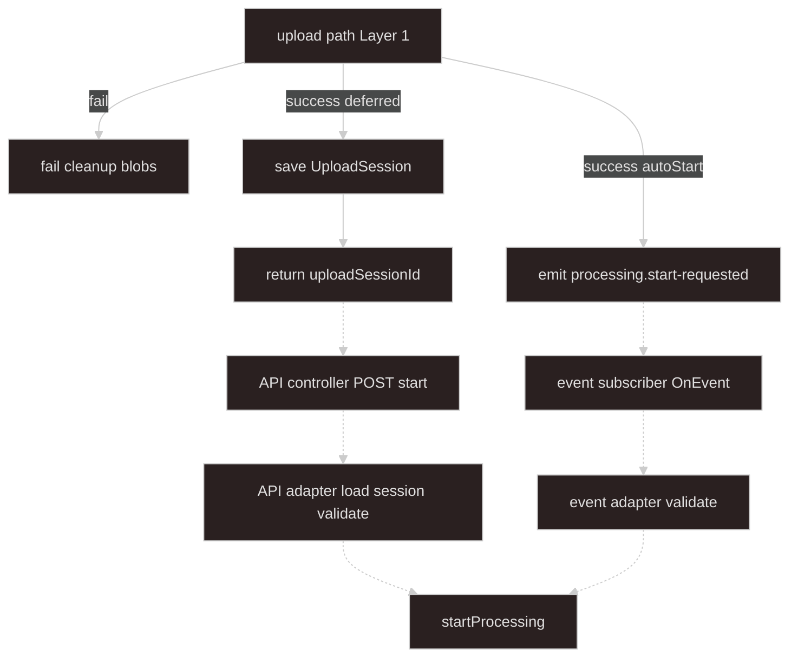

# Layer 2: Start Processing Adapter Layer

The adapter layer is the trigger boundary for async processing. It converts trusted server-side upload/session/event data into `StartProcessingInput`, then calls `ProcessingOrchestratorService.startProcessing`.

## Boundary

```text
UploadSession or trusted in-process event
  -> adapter validation and normalization
  -> StartProcessingInput
  -> startProcessing
```

Only adapters call `startProcessing`.

**Greenfield rule:** numbered flows in this chapter describe behavior. **Implementation pattern** blocks show the required code shape. Controllers and event subscribers stay thin; adapters own parse, session load, mapping, and `startProcessing`.

## Architecture

Solid arrows: upload ingest (Layer 1). Dashed arrows: this layer.



## What This Layer Owns

- `UploadSessionStore`
- Session-backed deferred start API
- Event-backed auto-start subscriber
- Validation of raw API or event input
- Mapping `UploadSessionSources` to `StartProcessingInput`
- HTTP `202` success and `409` active-job-conflict mapping

## What This Layer Must Not Own

- Multipart parsing or object-store upload mechanics
- Local disk paths or object-store key generation
- Job repository implementation
- BullMQ queue logic
- Worker source verification
- Business validation or parsing
- Duplicate `sourceSpecs` checks (orchestrator owns those — see [Layer 3](../03-async-processing-core-layer/README.md))

## Terminology

| Term                     | Meaning                                                                                       |
| ------------------------ | --------------------------------------------------------------------------------------------- |
| `UploadSessionSources`   | Server-built locators from ingest — stored on session or passed in-process                    |
| `uploadSessionId`        | Server id; start API loads canonical `sources` — do not trust client locators                 |
| `UploadSession`          | `{ domainKind, sources, expiresAt, context? }`; optional `startedJobId` for idempotent replay |
| `UploadSessionStore`     | `save` / `get` / `consume` — ingest saves; adapter loads and consumes on successful start     |
| `sourceId`               | Routing key; map key must match `entry.sourceId`                                              |
| `originalName`           | Client filename; maps to `ProcessingSource.label`                                             |
| `autoStart`              | Ingest emits event; requires `domainKind` on upload session                                   |
| `API / event adapter`    | Only adapter code that may call `startProcessing`                                             |
| `ActiveJobConflictError` | Singleton lock busy — API maps to `409`; event logs and skips (default)                       |

Types: [Appendix B: Shared Types](../appendix-b-shared-types/README.md). Zod schemas: [Appendix D: Validation Schemas](../appendix-d-validation-schemas/README.md). Constants: [Appendix C](../appendix-c-constants/README.md).

## Canonical Input to the Core

Adapters output `StartProcessingInput` with `ProcessingSource` entries mapped from `UploadSessionSources`.

## Deferred Start: Trust Model

**Default (recommended): session-backed start**

The client must not echo locators on `POST /app/async-processing/start`. The client sends `uploadSessionId` and optionally `domainKind` for verification. The API adapter loads `UploadSession` server-side and builds `StartProcessingInput` from stored `sources` and optional `context`.

Parse with `startApiBodySchema.strict()` — reject bodies that include client `sources` or `context`.

**autoStart (event path):** payload `{ domainKind, sources, context? }` is in-process from ingest — locators and context are trusted because upload code just built them.

## Deferred Start API

Recommended request:

```http
POST /app/async-processing/start
Content-Type: application/json

{ "uploadSessionId": "sess_abc", "domainKind": "invoice-import" }
```

On success:

```http
202 Accepted

{ "jobId": "...", "manifestId": "..." }
```

On active global singleton conflict:

```http
409 Conflict

{
  "code": "PROCESSING_ACTIVE_JOB",
  "message": "A processing job is already active for domainKind invoice-import"
}
```

Use `PROCESSING_ACTIVE_JOB_ERROR_CODE` from [Appendix C](../appendix-c-constants/README.md) for the `code` field.

## Session Lifecycle

| Step                                         | Behavior                                                                                              |
| -------------------------------------------- | ----------------------------------------------------------------------------------------------------- |
| Upload success                               | `UploadSessionStore.save` — session pending                                                           |
| `POST /app/async-processing/start`           | `get` — must exist and `expiresAt` in future                                                          |
| `startProcessing` succeeds                   | `consume` (recommended) **or** set `startedJobId` / `startedManifestId` and return same ids on replay |
| `startProcessing` fails (409, enqueue error) | **Keep session** — client may retry with same `uploadSessionId`                                       |
| Second start after `consume`                 | `get` returns null — **404**; client must re-upload                                                   |

**Recommended:** `consume` immediately after successful `startProcessing`. A client that lost the `202` response must re-upload unless you implement `startedJobId` idempotency instead of consume.

Ingest rules (Layer 1): server owns `path` and `key`; no HEAD/stat at ingest; ingest never calls `startProcessing`.

## UploadSessionStore

Inject `UploadSessionStore` into upload modules and API adapters. Upload ingest calls `save`; adapters call `get` and `consume`.

Redis is a typical backing store. Key: `uploadSessionKey(uploadSessionId)` from [Appendix C](../appendix-c-constants/README.md). TTL on `save` should match `expiresAt`.

### Implementation pattern: Redis store

```typescript
interface UploadSessionStore {
  save(session: UploadSession): Promise<void>;
  get(uploadSessionId: string): Promise<UploadSession | null>;
  consume(uploadSessionId: string): Promise<void>;
}

async save(session: UploadSession) {
  const ttlSeconds = Math.max(
    1,
    Math.floor((session.expiresAt.getTime() - Date.now()) / 1000),
  );
  const stored = { ...session, expiresAt: session.expiresAt.toISOString() };
  await redis.set(
    uploadSessionKey(session.uploadSessionId),
    JSON.stringify(stored),
    "EX",
    ttlSeconds,
  );
}

async get(uploadSessionId: string): Promise<UploadSession | null> {
  const raw = await redis.get(uploadSessionKey(uploadSessionId));
  if (!raw) return null;

  const stored = JSON.parse(raw) as StoredUploadSession;
  const session: UploadSession = {
    ...stored,
    expiresAt: new Date(stored.expiresAt),
  };

  if (session.expiresAt < new Date()) {
    await consume(uploadSessionId);
    return null;
  }

  return session;
}

async consume(uploadSessionId: string) {
  await redis.del(uploadSessionKey(uploadSessionId));
}
```

On deferred upload success, set `expiresAt` from `DEFAULT_UPLOAD_SESSION_TTL_SECONDS` in Appendix C.

## Mapping Session Sources to StartProcessingInput

Adapters map `originalName` to `label`. Each map key must equal `entry.sourceId`.

### Implementation pattern: map helpers

```typescript
function mapSessionSourcesToStartInput(
  domainKind: string,
  sessionSources: UploadSessionSources,
): StartProcessingInput {
  const entries = Object.entries(sessionSources);
  if (entries.length === 0) {
    throw new BadRequestException("At least one source is required");
  }

  return {
    domainKind,
    sources: Object.fromEntries(
      entries.map(([key, entry]) => {
        if (key !== entry.sourceId) {
          throw new BadRequestException(
            `sourceId mismatch: ${key} vs ${entry.sourceId}`,
          );
        }
        return [
          key,
          {
            sourceId: entry.sourceId,
            label: entry.originalName,
            mimeType: entry.mimeType,
            locator: entry.locator,
          },
        ];
      }),
    ),
  };
}

function mapUploadSessionToStartInput(
  session: Pick<UploadSession, "domainKind" | "sources" | "context">,
): StartProcessingInput {
  return {
    ...mapSessionSourcesToStartInput(session.domainKind, session.sources),
    context: session.context,
  };
}
```

Event adapters call `mapSessionSourcesToStartInput` after Zod parse. API adapters call `mapUploadSessionToStartInput` after loading the session.

## Validation Split

| Layer        | Validates                                                                                                 |
| ------------ | --------------------------------------------------------------------------------------------------------- |
| Adapter      | Zod parse; session exists; map key equals `sourceId`; at least one source                                 |
| Orchestrator | Required `sourceSpecs` from `DomainRegistry` — see [Layer 3](../03-async-processing-core-layer/README.md) |

Adapters do **not** duplicate registry `sourceSpecs` rules.

## Entry Points and Adapters

Controllers and subscribers forward **raw** input (`unknown`). Only adapters call `processingOrchestrator.startProcessing`.

### Implementation pattern: API controller

```typescript
@Controller("app/async-processing")
class StartProcessingController {
  @Post("start")
  @HttpCode(202)
  async start(@Body() body: unknown) {
    return this.apiStartProcessingAdapter.handle(body);
  }
}
```

### Implementation pattern: API adapter

Returns `202` body `{ jobId, manifestId }`. Maps `ActiveJobConflictError` to `409`. Does **not** `consume` on failure so the client can retry.

```typescript
class ApiStartProcessingAdapter {
  async handle(raw: unknown): Promise<{ jobId: string; manifestId: string }> {
    const body = startApiBodySchema.parse(raw);
    const session = await uploadSessionStore.get(body.uploadSessionId);
    if (!session) {
      throw new NotFoundException("Upload session expired or unknown");
    }

    if (body.domainKind && body.domainKind !== session.domainKind) {
      throw new BadRequestException(
        `domainKind does not match session: expected ${session.domainKind}`,
      );
    }

    // Optional idempotency mode: return stored ids when set (omit consume in that mode)
    if (session.startedJobId && session.startedManifestId) {
      return {
        jobId: session.startedJobId,
        manifestId: session.startedManifestId,
      };
    }

    const input = mapUploadSessionToStartInput(session);

    try {
      const result = await processingOrchestrator.startProcessing(input);
      await uploadSessionStore.consume(body.uploadSessionId);
      return result;
    } catch (error) {
      if (error instanceof ActiveJobConflictError) {
        throw new ConflictException({
          code: PROCESSING_ACTIVE_JOB_ERROR_CODE,
          message: `A processing job is already active for domainKind ${input.domainKind}`,
        });
      }
      throw error;
    }
  }
}
```

### Implementation pattern: event subscriber

```typescript
@Injectable()
class ProcessingStartRequestedListener {
  @OnEvent(PROCESSING_START_REQUESTED_EVENT)
  async onProcessingStartRequested(payload: unknown) {
    await this.eventStartProcessingAdapter.handle(payload);
  }
}
```

Use `PROCESSING_START_REQUESTED_EVENT` from [Appendix C](../appendix-c-constants/README.md).

### Implementation pattern: event adapter

**Default on `ActiveJobConflictError`:** log at warn, return without throw. Upload already succeeded; there is no HTTP client.

```typescript
class EventStartProcessingAdapter {
  private readonly logger = new Logger(EventStartProcessingAdapter.name);

  async handle(
    raw: unknown,
  ): Promise<{ jobId: string; manifestId: string } | void> {
    const input = this.normalizeAndValidateFromEvent(raw);
    try {
      return await processingOrchestrator.startProcessing(input);
    } catch (error) {
      if (error instanceof ActiveJobConflictError) {
        this.logger.warn(
          `Skipped autoStart for ${input.domainKind}: active job already running`,
        );
        return;
      }
      throw error;
    }
  }

  private normalizeAndValidateFromEvent(raw: unknown): StartProcessingInput {
    const payload = processingStartRequestedSchema.parse(raw);
    return {
      ...mapSessionSourcesToStartInput(payload.domainKind, payload.sources),
      context: payload.context,
    };
  }
}
```

## Event Auto-Start

Auto-start is an in-process path. The upload layer emits `processing.start-requested` with a `ProcessingStartRequestedPayload`. The event subscriber forwards the payload to the event adapter.

On `global_singleton` conflict during autoStart, the event adapter **logs and skips** — no HTTP `409`.

Upload progress (Layer 1) is separate from job SSE ([Layer 3](../03-async-processing-core-layer/README.md)).

## On Upload Success

| Mode                       | Ingest action                                           | Start path                                |
| -------------------------- | ------------------------------------------------------- | ----------------------------------------- |
| Deferred (default)         | `UploadSessionStore.save`, return `{ uploadSessionId }` | Client `POST /app/async-processing/start` |
| autoStart (optional local) | Emit `{ domainKind, sources, context? }` in-process     | Event adapter                             |

Object-store uploads (S3/COS) default to deferred — no `autoStart` unless explicitly designed.

## Nest Module Layout

`StartProcessingAdaptersModule` imports `AsyncProcessingCoreModule` (not the umbrella async module) to avoid circular dependencies. Upload modules import this module (or `UploadSessionStore` via its export) to call `save`.

```text
async-processing/
  async-processing.module.ts              # umbrella — imports core + adapters
  async-processing-core/                  # Layer 3
  start-processing-adapters/
    start-processing-adapters.module.ts
    upload-session.types.ts
    upload-session.store.ts
    start-processing-input.schema.ts      # or link Appendix D copies
    map-session-sources-to-start-input.ts
    start-processing.controller.ts
    api-start-processing.adapter.ts
    processing-start-requested.listener.ts
    event-start-processing.adapter.ts
  upload/                                 # Layer 1 — separate chapter
```

```typescript
@Module({
  imports: [AsyncProcessingCoreModule, RedisModule],
  controllers: [StartProcessingController],
  providers: [
    UploadSessionStore,
    ApiStartProcessingAdapter,
    EventStartProcessingAdapter,
    ProcessingStartRequestedListener,
  ],
  exports: [UploadSessionStore],
})
export class StartProcessingAdaptersModule {}
```

## Adapter Invariants

- Controllers and subscribers stay thin.
- API and event adapters are the only callers of `startProcessing`.
- Deferred start trusts only server-stored sessions.
- API start consumes a session only after successful `startProcessing`.
- API conflicts map to `409`.
- Event conflicts log and skip by default.
- Adapters do not duplicate domain `sourceSpecs`; the orchestrator validates required sources.
- Upload failed: cleanup blobs only — no job row, no event.
- Ingest never calls `startProcessing`.

## Rules and Anti-Patterns

| Anti-pattern                                          | Why                                                               |
| ----------------------------------------------------- | ----------------------------------------------------------------- |
| Trust client-supplied `locator` on `POST .../start`   | Forged paths or keys — use `uploadSessionId`                      |
| Upload code calls `startProcessing`                   | Adapters only                                                     |
| Controller or subscriber calls `startProcessing`      | Delegate to adapter                                               |
| Skip adapter normalization                            | Adapters own parse and session resolve                            |
| HEAD/stat at ingest                                   | Worker verifies in Layer 3                                        |
| Swallow `ActiveJobConflictError` on API start         | Map to HTTP `409`                                                 |
| Rethrow `ActiveJobConflictError` on autoStart default | Log and skip — upload already succeeded                           |
| Start without `consume` or idempotency                | Same `uploadSessionId` can enqueue duplicate jobs                 |
| `startApiBodySchema` without `.strict()`              | Client can POST forged `sources` / `context` alongside session id |
| Duplicate `sourceSpecs` in adapter                    | Orchestrator is the single registry gate                          |

## Checklist

**New start adapters:**

```text
- [ ] UploadSessionStore: save, get, consume (+ TTL on save)
- [ ] startApiBodySchema.strict() — uploadSessionId only on POST .../start
- [ ] Consume session after successful startProcessing (or startedJobId idempotency)
- [ ] Keep session on start failure so client can retry
- [ ] API adapter: ActiveJobConflictError → 409; controller @HttpCode(202)
- [ ] Event adapter: ActiveJobConflictError → log warn + return
- [ ] mapSessionSourcesToStartInput + processingStartRequestedSchema for event path
```

**New ingest path (Layer 1 + ingest rules):**

```text
- [ ] Fail → cleanup blobs, no event, no ProcessingJob row
- [ ] Success → server-generated path/key; save UploadSession or emit autoStart
- [ ] Document sourceId constants for the client
```
