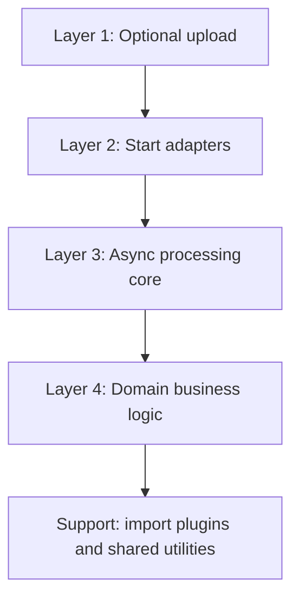

# How to Build an Async Processing System

This book documents a layered async processing architecture for a TypeScript server stack. Each chapter explains one layer's responsibilities, boundaries, and invariants.

The most important boundary is `startProcessing`.

Everything before `startProcessing` is about getting trusted server-side source locators ready. Everything from `startProcessing` onward is the async-processing system: job creation, manifests, admission locks, queueing, workers, progress, completion, and error persistence.

## Layer Map

## Responsibilities at a Glance

| Layer                 | Owns                                                                                  | Must not own                                                   |
| --------------------- | ------------------------------------------------------------------------------------- | -------------------------------------------------------------- |
| Optional upload       | Receiving files, storing bytes, creating server-side locators, saving upload sessions | Jobs, locks, queues, domain work                               |
| Start adapters        | Converting trusted upload/session/event input into `StartProcessingInput`             | Upload byte handling, worker orchestration, business parsing   |
| Async processing core | Job lifecycle, manifest, BullMQ, Redis lock, worker, source verification, SSE         | Upload routes, domain-specific validation, file format parsing |
| Domain business       | Actual business rules, persistence, domain progress, non-critical error collection    | Upload sessions, queue admission, worker control flow          |
| Import plugin support | Format parsing and shared import utilities used by domains                            | Domain rules, job orchestration, upload/session trust          |

## Core Principle

Each layer should speak to the next layer through a small contract:

- Upload produces an `UploadSession` or trusted in-process event payload.
- Adapters produce `StartProcessingInput`.
- The async core produces verified sources and calls a registered `DomainRunner`.
- The domain returns a `DomainRunResult`.
- Plugins return parsed rows or scoped parse errors to the domain; they do not start jobs.

When a new feature is hard to place, ask: "Does this handle bytes, start a job, orchestrate a job, or perform business work?" That answer usually identifies the layer.

## Reference Appendices

Implementation details that would interrupt layer narratives live in appendices:

| Appendix                                                         | Contents                                                    |
| ---------------------------------------------------------------- | ----------------------------------------------------------- |
| [A. Prisma Data Model](./appendix-a-prisma-data-model/README.md) | `ProcessingJob`, `ProcessingManifest`, `ProcessingJobError` |
| [B. Shared Types](./appendix-b-shared-types/README.md)           | Cross-layer DTOs, locators, progress, `DomainRunResult`     |
| [C. Constants and Redis Keys](./appendix-c-constants/README.md) | Queue names, TTLs, Redis key patterns, BullMQ options       |
