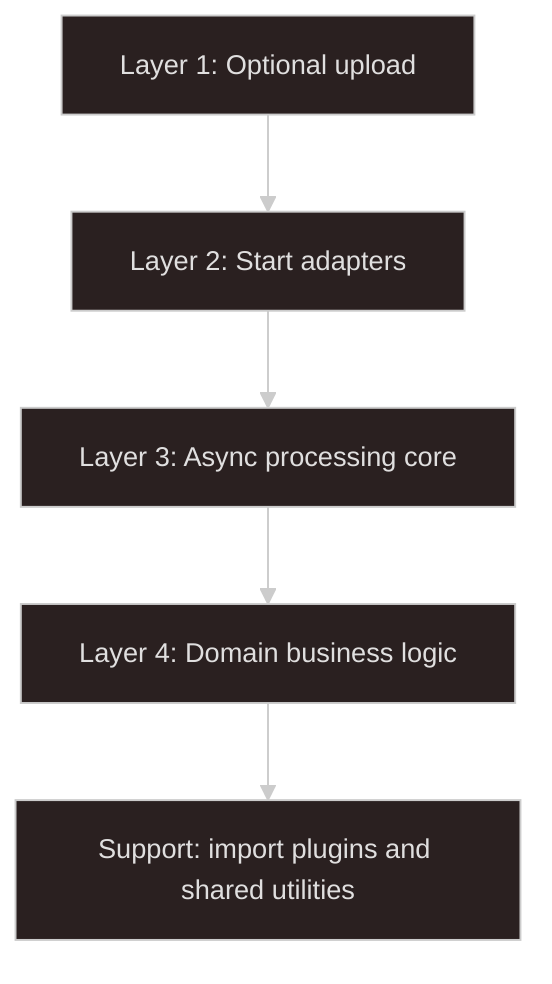
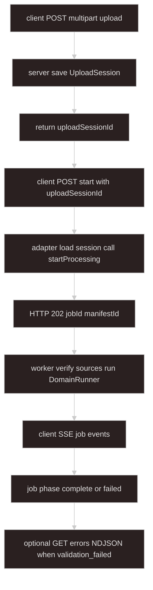

# How to Build an Async Processing System

This book documents a layered async processing architecture for a TypeScript server stack. Each chapter explains one layer's responsibilities, boundaries, and invariants.

The most important boundary is `startProcessing`.

Everything before `startProcessing` is about getting trusted server-side source locators ready. Everything from `startProcessing` onward is the async-processing system: job creation, manifests, admission locks, queueing, workers, progress, completion, and error persistence.

Full table of contents: [TOC.md](./TOC.md).

## Layer Map

## Chapters

| Layer | Chapter | Focus |
| ----- | ------- | ----- |
| 1 | [Optional Upload Layer](./01-optional-upload-layer/README.md) | Multipart, S3, COS, Aliyun OSS; `UploadSession` |
| 2 | [Start Processing Adapter Layer](./02-start-processing-adapter-layer/README.md) | Session/event adapters; HTTP `202` start |
| 3 | [Async Processing Core Layer](./03-async-processing-core-layer/README.md) | Orchestrator, worker, lock, SSE, job API |
| 4 | [Domain Business Layer](./04-domain-business-layer/README.md) | `DomainRunner`, business rules, `DomainRunResult` |
| 5 | [Import Plugin Support Layer](./05-import-plugin-support-layer/README.md) | Format plugins and shared import utilities |

### Layer 5 guides

| Guide | Role |
| ----- | ---- |
| [import-shared.md](./05-import-plugin-support-layer/import-shared.md) | `ErrorDetail`, domain progress, NDJSON error export |
| [xlsx.md](./05-import-plugin-support-layer/xlsx.md) | Tabular XLSX plugin |
| [jsonl.md](./05-import-plugin-support-layer/jsonl.md) | JSONL plugin |

## End-to-End Happy Path

Typical deferred-upload flow (multipart disk ingest plus manual start):

1. **Upload (Layer 1):** client sends files; server stores bytes and saves an `UploadSession` with server-side locators.
2. **Start (Layer 2):** client posts `uploadSessionId`; adapter maps the session to `StartProcessingInput` and calls `startProcessing`; API returns **HTTP 202** with `{ jobId, manifestId }`.
3. **Core (Layer 3):** worker claims the job, verifies locators, invokes the registered `DomainRunner`, publishes progress over SSE, finalizes the job row.
4. **Domain (Layer 4):** runner parses `io.context`, opens streams, calls format plugins (Layer 5), persists valid data, returns `success` or `validation_failed`.
5. **Errors (Layer 3):** when `outcome` is `validation_failed`, client downloads persisted errors as **NDJSON** from `GET .../jobs/:jobId/errors`.

Auto-start (upload emits `processing.start-requested`) skips the manual start step; the event adapter calls `startProcessing` directly.

## Responsibilities at a Glance

| Layer                 | Owns                                                                                  | Must not own                                                   |
| --------------------- | ------------------------------------------------------------------------------------- | -------------------------------------------------------------- |
| Optional upload       | Receiving files, storing bytes, creating server-side locators, saving upload sessions | Jobs, locks, queues, domain work                               |
| Start adapters        | Converting trusted upload/session/event input into `StartProcessingInput`             | Upload byte handling, worker orchestration, business parsing   |
| Async processing core | Job lifecycle, manifest, BullMQ, Redis lock, worker, source verification, SSE         | Upload routes, domain-specific validation, file format parsing   |
| Domain business       | Actual business rules, persistence, domain progress, non-critical error collection    | Upload sessions, queue admission, worker control flow          |
| Import plugin support | Format parsing and shared import utilities used by domains                            | Domain rules, job orchestration, upload/session trust          |

## Core Principle

Each layer should speak to the next layer through a small contract:

- Upload produces an `UploadSession` or trusted in-process event payload.
- Adapters produce `StartProcessingInput`.
- The async core produces verified sources and calls a registered `DomainRunner`.
- The domain returns a `DomainRunResult`.
- Plugins return parsed rows or scoped parse errors to the domain; they do not start jobs.

When a new feature is hard to place, ask: "Does this handle bytes, start a job, orchestrate a job, or perform business work?" That answer usually identifies the layer.

## Reference Appendices

Implementation details that would interrupt layer narratives live in appendices:

| Appendix                                                         | Contents                                                    |
| ---------------------------------------------------------------- | ----------------------------------------------------------- |
| [A. Prisma Data Model](./appendix-a-prisma-data-model/README.md) | `ProcessingJob`, `ProcessingManifest`, `ProcessingJobError` |
| [B. Shared Types](./appendix-b-shared-types/README.md)           | Cross-layer DTOs, locators, progress, `DomainRunResult`     |
| [C. Constants and Redis Keys](./appendix-c-constants/README.md) | Queue names, TTLs, Redis key patterns, BullMQ options       |
| [D. Validation Schemas](./appendix-d-validation-schemas/README.md) | Zod schemas for HTTP bodies, queries, events, domain context |
