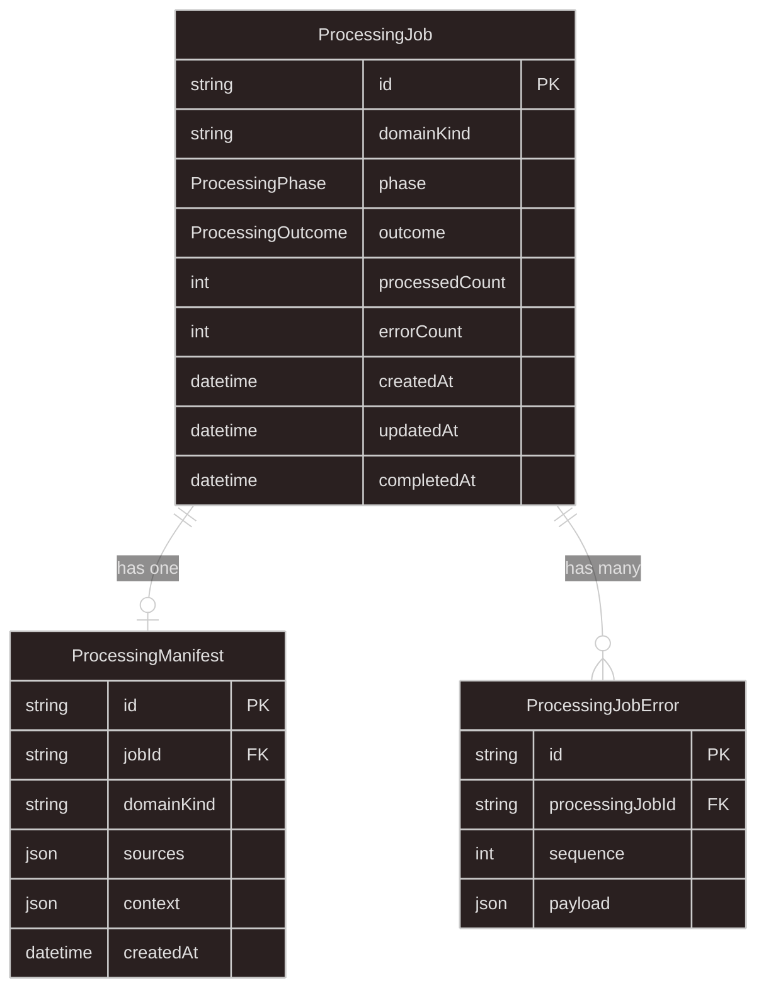

# Appendix A: Prisma Data Model

This appendix is the canonical reference for the async-processing persistence layer. Layer 3 describes how the core reads and writes these models; this document defines the schema.

Place these models in your API application's Prisma schema (for example a shared `packages/database` package). Domain-specific result tables are out of scope here; they belong in the domain business layer and may reference `ProcessingJob.id` as a foreign key.

Related skill: `.cursor/skills/async-processing/SKILL.md`

## What PostgreSQL Owns

| Model | Role |
| --- | --- |
| `ProcessingJob` | Durable job lifecycle, terminal phase, outcome, and aggregate counts |
| `ProcessingManifest` | Frozen input snapshot: `sources` locators and optional `context` parameters |
| `ProcessingJobError` | One row per non-critical validation error when outcome is `validation_failed` |

Live progress is **not** stored in these tables. The worker publishes progress to Redis; SSE clients subscribe there. Terminal state and counts live on `ProcessingJob`.

## Entity Relationships



## Enums

```prisma
enum ProcessingPhase {
  queued
  processing
  complete
  failed
}

enum ProcessingOutcome {
  success
  validation_failed
  failed
}
```

### Phase vs outcome

| Field | Meaning |
| --- | --- |
| `phase` | Where the job is in orchestration: queued, actively processing, or terminal (`complete` / `failed`) |
| `outcome` | Set when terminal. `null` while the job is still `queued` or `processing` |

When `phase` is `complete`, `outcome` is either `success` or `validation_failed`. When `phase` is `failed`, `outcome` is `failed`.

Validation failures are **completed** jobs (`phase: complete`, `outcome: validation_failed`), not failed orchestration.

## Full Schema

```prisma
/**
 * async-processing — durable job lifecycle and input snapshot
 * Live progress in Redis; terminal state and counts here
 */
enum ProcessingPhase {
  queued
  processing
  complete
  failed
}

enum ProcessingOutcome {
  success
  validation_failed
  failed
}

model ProcessingJob {
  id              String             @id // jobId (nanoid)
  domainKind      String
  phase           ProcessingPhase    @default(queued)
  outcome         ProcessingOutcome?
  processedCount  Int?
  errorCount      Int?
  createdAt       DateTime           @default(now())
  updatedAt       DateTime           @updatedAt
  completedAt     DateTime?

  manifest            ProcessingManifest?
  processingJobErrors ProcessingJobError[]

  @@index([domainKind])
  @@index([phase])
  @@index([domainKind, phase])
}

model ProcessingManifest {
  id         String   @id // manifestId (nanoid)
  jobId      String   @unique
  domainKind String
  sources    Json
  context    Json?
  createdAt  DateTime @default(now())

  job ProcessingJob @relation(fields: [jobId], references: [id], onDelete: Cascade)

  @@index([domainKind])
}

/**
 * One validation error row per failed ingest item — domain owns payload shape (JSON).
 * Deleted with the parent ProcessingJob.
 */
model ProcessingJobError {
  id              String @id @default(cuid())
  processingJobId String
  /** Stable export / replay order within the job (1..N) */
  sequence        Int
  payload         Json

  processingJob ProcessingJob @relation(fields: [processingJobId], references: [id], onDelete: Cascade)

  @@unique([processingJobId, sequence])
  @@index([processingJobId])
}
```

After schema edits, run **`prisma generate`** so TypeScript matches the models. Create and apply migrations yourself (for example `bunx prisma migrate dev --name add_processing_models`).

## Field Notes

### `ProcessingJob.id`

Application-generated `jobId` (typically nanoid). The orchestrator creates the row before enqueue so the database is the source of truth for job history.

### `ProcessingJob.domainKind`

Registry key for `DomainRegistry`. Duplicated on the manifest so the worker can resolve the runner from manifest data without joining back through optional domain tables.

### `ProcessingJob.processedCount` and `errorCount`

Set in `finalize` when the domain returns. `processedCount` is rows or items successfully handled. `errorCount` is non-critical validation failures collected by the domain.

### `ProcessingManifest.sources`

Frozen `Record<string, ProcessingSource>` as JSON. Each value holds `sourceId`, optional `label` / `mimeType`, and a `locator` (`local` path or `object` bucket/key). Written once at `createQueued`; the worker verifies locators against this snapshot.

### `ProcessingManifest.context`

Optional JSON for job parameters that are **not** file locators (for example `yearMonth`, `timezone`, `startedAtTimestamp`). Adapters copy `StartProcessingInput.context` here. Domain runners validate `io.context` with a domain Zod schema. BullMQ payload stays `{ jobId, domainKind, manifestId }` only.

### `ProcessingJobError.sequence`

1-based stable order for NDJSON export and replay. `ProcessingJobErrorRepository.createManyFromErrors` assigns sequences in batch inserts.

### `ProcessingJobError.payload`

Domain-owned JSON matching `ErrorDetail` from shared import utilities. The core persists rows; the domain defines the payload shape.

## Lifecycle Mapping

| Event | `ProcessingJob.phase` | `ProcessingJob.outcome` |
| --- | --- | --- |
| `createQueued` | `queued` | `null` |
| Worker claims job | `processing` | `null` |
| Domain returns success | `complete` | `success` |
| Domain returns validation errors | `complete` | `validation_failed` |
| Uncaught worker/domain failure | `failed` | `failed` |

On `validation_failed`, the worker calls `ProcessingJobErrorRepository.createManyFromErrors` before `finalize`.

## Repository Contracts

These interfaces map directly to the schema:

| Method | Models touched |
| --- | --- |
| `createQueued` | Creates `ProcessingJob` + `ProcessingManifest` in one transaction |
| `claimProcessingPhase` | Conditional update `queued` to `processing` (single winner) |
| `finalize` | Sets terminal `phase`, `outcome`, counts, `completedAt` |
| `getManifestByManifestId` | Loads manifest for worker by BullMQ `manifestId` |
| `createManyFromErrors` | Inserts `ProcessingJobError` rows with `sequence` |
| `listPayloadsByJobId` | Reads errors ordered by `sequence` for `GET jobs/:jobId/errors` |
| `deleteById` | Deletes job; cascade removes manifest and errors |

## Indexes

| Index | Purpose |
| --- | --- |
| `ProcessingJob.domainKind` | Filter job lists by domain |
| `ProcessingJob.phase` | Filter active vs terminal jobs |
| `ProcessingJob.[domainKind, phase]` | Combined list queries (for example active jobs per domain) |
| `ProcessingManifest.domainKind` | Operational queries by domain |
| `ProcessingJobError.[processingJobId, sequence]` unique | Stable ordering without gaps in application logic |
| `ProcessingJobError.processingJobId` | Load all errors for one job |

## What Does Not Belong Here

| Concern | Where it lives |
| --- | --- |
| Upload sessions, presigned URLs | Upload layer (Layer 1) |
| BullMQ payload | Redis queue only; references `jobId` and `manifestId` |
| Live progress events | Redis pub/sub channels |
| Active-job admission lock | Redis `SET NX` per `domainKind` |
| Domain business result rows | Domain layer tables (optional FK to `ProcessingJob.id`) |
| Parsed file bytes | Disk or object store locators referenced in `manifest.sources` |

## See Also

- [Layer 3: Async Processing Core Layer](../03-async-processing-core-layer/README.md) — orchestrator, worker, and repository behavior
- [Layer 2: Start Processing Adapter Layer](../02-start-processing-adapter-layer/README.md) — how `context` and `sources` reach `createQueued`
